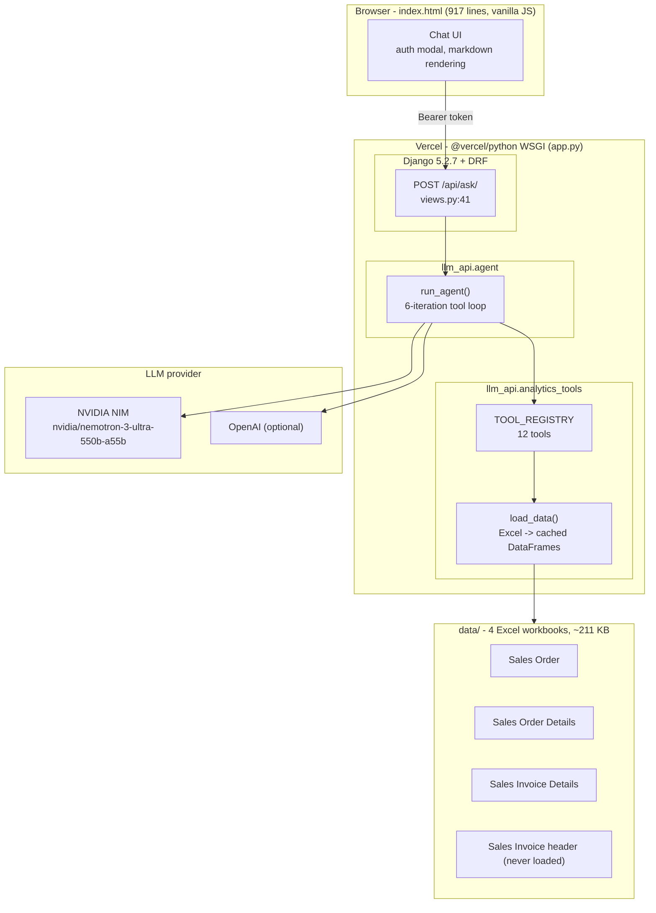

# ERP AI Analytics

AI-powered sales-intelligence chatbot for **Best Marine Private Limited**. It
reads the four ERP Excel exports in `data/` (Sales Orders, Sales Order
Details, Sales Invoice Details), and answers ad-hoc business questions through
an LLM agent that calls a curated set of analytical tools.

**Live demo:** https://erp-2w694uaqf-erp-bot-demo.vercel.app/

> This README is the operational entry point. For architecture, algorithms,
> verified figures, defect register (F-01..F-21), security review (S-1..S-8)
> and interview Q&A, see **[PROJECT_FLOW.md](PROJECT_FLOW.md)** in this repo.

---

## What it does

- **Conversational analytics** - ask in plain English, the agent picks tools and answers with tables/percentages.
- **Top N** customers, products, categories by revenue / qty / order count.
- **Customer health scores** (0-100, weighted) and **discontinuation candidates**.
- **Growth alerts** (first- vs second-half comparison) and **weekly trend direction** per customer/product.
- **Order-to-invoice fulfilment comparison** (known join defect - see Limitations).
- **Low-volume / slow-moving inventory**, **revenue summary**, and per-customer / per-product **deep dives**.
- Two honest **stubs** for payment behaviour and sales returns (data not present).

Current data scope: 37 orders, 415 order-detail lines, 3,333 invoice lines,
33 customers, 13 products, 46 categories - exports dated 01-Apr to 06-May-2026.

---

## Architecture



The agent loop: send user query + 12 tool definitions to the LLM, execute any
`tool_calls` against `TOOL_REGISTRY`, feed results back, repeat until the model
answers or 6 iterations are exhausted (`max_tokens=16384`).

---

## Tech stack

| Layer | Choice |
| --- | --- |
| Frontend | Single-file vanilla HTML/CSS/JS, no framework, no build step (`index.html`, 917 lines) |
| Backend | Django 5.2.7 + Django REST Framework, single WSGI app |
| Agent | OpenAI Python SDK in OpenAI-compatible mode (`httpx`) |
| LLM | NVIDIA NIM `nvidia/nemotron-3-ultra-550b-a55b` (OpenAI optional) |
| Data | pandas + openpyxl, in-memory cache behind a threading lock |
| Deployment | Vercel (`@vercel/python`) |

Python 3.12 is pinned in `.python-version`. Dependencies (8) are in the root
`requirements.txt` (identical copy under `llm_project/`).

---

## Repository layout

```
erp-bot/
├─ app.py                    Vercel WSGI entry point
├─ manage.py                 repo-root Django dev entry (chdirs into llm_project/)
├─ index.html                the entire frontend
├─ requirements.txt          Python dependencies
├─ vercel.json               build + catch-all rewrite to /app.py
├─ .python-version           3.12
├─ .gitignore                227 lines
├─ data/                     the 4 ERP Excel exports (~211 KB) - see Data below
├─ PROJECT_FLOW.md           deep-dive design/audit document
└─ llm_project/
   ├─ .env.example           documented env-var template
   ├─ manage.py
   ├─ llm_api/               the application
   │  ├─ agent.py            LLM tool-loop agent (305 lines)
   │  ├─ analytics_tools.py  12 analytical tools (529 lines)
   │  ├─ data_loader.py      Excel -> DataFrame loading + cache (89 lines)
   │  ├─ views.py            auth + 4 API views (142 lines)
   │  └─ urls.py             /api/ routes
   └─ llm_project/           Django project (settings.py, urls.py, wsgi.py)
```

---

## Data

The app loads **three** of the four workbooks (`data_loader.py:17-30`). The
fourth (Sales Invoice **header**) is shipped but not ingested - defect
**F-02** in PROJECT_FLOW.md.

| File (`data/`) | Rows after load | Bytes | Loaded |
| --- | --- | --- | --- |
| Sales Order - DynaRep_Best Marine..._2026-04-01_2026-05-16_Date Wise Sales Order.xlsx | 37 | 7,015 | yes |
| Sales Order Details - DynaRep_...__Submitted + Draft_Date Wise Sales Order.xlsx | 415 | 24,114 | yes |
| Sales Invoice Details - DynaRep_..._Sales Invoice_Submitted + Draft_...xlsx | 3,333 | 151,321 | yes |
| Sales Invoice - DynaRep_..._Sales Invoice_Submitted + Draft_...xlsx | (header; 611 rows) | 28,915 | no |

Files resolve against `data/` automatically. If you change the files on disk,
call `POST /api/reload-data/` (or restart) to refresh the in-memory cache.

---

## Quick start

```bash
git clone https://github.com/nachiiiket/erp-bot.git
cd erp-bot
python -m venv .venv
# Windows: .venv\Scripts\activate     macOS/Linux: source .venv/bin/activate
pip install -r requirements.txt
```

Create `llm_project/.env` from `llm_project/.env.example` at minimum:

```ini
NVIDIA_API_KEY=nvapi-...        # from https://build.nvidia.com
DJANGO_SECRET_KEY=<generated>   # python -c "from django.core.management.utils import get_random_secret_key; print(get_random_secret_key())"
```

> **Data directory - read this before editing `.env`.**
> `data_loader.py` reads `SALES_DATA_DIR` at import time and, when set, treats
> it as an **absolute path** or as a path **relative to the current working
> directory**. `manage.py` runs Django with the working directory set to
> `llm_project/`, so `SALES_DATA_DIR=data` (the value in `.env.example`)
> resolves to `llm_project/data/` - which does **not** exist - and every tool
> fails with file-not-found. A leftover `SALES_DATA_DIR=` (empty) line has the
> same effect.
> **Fix: leave `SALES_DATA_DIR` commented out / deleted** (the default points
> at the repo-root `data/` and works from any directory), **or** set it to an
> absolute path. 

Run:

```bash
python manage.py runserver      # from repo root
```

Open http://localhost:8000 - the Django root route serves `index.html`. Enter
an auth token in the popup and start querying.

---

## Auth tokens

Every `/api/*` request must carry `Authorization: Bearer <token>`. The token
also **selects the LLM provider** (`views.py:15-28`).

| Environment var | Example | Provider selected |
| --- | --- | --- |
| `NVIDIA_AUTH_TOKEN` | `nv-token-2603` (shared demo token) | NVIDIA NIM |
| `OPENAI_AUTH_TOKEN` | `sk-...` | OpenAI |

If a token matches neither, the API returns `401 {"error": "Unauthorized"}`.
`nv-token-2603` is the published demo token baked into the live frontend -
rotate it for any shared or production deployment.

---

## API endpoints

| Method | Path | Description |
| --- | --- | --- |
| POST | `/api/ask/` | Run the agent. Body `{"query": "...", "session_id": "..."}` |
| GET | `/api/health/` | `{"status": "ok", "data": {sales_orders, order_details, invoice_lines}}` |
| POST | `/api/reload-data/` | Re-read the Excel files from disk, returns new row counts |
| DELETE | `/api/session/<session_id>/` | Drop one conversation history |
| GET | `/` | Serves the chat frontend (`index.html`) |

Example:

```bash
curl -X POST http://localhost:8000/api/ask/ \
  -H "Authorization: Bearer nv-token-2603" \
  -H "Content-Type: application/json" \
  -d '{"query": "Top 5 customers by revenue", "session_id": "demo"}'
```

Returns `{ "answer", "tools_used", "session_id", "error" }`. Conversation
history is kept in an in-memory dict (`_sessions`, capped at 20 messages / 10
exchanges per session id); multi-turn context is enabled by passing the same
`session_id`.

---

## Tools the agent can call

Defined in `analytics_tools.py`, exposed as OpenAI tool definitions in
`agent.py:37-182`. All are parameterised by the model.

| # | Tool | Serves |
| --- | --- | --- |
| 1 | `get_top_n` | Top N customers/products by revenue, qty or orders |
| 2 | `get_customer_health_scores` | Weighted 0-100 health score per customer |
| 3 | `get_discontinuation_candidates` | Products/customers to discontinue |
| 4 | `get_volume_growth_alerts` | First- vs second-half revenue/qty growth |
| 5 | `get_trend_direction` | Weekly revenue trend per customer/product |
| 6 | `get_order_to_invoice_analysis` | Order vs invoiced revenue per customer |
| 7 | `get_low_volume_analysis` | Bottom N products by qty (slow movers) |
| 8 | `get_revenue_summary` | Whole-business summary |
| 9 | `get_customer_deep_dive` | Customer view: orders, products, trend, health |
| 10 | `get_product_deep_dive` | Product view: customers, revenue, qty, trend |
| 11 | `get_payment_behavior` | **Stub** - payment data not uploaded |
| 12 | `get_return_analysis` | **Stub** - returns data not uploaded |

---

## Deploy to Vercel

1. Push `main` to GitHub (`https://github.com/nachiiiket/erp-bot`) - Vercel
   auto-deploys every commit (`vercel.json`: build `app.py` with
   `@vercel/python`, rewrite `/(.*)` to `/app.py`).
2. In the Vercel dashboard set the same env vars as in `.env`, plus a real
   `DJANGO_SECRET_KEY` (**never** commit `.env`).
3. Note: on serverless the `data/` workbooks are bundled read-only at build
   time - you cannot hot-replace them in the running app; `reload-data/` only
   re-reads the bundled copies.

---

## Known limitations

- **F-01**: `get_order_to_invoice_analysis` joins orders to invoices purely on
  customer name and divides by `so_revenue + 1e-9`; 31 of 38 rows have an
  empty join side and the tool reports values up to `4.9e17%` instead of a
  clean answer.
- **F-03 / F-05**: trend answers are contradictory between
  `get_customer_deep_dive` and `get_trend_direction`; 52 of 215 entities are
  silently dropped.
- **F-02**: the invoice-header workbook (dates, due dates, outstanding
  amounts) is never loaded, so payment-latency/debtor analysis is impossible.
- Two of the twelve tools are honest stubs; the requirement's regional,
  bottleneck, confidence and churn analyses are absent.
- No automated tests (`tests.py` is the vanilla Django stub); the agent/tools
  were validated by direct execution of every tool and by diffing the demo's
  canned answers against live outputs.
- LLM quality is untuned: `temperature=1`, `top_p=0.95`, no guardrails, 6
  iterations cap.

Full defect register (F-01..F-21), security review (S-1..S-8), risk register,
and verified numbers are in **PROJECT_FLOW.md**.

---

## Security notes

- The four ERP workbooks (~211 KB of real business data) are **tracked in this
  public repository** (`data/*.xlsx`). Remove them and rotate any credentials
  before wider distribution. `.gitignore` guards a legacy path only.
- The demo auth token is published here and in the frontend; cut a fresh
  `NVIDIA_AUTH_TOKEN` (and add an OpenAI one) for anything beyond the demo.
- `DJANGO_SECRET_KEY` silently falls back to a per-startup random value, which
  invalidates sessions on restart - set it explicitly in Vercel.
- Sessions are a shared in-memory dict: no TTL, unbounded growth, no isolation
  between concurrent users.

---

## Further reading

- **`PROJECT_FLOW.md`** - full design doc: requirement traceability, algorithm
  walkthroughs, 12-tool catalogue, agent loop, API/auth details, defect
  register (F-01..F-21), security review (S-1..S-8), measured timings,
  interview Q&A (20 items), verified figures appendix.