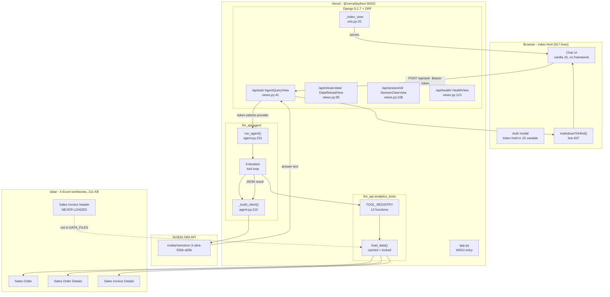
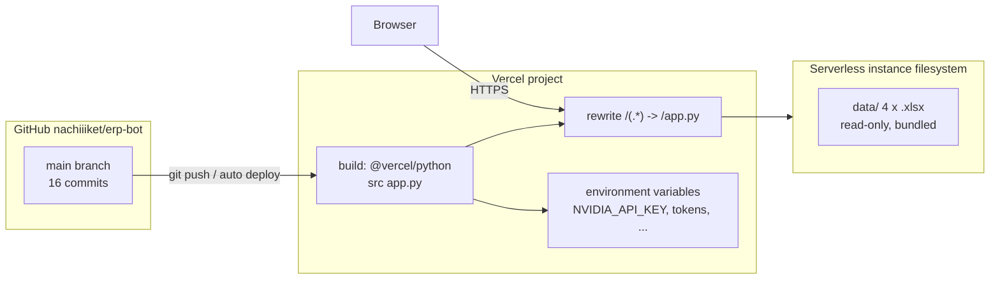
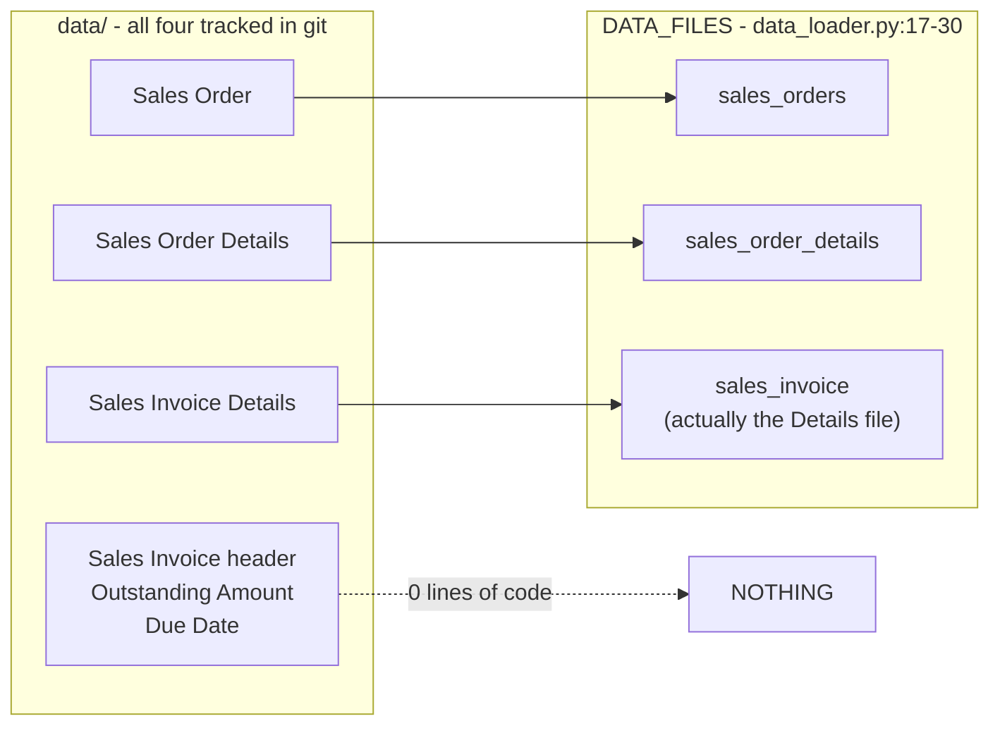

# ERP AI Analytics (erp-bot) - AI Sales Intelligence Chatbot

Project Flow, Architecture and Engineering Design Document

**Project code:** erp-bot
**Repository:** `https://github.com/nachiiiket/erp-bot.git` (branch `main`)
**Document type:** Project flow / architecture / design specification
**Document version:** 1.0
**Status:** Describes a **running, deployed** codebase (implemented system, not a proposal)
**Live deployment:** `https://erp-2w694uaqf-erp-bot-demo.vercel.app/`

---

## 0. How To Read This Document

This document describes **erp-bot**: a deployed, end-to-end AI sales analytics
chatbot. Unlike a design specification, every architecture, algorithm and
workflow described here exists as executable code in the repository. The
document is therefore an *analysis of an implemented system* - what it does,
how it does it, what it gets right, and where it is wrong.

So that a reviewer can always separate evidence from interpretation, every
statement in a heading or table caption carries a tag:

| Tag | Meaning |
| --- | --- |
| `[IMPLEMENTED]` | Present in the source code. Path and line range are given and reproducible. |
| `[VERIFIED]` | Executed against the real data in `data/` during preparation of this document. The exact output is quoted. |
| `[OBSERVED]` | Read directly from repository artefacts (source, git history, config, data files). Not executed. |
| `[DESIGN]` | An interpretation or rationale for why the code is shaped this way. Inference, not stated by the author. |
| `[GAP]` | A requirement or behaviour that is missing, incomplete, or contradicted by the code. |
| `[RISK]` | A defect, security exposure, or correctness hazard, with a demonstrated trigger. |
| `[BLOCKED]` | Cannot be verified from this repository alone (external service, secret, or runtime dependency). |

Anything without a tag in a heading or table caption should be read as
`[IMPLEMENTED]` narrative backed by the cited source lines.

**Verification environment.** All `[VERIFIED]` figures were produced with
Python 3.10.11, pandas 2.3.3, numpy 2.2.6 on Windows, importing
`llm_api.data_loader` and `llm_api.analytics_tools` directly. The Django and
OpenAI layers were **not** executed (see `14. Risks and Limitations`).

---

## 1. Executive Summary

### 1.1 What this project is `[IMPLEMENTED]`

erp-bot is a natural-language chatbot over ERP sales data. A user opens a web
page, pastes an access token, and asks questions in plain English:

> *"Which products and customers should we discontinue and why?"*

A Django REST endpoint accepts the question, hands it to an LLM agent
(NVIDIA Nemotron by default), lets the model call **12 deterministic Python
analytics tools** in a loop, and returns a structured answer
(`Summary -> Key Findings -> Recommendations`) with badges showing which tools
were used.

The essential architectural bet is:

> **The model never computes. It only selects tools and narrates their output.**

All arithmetic happens in pandas. The LLM is restricted to (a) choosing a
tool, (b) choosing its arguments, and (c) turning the returned JSON into
prose. This is what makes the numbers trustworthy and the answers
reproducible in structure, even though the prose is not byte-reproducible.

### 1.2 What actually exists `[OBSERVED]`

| Component | Reality | Evidence |
| --- | --- | --- |
| Frontend | Single-file vanilla HTML/CSS/JS, 917 lines | `index.html` |
| Backend | Django 5.2.7 + Django REST Framework | `requirements.txt` |
| Agent | OpenAI-compatible client, 6-iteration tool loop | `agent.py:231-305` |
| Analytics | 12 registered pandas tools, 529 lines | `analytics_tools.py:516-529` |
| Data | 4 Excel workbooks, 211,365 bytes, committed | `data/` |
| Persistence | **None.** `models.py` is 2 lines, empty | `llm_api/models.py` |
| Deployment | Vercel serverless WSGI, catch-all rewrite | `vercel.json`, `app.py` |
| Tests | `tests.py` is the untouched Django stub | `llm_api/tests.py` |
| Git | 16 commits, working tree clean, 34 tracked files | `git log`, `git status`, `git ls-files` |

Total application source (excluding the HTML/CSS shell): **~1,070 lines of
Python** across the five substantive `llm_api` modules - `agent.py` 305,
`analytics_tools.py` 529, `views.py` 142, `data_loader.py` 89, `urls.py` 8.

### 1.3 The three findings that shape this document

1. **The invoice header workbook is shipped but never read.**
   `data/` contains four exports. `DATA_FILES` maps only three of them
   (`data_loader.py:17-30`). The file with `Outstanding Amount` and `Due Date`
   - i.e. every field needed for payment, DSO and overdue analysis - is
   present on disk, tracked in git, and **loaded by zero lines of code**.
   Consequently two tools return `DATA_NOT_AVAILABLE` stubs and the health
   score has no payment dimension at all.

2. **Order-to-invoice analysis joins on customer name and produces
   numbers up to 4.94 x 10^17.**
   There is no order-to-invoice key. The tool outer-joins two customer-name
   aggregates (`analytics_tools.py:296-302`) and then divides by
   `so_revenue + 1e-9` (`:304`). For the 26 customers who appear in invoices
   but in no order export, `so_revenue = 0` and the denominator collapses to
   `1e-9`. Result: `gap_pct = -4.94287053e+17`, `status = OVER_INVOICED`,
   and **31 of 38 rows have an empty join side** (26 invoice-only, 5
   order-only). Only 7 rows have data on both sides, and **just 1 of those
   is `MATCHED`.**

3. **The same customer gets two contradictory trend labels.**
   `get_trend_direction` zero-fills the week axis before fitting, and drops
   `STABLE` entities from its response. `get_customer_deep_dive` does *not*
   zero-fill. For `V.Ships India Pvt.Ltd.` the first tool returns **nothing**
   (classified `STABLE`, silently omitted) while the second returns
   **`trend: DECLINING`** with the action *"Declining activity - investigate
   satisfaction, pending orders, or competitive loss."* Both call the same
   `_slope_label` on differently-shaped input.

### 1.4 Verified baseline at a glance `[VERIFIED]`

All figures below were reproduced by executing the repository's own code.

| Metric | Value |
| --- | --- |
| Loaded frames | `so` 37 x 10, `sod` 415 x 13, `inv` 3333 x 13 |
| Invoice net revenue (`inv['Amount'].sum()`) | 10,408,405.39 |
| Invoice quantity | 14,998 |
| Invoice documents (`Doc.No.` nunique) | 610 |
| Distinct invoice customers | 33 |
| Distinct invoice items | 182 |
| Derived categories | 46 |
| Sales-order gross (`so['Grand Total'].sum()`) | 5,106,918.32 |
| Sales-order net (`so['Amt.Total'].sum()`) | 4,549,969.80 |
| Sales-order detail net (`sod['Amount'].sum()`) | 4,264,965.68 |
| Order net minus order-detail net (orphan orders) | 285,004.12 |
| Invoice weeks present (ISO) | 14, 15, 16, 18 |
| Sales-order weeks present (ISO) | 14, 15, 16, 18, 19 |
| Derived `category` count | 46 |
| Tools registered | 12 (10 computing, 2 stubs) |
| Agent iteration cap | 6 |
| Session history cap | 20 messages (10 exchanges) |

### 1.5 Position relative to the HNS requirement document `[GAP]`

This repository is the working POC against the HNS requirement document
*"AI-Based Sales Analytics & Decision Intelligence Platform"*. The lineage is
visible in the code itself: `settings.py:188` still carries the comment
*"Local frontend support for hns_agent.html"*, and the agent's system prompt
names the business (*"Best Marine Private Limited"*).

Section `2. Requirement Traceability` maps each required module to its actual
implementation status. In short: **2 of 5 modules partially implemented,
3 of 5 not implemented, and no module emits the required confidence levels.**

---

## 2. Requirement Traceability `[REQUIRED] -> [IMPLEMENTED]`

| # | Requirement (HNS document) | Status | Evidence |
| --- | --- | --- | --- |
| 1 | Module 1 - Customer Health & Discontinuation Intelligence | **PARTIAL** | `get_customer_health_scores`, `get_discontinuation_candidates` exist. No payment component; no confidence field. |
| 2 | Module 2 - Sales Bottleneck & Delay Analysis | **MISSING** | 0 occurrences of `bottleneck`/`delivery` in `*.py`. Needs delivery/PO data not present. |
| 3 | Module 3 - Regional Sales Intelligence | **MISSING** | 0 occurrences of `region`/`regional` in `*.py`. No region column in any workbook. |
| 4 | Module 4 - Customer Potential Analysis | **MISSING** | 0 occurrences of `potential` in `*.py`. |
| 5 | Module 5 - Trend & Opportunity Analysis | **PARTIAL** | `get_trend_direction`, `get_volume_growth_alerts`. But see defects F-03, F-05. |
| 6 | Full Order-to-Cash lifecycle | **PARTIAL** | Orders + invoices only. Delivery, payments, credit/debit notes absent. Returns is a stub. |
| 7 | Explanations, justifications, supporting parameters | **PARTIAL** | Free-text `reason` / `action` / `recommendation` strings only; no structured parameter list. |
| 8 | Confidence levels | **MISSING** | 0 occurrences of `confidence` in `*.py`. |
| 9 | Not a static dashboard - conversational | **DONE** | Chat UI, `POST /api/ask/`. |
| 10 | Parameter-driven, repeatable business logic | **PARTIAL** | Tool args are parameterised (`n`, `threshold_pct`, `top_n`, `entity_type`); but health weights, slope threshold and recency window are hardcoded. |
| 11 | Start on NVIDIA free LLM APIs, OpenAI later | **DONE** | Dual provider, token-selected (`views.py:23-26`). |
| 12 | 15-day to 1-month validation sample | **DONE** | Data spans 01-Apr-2026 to 06-May-2026 (36 days). |
| 13 | Payment behaviour analysis | **STUB** | `get_payment_behavior` returns `DATA_NOT_AVAILABLE`. |
| 14 | Sales returns analysis | **STUB** | `get_return_analysis` returns `DATA_NOT_AVAILABLE`. |

**Reading:** the repo delivers a credible conversational shell and partial
implementations of **2 of the 5 required analytical modules** (Modules 1 and
5), built on **2 of the 8 inputs the requirement names** - Sales Orders and
Sales Invoices. Delivery information, payment behaviour, debit/credit notes
and sales returns are absent; the two tools that would need the last two are
stubs, and the other two have no tool at all.

---

## 3. System Architecture (as implemented)

### 3.1 Component map `[IMPLEMENTED]`



### 3.2 Request lifecycle `[IMPLEMENTED]`

One HTTP round trip. The full path from keystroke to rendered answer:

```mermaid
sequenceDiagram
    autonumber
    participant U as User
    participant I as index.html
    participant V as AgentQueryView
    participant A as run_agent()
    participant L as LLM API
    participant T as TOOL_REGISTRY
    participant D as data/ (Excel)

    U->>I: types query, presses Enter
    I->>I: sendQuery() line 684, appendTyping()
    I->>V: POST /api/ask/ {query, session_id}<br/>Authorization: Bearer &lt;token&gt;
    V->>V: _check_auth() line 15 -&gt; provider
    V->>V: history = _sessions[session_id] line 58
    V->>A: run_agent(query, history, provider) line 61

    loop up to 6 iterations (agent.py:253)
        A->>L: chat.completions.create(tools=12, temperature=1)
        L-->>A: message with optional tool_calls
        alt tool_calls present
            A->>T: TOOL_REGISTRY[name](**args) line 287
            T->>D: load_data() (cache hit after 1st call)
            D-->>T: so, sod, inv DataFrames
            T-->>A: dict result
            A->>L: append role=tool message line 293
        else no tool_calls
            A-->>V: {answer, tools_used, error: null}
        end
    end

    V->>V: append user+assistant to _sessions, cap [-20:] line 69-75
    V-->>I: {answer, tools_used, session_id, error}
    I->>I: markdownToHtml() line 837, render tool badges line 778
    I-->>U: structured answer + tool badges
```

### 3.3 Deployment topology `[OBSERVED]`



`vercel.json` is 14 lines: one `builds` entry (`app.py` via
`@vercel/python`) and one catch-all `rewrites` to the same. Everything -
the HTML page and all four API routes - is served by a single Django WSGI
application.

### 3.4 Why this shape `[DESIGN]`

| Decision | Benefit | Cost |
| --- | --- | --- |
| Single WSGI entrypoint for static + API | One deploy target, no CORS needed in production, no CDN/static pipeline | Full HTML re-read from disk on every page load (`urls.py:26-28`), no cache headers |
| Model never computes; pandas does | Numbers are auditable and exact; model cannot hallucinate a total | Every question must be answerable by one of 12 tools; anything else fails |
| OpenAI SDK pointed at NVIDIA's OpenAI-compatible endpoint | Free provider today, swap to OpenAI by changing `base_url` + key | Provider-specific extras (`chat_template_kwargs`, `reasoning_budget`) smuggled via `extra_body` |
| Excel on local disk, not a database | Zero-ops, data is a client drop, reload is a POST | Re-reads all 4 workbooks on cold start; no incremental update; no query pushdown |
| In-memory session dict | 4 lines, no Redis dependency | Sessions die with the instance - see F-08 |
| Token doubles as provider selector | One header, no user table, no JWT | Anyone with the token gets the backend - see F-10 |

---

## 4. Repository Map and Entrypoints `[OBSERVED]`

```
erp-bot/
|-- .gitignore                     227 lines - see F-09 (.env guarded, data/ not)
|-- .python-version                3.12
|-- app.py                         15 lines - Vercel WSGI entry
|-- manage.py                      20 lines - os.chdir(llm_project/) then execute
|-- index.html                    917 lines - the entire frontend
|-- package-lock.json              86 bytes, no package.json  (vestigial)
|-- README.md                      60 lines - live URL + public trial token
|-- requirements.txt                8 lines - duplicate of llm_project/requirements.txt
|-- vercel.json                    14 lines - build + catch-all rewrite
|-- data/                          4 xlsx, 211,365 bytes, TRACKED IN GIT
|
|-- llm_project/
|   |-- .env                       623 bytes, NOT tracked (correct)
|   |-- .env.example               60 lines, tracked - contains real trial token
|   |-- .python-version            3.12
|   |-- db.sqlite3                 131,072 bytes, ignored, never used by app code
|   |-- manage.py                  20 lines
|   |-- requirements.txt           8 lines
|   |
|   |-- llm_project/               Django project package
|   |   |-- settings.py           198 lines
|   |   |-- urls.py                37 lines - includes _index_view
|   |   |-- wsgi.py / asgi.py      standard
|   |
|   |-- llm_api/                   Django app = the whole product
|       |-- agent.py              305 lines - system prompt, tool schema, loop
|       |-- analytics_tools.py    529 lines - 12 tools + registry
|       |-- data_loader.py         89 lines - Excel -> DataFrames, cache
|       |-- views.py              142 lines - auth, 4 API views, session store
|       |-- urls.py                 8 lines - 4 routes
|       |-- models.py               2 lines - EMPTY
|       |-- tests.py                stub
|       |-- README.md              80 lines - STALE (still says `anthropic`)
|       |-- data/                  4 xlsx - duplicate copy, gitignored
|       |-- migrations/            empty
```

**Two copies of the data exist on disk.** The tracked `data/` at the repo
root and an ignored duplicate under `llm_project/llm_api/data/`. Only the
former is read (`data_loader.py:9-15`: default is `ROOT_DIR/'data'`, the
legacy path is the fallback if the default does not exist).

### 4.1 Entrypoint resolution `[VERIFIED]`

| Entry | Used by | Behaviour |
| --- | --- | --- |
| `app.py` | Vercel | inserts `llm_project/` on `sys.path`, sets `DJANGO_SETTINGS_MODULE`, returns `get_wsgi_application()` |
| `manage.py` (root) | local dev | `os.chdir(llm_project/)` then executes the inner `manage.py` |
| `manage.py` (inner) | local dev | standard Django; README instructs `cd llm_project && python manage.py runserver` |

**Hazard:** because the README's local instructions change the working
directory to `llm_project/`, and `.env.example:24` sets
`SALES_DATA_DIR=data` (**relative**), data resolution becomes
CWD-dependent. Verified:

| CWD | `DATA_DIR` | File exists? |
| --- | --- | --- |
| repo root | `D:\hns_git\erp-bot\data` (absolute default, env unset) | **Yes** |
| `llm_project/` | `data` (relative, from `.env`) | **No** - `FileNotFoundError` on first query |
| repo root | `data` (relative, from `.env`) | Yes, by coincidence |

The default path (env unset) is absolute and safe. The *documented* env
override is relative and breaks. See F-12.

---

## 5. Data Layer `[IMPLEMENTED]`

### 5.1 Files on disk `[OBSERVED]`

| # | Workbook | Rows read | Role |
| --- | --- | --- | --- |
| 1 | `Sales Order - ..._Date Wise Sales Order.xlsx` | 37 (after footer drop) | Order headers |
| 2 | `Sales Order Details - ..._Date Wise Sales Order.xlsx` | 415 | Order lines |
| 3 | `Sales Invoice Details - ..._Date Wise Sales Invoice.xlsx` | 3,333 | Invoice lines - **the primary fact table** |
| 4 | `Sales Invoice - ..._Date Wise Sales Invoice.xlsx` | 611 (610 docs) | Invoice headers - **never loaded** |

File 4's columns are
`Date, Customer Name, Amt.Total, Qty Total, Grand Total, Outstanding Amount, Due Date, Doc.No.`
- verified by reading it directly during preparation of this document.
`Outstanding Amount` and `Due Date` are exactly the fields that would make
payment behaviour, DSO, overdue buckets and realisation rate computable.

### 5.2 Loader: cache, lock, and the file map `[IMPLEMENTED]`

`data_loader.py` is 89 lines. The important parts:

| Lines | What |
| --- | --- |
| 9-15 | `ROOT_DIR = parents[2]` (repo root); `DATA_DIR` from `SALES_DATA_DIR` env, else `ROOT_DIR/'data'`, else legacy `llm_api/data` |
| 17-30 | `DATA_FILES` - exactly 3 entries, each overridable by an env var |
| 33-46 | `_resolve_data_file` accepts `http(s)://`, absolute, or `DATA_DIR / name`; `_read_data_file` dispatches `.csv` vs `.xlsx` |
| 49-56 | `_clean(df, date_col, required='Customer Name')` |
| 59-81 | `load_data()` - thread-locked memoised load |
| 84-89 | `reload_data()` - clears cache, re-loads (exposed as `POST /api/reload-data/`) |

Two details worth calling out:

- **Footer stripping is implicit, not explicit.** Query-report exports end
  with a `Grand Total` row whose `Customer Name` is blank. `_clean` drops
  rows with `dropna(subset=['Customer Name'])` (`:51`), and `load_data`
  does the same for the order header (`:69`). There is no date-pattern guard,
  so a footer with a populated customer name would leak in. It happens not
  to, because the footer row is empty in all four files.
- **The env var for the invoice file is named `SALES_INVOICE_DETAILS_FILE`
  and points at the *Details* workbook** (`:26-29`). There is no
  `SALES_INVOICE_FILE`. The naming makes it easy to believe the header is
  wired up when it is not.

### 5.3 Cleaning and derived columns `[IMPLEMENTED]`

```
_clean(df, date_col):
    dropna(subset = ['Customer Name'])                    # removes footer rows
    date_col = to_datetime(date_col, format='%d-%b-%y',
                           errors='coerce')               # 02-Apr-26 -> 2026-04-02
    week = date.dt.isocalendar().week                     # ISO week number
    month = date.dt.month
    half  = 'first'  if week <= 15 else 'second'          # hardcoded split point
```

Applied at `data_loader.py:74-75` to both `sod` and `inv`
(date column `Posting Date`). The order header is handled separately at
`:69-72` with date column `Date` and **no `month`, no `category`**.

Category derivation (`:77-78`), applied to `sod` and `inv` only:

```
category = Item Name.str.split('-').str[0].str.strip()
```

The item names are `~`-separated compound descriptors such as
`Boilersuit-~-MOL-~-StatSafe-Orange -JAP-BM.CL-CT-UV-~-~-2pc`, so the
first `-`-delimited token is the product family. This yields **46 categories**.

**Split-point fragility `[RISK]`:** `half` is defined as `week <= 15`, not as
the calendar midpoint. The data spans ISO weeks 14-19. A one-week shift in
the export window silently moves week 16 from "second" to "first" for no
reason other than the constant. The constant is not a parameter of any tool.

### 5.4 Verified dataset statistics `[VERIFIED]`

Produced by loading through the repository's own `load_data()`.

| Frame | Shape | Notes |
| --- | --- | --- |
| `so` | 37 x 10 | order headers, `Grand Total` 5,106,918.32 / `Amt.Total` 4,549,969.80 |
| `sod` | 415 x 13 | order lines, `Amount` 4,264,965.68, 32 distinct `Doc.No.` |
| `inv` | 3,333 x 13 | invoice lines, `Amount` 10,408,405.39, 610 distinct `Doc.No.` |

**Orphan-order cross-check.** `so` net minus `sod` net =
`4,549,969.80 - 4,264,965.68 = 285,004.12`. That is precisely the value of
the 5 order headers with zero detail lines - an independent confirmation of
the reference-integrity finding in the HNS analysis. The number is *not*
surfaced anywhere in erp-bot: no tool joins `so` to `sod`.

| Dimension | Value |
| --- | --- |
| Invoice weeks | 14, 15, 16, 18 (**week 17 absent, week 19 absent**) |
| Order weeks | 14, 15, 16, 18, 19 |
| `half` row split (invoice) | first 2,051 / second 1,282 |
| `half` row split (order) | first 27 / second 10 |
| Invoice customers | 33 |
| Invoice items | 182 raw / 182 after `str.strip()` |
| Categories | 46 |
| Rows with whitespace-padded `Item Name` | 133 rows, 5 distinct names (e.g. `' Woven Belt-~-Black'`, `'Boilersuit-~-ESM-R.Blue-~-BM.CL-PC-~-~-1pc '`) |

**Week 17 is missing from the invoice export entirely.** Because
`_trends()` builds its axis from `sorted(df['week'].unique())`
(`analytics_tools.py:250`), week 17 does not appear in any weekly series.
Weeks 16 and 18 are therefore plotted as *adjacent* points. The 8-day gap
(19-Apr to 26-Apr 2026, an empty ISO week) is invisible to every trend
computation in the codebase.

### 5.5 What the loader does not load `[GAP]`



Downstream consequences, all verified:

| Capability | Would need | Actual behaviour |
| --- | --- | --- |
| Outstanding / aged receivables | `Outstanding Amount` | Impossible - column never read |
| Due-date / overdue analysis | `Due Date` | Impossible - column never read |
| Payment terms distribution | `Payment Term` | Impossible - not even present in the header export |
| Realisation rate (cash vs gross) | header `Grand Total` vs line `Amount` | Impossible - `get_revenue_summary` compares line net to `so['Grand Total']`, which are different bases |
| `get_payment_behavior` | payment ledger | Returns `DATA_NOT_AVAILABLE` stub (`analytics_tools.py:483-495`) |
| Customer health with payment weight | outstanding + due date | Health score is 100% behavioural - see 6.2 |

---

## 6. Analytics Tool Catalogue `[IMPLEMENTED]` + `[VERIFIED]`

Twelve functions, registered in `TOOL_REGISTRY` (`analytics_tools.py:516-529`).
Ten compute; two are honest stubs. Every one is a pure function of the three
cached DataFrames - no network, no DB, no randomness.

### 6.0 Calling convention and shared helpers

| Helper | Lines | Behaviour |
| --- | --- | --- |
| `_slope_label(series, threshold=0.15)` | 7-21 | Trend classifier - the single most important function in the file, dissected in 6.5 |
| `_r(val)` | 24-25 | `round(float(val), 2)`, returns `0.0` for NaN |
| `load_data()` | via `:32` etc. | Every tool calls it; first call reads Excel, later calls hit the cache |

**Everything is named `orders` but counts invoices.** The aggregation
`orders=('Doc.No.', 'nunique')` appears at `:41`, `:81`, `:137`, `:163`,
`:343`. In `inv` (invoice lines), `Doc.No.` is the **invoice number**.
So:

| Where the model sees "orders" | What is actually counted |
| --- | --- |
| `get_top_n(metric='orders')` | distinct invoices |
| `get_customer_health_scores().orders` | distinct invoices |
| `get_discontinuation_candidates().orders` | distinct invoices |
| `get_revenue_summary().unique_orders` = 610 | distinct invoices (real sales orders = 37) |
| `get_revenue_summary().avg_order_value` = 17,062.96 | mean invoice value |

The system prompt tells the model to be precise with data
(`agent.py:35` "Do not invent data"), yet the tool layer hands it a field
that is systematically mislabelled by a factor of 16.5x (610 vs 37). This is
F-04 below.

---

### 6.1 `get_top_n(entity, n, metric='revenue')` - lines 30-66

**Schema** (`agent.py:39-53`): `entity` in `{customer, product}`, `n` integer,
`metric` in `{revenue, qty, orders}`.

```
group_col = 'Customer Name' if entity == 'customer' else 'Item Name'
total     = inv[agg_col].agg(agg_fn)              # global denominator
ranked    = inv.groupby(group_col)[agg_col].agg(agg_fn).desc().head(n)
share_pct = value / total * 100
```

Invalid `metric` silently falls back to `revenue` (`:43-44`) - no error is
returned to the model.

**Verified output, `get_top_n('customer', 5)`:**

| Rank | Customer | Revenue | Share |
| --- | --- | --- | --- |
| 1 | Best Marine Exports | 4,942,870.53 | 47.49% |
| 2 | Executive Ship Management Pte Ltd | 1,082,970.00 | 10.40% |
| 3 | Mas Workwear | 884,040.00 | 8.49% |
| 4 | Msc Shipmanagement Limited Cyprus | 568,635.00 | 5.46% |
| 5 | V.Ships India Pvt.Ltd. | 542,267.00 | 5.21% |

Total: 10,408,405.39. Top-5 concentration **77.06%** (top-5 revenue
8,020,782.53).

**Verified output, `get_top_n('product', 5)`:**

| Rank | Item | Revenue | Share |
| --- | --- | --- | --- |
| 1 | `Boilersuit-~-MOL-~-StatSafe-Orange -JAP-BM.CL-CT-UV-~-~-2pc` | 1,158,453.12 | 11.13% |
| 2 | `Boilersuit-~-MSC-~-StatSafe-Rust Yellow-...-CargoPkt-2pc` | 555,582.00 | 5.34% |
| 3 | `Parka-BM ColdStar-~-N.Blue-Polyster-...` | 501,192.00 | 4.82% |
| 4 | `Parka-BM Alpine-MOL-StatSafe-Flr.Green-...` | 342,619.20 | 3.29% |
| 5 | `Safety Shoes-Legasea-Xtreme-...-Steel Toe` | 341,720.24 | 3.28% |

**Caveat `[GAP]`:** the ranking is over raw `Item Name` strings, so
near-duplicate SKUs (differing only by a trailing space or a client code)
are ranked separately rather than as a product family. The 5 whitespace-padded
names found in 5.4 are treated as distinct products.

---

### 6.2 `get_customer_health_scores(customer_name=None)` - lines 71-118

**The formula** (`:94-100`, weights stated in the docstring `:74`):

```
score = rev_score + freq_score + div_score + rec_score
      = (revenue        / max_revenue)        * 40
      + (invoices       / max_invoices)        * 30
      + (unique_products / max_unique_products) * 20
      + max(0, 1 - days_since_last_invoice / 30) * 10
```

Bands (`:109`): `HIGH >= 60`, `MEDIUM >= 30`, else `LOW`.

Where `days_since = (latest_invoice_date_in_dataset - customer_last_invoice).days`
(`:97`) - **recency is measured against the newest invoice in the file, not
against today.**

**Properties `[DESIGN]`:**

| Property | Consequence |
| --- | --- |
| Min-max scaled against the *largest* customer | The top customer automatically earns 40/40 on revenue regardless of its actual health. Concentration and health become the same number. |
| No payment / outstanding term at all | A customer that never pays scores identically to one that pays in 3 days - the data is not loaded (5.5). |
| Recency measured against dataset max | With data spanning 28 days, `days_since` maxes at 28, so `rec_score` never drops below `max(0, 1-28/30)*10 = 0.67`. The 10-point recency term is effectively a constant across this dataset. |
| `orders` counts invoices | Frequency rewards customers invoiced many times for small amounts (Executive: 140 invoices, 10.4% of revenue) over customers invoiced few times for large amounts (Best Marine Exports: 20 invoices, 47.5%). |
| No denominator guard | If `max_rev` or `max_ord` were 0 the score would raise `ZeroDivisionError`, caught only by the agent's `except` at `agent.py:288-290`. |

**Verified output - all 33 customers, rating distribution:**

| Rating | Count | Score range |
| --- | --- | --- |
| HIGH | 1 | 69.29 |
| MEDIUM | 3 | 38.21 - 53.30 |
| LOW | 29 | 2.74 - 27.91 |

| Customer | Score | Invoices | Products | Days since | Rating |
| --- | --- | --- | --- | --- | --- |
| Best Marine Exports | 69.29 | 20 | 65 | 15 | HIGH |
| Executive Ship Management Pte Ltd | 53.30 | 140 | 31 | 15 | MEDIUM |
| Msc Shipmanagement Limited Cyprus | 39.08 | 97 | 12 | 0 | MEDIUM |
| V.Ships India Pvt.Ltd. | 38.21 | 104 | 18 | 12 | MEDIUM |
| Cash Sale | 27.91 | 75 | 20 | 16 | LOW |
| Best Marine Pvt Ltd Delhi | 16.59 | 7 | - | - | LOW |
| ... | ... | ... | ... | ... | LOW |
| Hydra Safety Trading Llc | 2.74 | 1 | - | - | LOW |

**Observations `[VERIFIED]`:**

- 29 of 33 customers are `LOW`. The threshold structure produces a
  near-uniform LOW classification, which makes the score useless as a
  triage device - the system prompt even works around it
  (`agent.py:30`: *"only flag customers with LOW or MEDIUM scores"*).
- `Cash Sale` - a ledger bucket, not a customer - ranks 5th with score 27.91
  from 75 invoices. It is a real row in the source data, and nothing in the
  pipeline excludes it. Recommending an account manager for "Cash Sale"
  is the visible failure mode of this.
- `Best Marine Exports` scores highest *and* is the concentration risk
  (47.49% of revenue). The score cannot express that.

---

### 6.3 `get_discontinuation_candidates(entity_type='both')` - lines 123-187

**Rules:**

```
latest_week = inv['week'].max()                       # = 18

PRODUCT  flagged  iff  revenue <= quantile(product_revenue, 0.10)
                   AND invoices <= 2
                   AND last_active_week < latest_week      # :145

CUSTOMER flagged  iff  invoices == 1
                   AND revenue < median(customer_revenue) / 2
                   AND last_active_week < latest_week      # :170
```

Each candidate carries a generated `reason` string (`:152-156`, `:176-180`)
that interpolates the actual figures - this is what satisfies the
requirement for "justifications".

**Verified output:** 13 products, 6 customers.

Products flagged (revenue / invoices / last active week):

| Product | Revenue | Invoices | Last week |
| --- | --- | --- | --- |
| `' Woven Belt-~-Black'` | 270.00 | 1 | 15 |
| `Bags-Carry-Dynacom-N.Blue-L22xB10xH12` | 440.00 | 2 | 15 |
| `Bags-Carry-Suntech-N.Blue-L22xB10xH12` | 492.00 | 1 | 16 |
| `Boilersuit-BM Accord-Seaspan-...-Orange` | - | - | - |
| `Boilersuit-BM Accord-WP-White-...` | - | - | - |
| `Boilersuit-BM Classic-SunTech-White-...` | - | - | - |
| `Boilersuit-~-ESM-R.Blue-...-1pc '` | - | - | - |
| `Boilersuit-~-Sima-...-N.Blue+Flr.Green-...` | - | - | - |
| `Boilersuit-~-Sima-...-White-...` | - | - | - |
| `Epaulet-~-Velcro-Propellor-~` | - | - | - |
| `Epaulet-~-Velcro-~-~` | - | - | - |
| `Peak Cap-Master` | - | - | - |
| `Shirt-BM Officer-Anglo-HS-...` | - | - | - |

(The first three are shown with figures from the tool's own output; the
remainder are listed by name from the same response.)

**Why the rule mostly works here `[VERIFIED]`:** `latest_week` is 18, and
week 18 contains almost no revenue (10,874.00 of 10,408,405.39 - 0.1%).
So "no activity after the last week" is effectively "no activity since
week 16", which is a much stronger statement than it reads. On a dataset
where the final week is busy, this rule would flag almost nothing.

**Two defects `[RISK]`:**

1. **Trailing/leading whitespace splits identity.** `' Woven Belt-~-Black'`
   (leading space) and `'Boilersuit-~-ESM-...-1pc '` (trailing space) are
   distinct group keys. If the same item also appears untrimmed, it is a
   separate product with separate revenue, and could pass the
   `<= 10th percentile` test only in its whitespace-inflated twin.
2. **Service lines with zero quantity are stock-adjacent.**
   `get_low_volume_analysis` (6.7) classifies `Delivery Courier Charges`
   as `DEAD_STOCK`. Discontinuation does not hit it (its revenue is high),
   but the two tools together would push the model toward "discontinue the
   courier line".

---

### 6.4 `get_volume_growth_alerts(entity_type='both', threshold_pct=20.0)` - lines 192-236

**Rule** (`:203-212`):

```
h1 = Amount where half == 'first'
h2 = Amount where half == 'second'
pct = 100.0                      if h1 == 0 and h2 > 0
    = (h2 - h1) / h1 * 100       otherwise
flag if pct >= threshold_pct
```

`half` comes from `week <= 15` (5.3). **A customer with `h1 = 0` is
assigned exactly `100.0%` growth**, not infinity - a bounded but arbitrary
value that is indistinguishable from a genuine +100% (`:207-208`).

**Verified output:** 12 growing customers, 40 growing products, threshold 20.

| Customer | First half | Second half | Growth |
| --- | --- | --- | --- |
| Goodwood Shipmanagement Pvt. | 3,445.82 | 14,934.15 | +333.40% |
| Ocs Services Dmcc (Valles) | 21,116.00 | 53,373.00 | +152.76% |
| Shane Marine Services Private Limited | 9,280.00 | 18,960.00 | +104.31% |

Top product: `Boilersuit-~-MOL No RR-...-2pc` at **+1,400.00%**.

**Asymmetry `[GAP]`:** the function name says "alerts" and the docstring
says "Flags entities growing > threshold". There is **no declining
counterpart** - the response keys are `growing_customers`,
`growing_products`, `threshold_pct`, `summary`. Declining entities are
simply not reported by this tool. The demo-mode canned answer
(`index.html:877-885`) correctly reflects this, but a user asking "who is
shrinking?" will get whatever `get_trend_direction` produces instead, which
uses a different method (6.5) and a different threshold.

---

### 6.5 `get_trend_direction(entity_type='both', entity_name=None)` - lines 241-284

The most consequential function in the codebase.

#### 6.5.1 The classifier `_slope_label` - lines 7-21

```python
def _slope_label(series, threshold=0.15):
    if len(series) < 2:      return 'INSUFFICIENT_DATA'
    x = np.arange(len(series))
    y = series.values.astype(float)
    if y.sum() == 0:         return 'NO_ACTIVITY'
    slope = np.polyfit(x, y, 1)[0]          # ordinary least squares
    pct_change = slope / (y.mean() + 1e-9)  # slope normalised by mean level
    if pct_change >  threshold: return 'GROWING'
    if pct_change < -threshold: return 'DECLINING'
    return 'STABLE'
```

In words: fit a straight line through the period series, express the
per-period slope as a percentage of the series mean, and compare against
+/-15%.

**Verified behaviour of the classifier in isolation:**

| Series input | Label | Comment |
| --- | --- | --- |
| `[10, 12, 14, 16]` | `GROWING` | clean upward trend, pct = +0.50 |
| `[10, 9, 11, 8]` | `STABLE` | noise around flat |
| `[5000, 0, 0, 0]` | `DECLINING` | immediate collapse |
| `[0, 0, 0, 0]` | `NO_ACTIVITY` | guard at `:13` |
| `[0, 0, 33028, 0]` | **`GROWING`** | **false positive - a single spike** |
| `[0, 0, 0, 5000]` | **`GROWING`** | single late spike also passes |

The single-spike case is not hypothetical: `Davic Ship Management` has
`weekly_revenue = {14: 0, 15: 0, 16: 33028, 18: 0}` and is returned in the
`growing` list with the recommendation *"Increasing trend - deepen
relationship, ensure stock availability, explore upsell."* Its entire
revenue is one invoice in one week; it never appears again. The slope is
positive purely because the mean is dragged down by the three zeros.

**Root cause `[DESIGN]`:** normalising a slope by `y.mean()` makes the
threshold scale-free, which is good, but it also means that **any series
whose mass is concentrated late** has a positive slope regardless of shape.
A symmetric series with mass concentrated *early* is symmetrically
`DECLINING`. The classifier has no notion of "how many periods of activity",
no minimum-activity guard, and no weighting for recency of the spike.

#### 6.5.2 What the tool returns - lines 249-284

```
all_weeks   = sorted(df['week'].unique())       # :250, from the FULL frame
weekly      = grp.groupby('week')['Amount'].sum().reindex(all_weeks, fill_value=0)
label       = _slope_label(weekly)
if label in ('GROWING', 'DECLINING'):  append to results      # :254
```

- Zero-filling over `all_weeks` is correct: gaps become explicit zeros.
- **`STABLE`, `NO_ACTIVITY` and `INSUFFICIENT_DATA` entities are dropped
  from the response entirely** (`:254`). The `summary` block reports only
  `growing_count` and `declining_count` (`:280-283`).

**Verified:** 33 customers + 182 products = 215 entities enter the
function; **39 return as `growing`, 124 as `declining`, and 52 are
silently discarded.** The response contains no `stable` key and no
`stable_count`, so a consumer cannot tell that 24% of the entity universe
went unreported.

This is not an accident - the docstring says so (`:244`: *"Returns only
GROWING and DECLINING - silent on STABLE/INSUFFICIENT"*), the tool
description says so (`agent.py:99`), and the system prompt makes it a rule
(`agent.py:29`: *"only report GROWING or DECLINING entities, skip STABLE"*).
It is a deliberate design choice whose consequence - that "is my customer
base stable?" is unanswerable - is never surfaced to the user.

- Customers and products are **merged into the same two lists** with no
  `type` field. The model must infer entity type from the name string.
- `declining` (124) outnumbers `growing` (39) by 3.2:1. Part of that is
  real (the period ends on a near-empty week 18), part is the classifier's
  asymmetry on sparse series.

**Verified sample of the `growing` list** (mixed customers and products):
`Davic Ship Management`, `Densay Marine Private Limited`,
`Eastaway (India) Private Limited`, `Goodwood Shipmanagement Pvt.`,
`Ocs Services Dmcc (Valles)`, `SM Services Fzc`, `Shane Marine Services
Private Limited`, `Synergy Maritime Recruitment Services Pvt Ltd`,
`Vigma Maritime Services Private Limited`, `Xt Ships Management India Pvt
Ltd`, then 29 products.

**Verified sample of the `declining` list:** `Apeejay Shipping Limited`,
`Arudra Engineers Private Limited`, `Bernhard Schulte Shipmanagement India
Private Limited`, `Best Marine Exports`, `Best Marine Online`,
`Best Marine Pvt Ltd Delhi`, `Cash Sale`, `Dynacom Tankers Management Pvt
Ltd`, `Mas Workwear`, `Scorpio Ship Management Sam`, ... then 112 products.

Note `Best Marine Exports` - 47.49% of all revenue - is labelled
`DECLINING`. It is, in this window (peak week 15, near-zero week 18), and
the system prompt will present that without the caveat that the series has
only four points, one of which is empty.

---

### 6.6 `get_order_to_invoice_analysis(customer_name=None)` - lines 289-329

**The algorithm:**

```python
so_rev  = sod.groupby('Customer Name')['Amount'].sum()   # :296  order lines
inv_rev = inv.groupby('Customer Name')['Amount'].sum()   # :299  invoice lines
merged  = pd.merge(so_rev, inv_rev, on='Customer Name', how='outer').fillna(0)
merged['gap']     = so_revenue - invoiced_revenue                     # :303
merged['gap_pct'] = (gap / (so_revenue + 1e-9)) * 100                 # :304
status = 'MATCHED'      if abs(gap_pct) < 5
       = 'UNDER_INVOICED' if gap > 0
       = 'OVER_INVOICED'                                             # :311
```

**Why it fails `[RISK]` - three independent problems:**

1. **There is no order-to-invoice key.** The join is on `Customer Name`
   only. Even if both sides were populated for the same customer, the tool
   would compare *aggregate* order value to *aggregate* invoice value, which
   is a period-overlap comparison, not a fulfilment comparison. The tool
   description promises *"Detects under-invoiced or unfulfilled orders"*
   (`agent.py:113`). It cannot: it cannot tell which invoice satisfies which
   order.

2. **Customer-name fragmentation makes the join mostly empty.** The order
   export has 12 customer strings; the invoice export has 33. An outer join
   therefore produces rows where one side is structurally zero:

   | Group | Count | Effect |
   | --- | --- | --- |
   | present on both sides | 7 | meaningful-ish |
   | order-only | 5 | `invoiced_revenue = 0` -> `UNDER_INVOICED`, gap_pct = 100 |
   | invoice-only | 26 | `so_revenue = 0` -> `OVER_INVOICED`, gap_pct = absurd |

   **26 of 38 rows (68%) are invoice-only customers that never had an
   order row at all.**

3. **Division by `1e-9` produces machine-scale numbers.** For
   `so_revenue = 0`:
   `gap_pct = (0 - 4,942,870.53) / (0 + 1e-9) * 100 = -4.94287053e+17`.

**Verified output (all 38 rows):**

| Status | Count |
| --- | --- |
| `OVER_INVOICED` | 30 |
| `UNDER_INVOICED` | 7 |
| `MATCHED` | **1** |
| max abs(gap_pct) | **4.94287053e+17** |

Worst offenders, all with `so_revenue = 0.0`:

| Customer | so_revenue | invoiced_revenue |
| --- | --- | --- |
| Best Marine Exports | 0.00 | 4,942,870.53 |
| Mas Workwear | 0.00 | 884,040.00 |
| Best Marine Pvt Ltd Delhi | 0.00 | 451,318.75 |
| Cash Sale | 0.00 | 126,295.73 |
| Elegant Marine Services Private Limited | 0.00 | 124,186.00 |
| International Maritime Institute | 0.00 | 122,388.00 |
| ... (20 more) | 0.00 | ... |

The `note` field then reads *"Invoiced Rs 4942870.53 more than ordered -
check for manual invoices."* - advice that would send a reader hunting for
a phantom manual invoice, when the truth is that the order export simply
does not contain this customer.

**Also inconsistent:** `total_so_revenue` returned by this tool is
`4,264,965.68` (order *detail* net), while `get_revenue_summary` reports
`total_so_value = 5,106,918.32` (order *header* gross). Two tools, two
different meanings for "SO value", in the same conversation.

---

### 6.7 `get_low_volume_analysis(top_n=20)` - lines 334-361

Not a filter - a **sort**. Take the bottom `top_n` products by summed `Qty`,
then stamp a verdict (`:355-358`):

```
DEAD_STOCK  if qty == 0
VERY_LOW    if qty <= 5
LOW         otherwise
```

**Verified output:** 20 rows - 2 `DEAD_STOCK`, 18 `VERY_LOW`.

| Product | Qty | Revenue | Invoices | Customers | Verdict |
| --- | --- | --- | --- | --- | --- |
| Delivery Courier Charges | 0 | 60,970.00 | 43 | 9 | **DEAD_STOCK** |
| Packing & Forwarding Charges | 0 | 138,910.00 | 3 | 1 | **DEAD_STOCK** |
| Blazer-Refer Coat-Black-PC-Double Breasted-2Off- ~~-BM-~ | 1 | 3,298.00 | 1 | 1 | VERY_LOW |
| `' Woven Belt-~-Black'` | 1 | 270.00 | 1 | 1 | VERY_LOW |
| Boilersuit-BM Accord-WP-White-...-2pc | 1 | 1,190.00 | 1 | 1 | VERY_LOW |

**Misclassification `[RISK]`:** the two `DEAD_STOCK` rows are **service
charges**, not inventory. They have no quantity by nature. `Delivery Courier
Charges` earned 60,970 across 43 invoices from 9 customers - labelling that
"dead stock" is plainly wrong, and the verdict is generated without any
inspection of the revenue, invoice count or item type. A model narrating
this tool would report two dead-stock SKUs that are in fact a profitable
ancillary service.

**Also:** `Qty` sums across mixed units of measure (`Nos` and `Pair`), so
`qty <= 5` is not a comparable threshold across products.

---

### 6.8 `get_revenue_summary()` - lines 366-388

The designated "starting point for general questions"
(`agent.py:136`).

**Verified output:**

```json
{
  "period": "01-Apr-2026 to 30-Apr-2026",
  "total_invoiced_revenue": 10408405.39,
  "total_so_value": 5106918.32,
  "total_invoice_line_items": 3333,
  "unique_customers": 33,
  "unique_products": 182,
  "unique_orders": 610,
  "weekly_revenue": {
    "week_14": 972988.28,
    "week_15": 6988992.75,
    "week_16": 2435550.36,
    "week_18": 10874.00
  },
  "top_categories": [ ...8 entries... ],
  "avg_order_value": 17062.96,
  "peak_week": 15
}
```

Top 8 categories:

| Category | Revenue | Share |
| --- | --- | --- |
| Boilersuit | 4,560,915.38 | 43.82% |
| Parka | 1,412,292.60 | 13.57% |
| Safety Shoes | 877,707.07 | 8.43% |
| Parka Pant | 511,166.40 | 4.91% |
| Safety Boots | 450,525.69 | 4.33% |
| Gloves | 379,029.66 | 3.64% |
| Winter Boilersuit | 325,004.00 | 3.12% |
| Uniform Pant | 201,863.90 | 1.94% |

**Four defects `[RISK]`, all in one 20-line function:**

1. **`period` is a hardcoded literal** (`:374`):
   `'01-Apr-2026 to 30-Apr-2026'`. The real invoice range is 02-Apr to
   30-Apr, and the order data extends to 06-May-2026. The field will never
   change, even after a data reload.
2. **Mixed measurement bases.** `total_invoiced_revenue` is line-level
   **net**; `total_so_value` is header-level **gross**
   (`so['Grand Total']`, `:376`). Putting them in the same object invites
   the model to compute a conversion rate between them. The correct
   order-side net figure (4,549,969.80) is never returned by any tool.
3. **`unique_orders` is 610** (`:380`) - that is invoices. Actual sales
   orders number 37.
4. **`week_17` does not exist** in `weekly_revenue`, and `week_18`
   (10,874.00 - 0.1% of revenue) is presented as a peer of `week_15`
   (6,988,992.75). A model asked "is revenue declining?" will see 4 points
   ending at 0.16% of the peak and say yes, with no signal that the final
   point is a partial/empty week.

`peak_week: 15` and `avg_order_value: 17062.96` are both correct.

---

### 6.9 `get_customer_deep_dive(customer_name)` - lines 393-434

Substring match (`str.contains(..., case=False)`, `:397-398`) against both
`inv` and `sod`. Returns revenue, invoices, qty, unique products,
`so_value`, trend, weekly series, top 5 products, and an `action` string.

**Verified output for `'V.Ships'`:**

```json
{
  "customer": "V.Ships",
  "total_revenue": 542267.00,
  "total_orders": 104,
  "total_qty": 792,
  "unique_products": 18,
  "so_value": 79752.00,
  "trend": "DECLINING",
  "weekly_revenue": {"week_15": 306902.00, "week_16": 235365.00},
  "action": "Declining activity - investigate satisfaction, pending orders, or competitive loss."
}
```

**Two defects, both verified:**

1. **It contradicts `get_trend_direction` (F-03).** This function computes
   `weekly = c_inv.groupby('week')['Amount'].sum()` (`:403`) with **no
   reindex to the full week axis**, then passes the 2-element sparse series
   `[306902, 235365]` to `_slope_label` -> `-26.4%` -> `DECLINING`.
   `get_trend_direction` zero-fills to `[0, 306902, 235365, 0]` and
   computes `-5.3%` -> `STABLE`, then **drops the row**. Verified:

   | Source | Result for V.Ships India Pvt.Ltd. |
   | --- | --- |
   | `get_trend_direction(entity_type='customer')` | **absent** from both lists |
   | `get_customer_deep_dive('V.Ships')` | **`trend: DECLINING`** + investigate action |

   The model, following `agent.py:29` (use `get_trend_direction` for trend
   questions), would report V.Ships as not-trending; following the deep-dive
   path, as declining. Both are "the tool's answer".

   The general form: **omitting zero-fill concatenates non-adjacent weeks as
   if adjacent.** An entity active only in weeks 14 and 18 produces a
   2-point series that looks like one period of change.

2. **Two customer universes are mixed.** `total_revenue` comes from the
   invoice side (33 customers), `so_value` from the order side (12
   customers, different spellings). `so_value: 79752.00` for V.Ships is
   whatever the order-detail export happens to call "V.Ships" - it is not
   the same population as the 542,267.00 on the invoice side, and the tool
   returns both under one customer heading with no reconciliation.

---

### 6.10 `get_product_deep_dive(product_name)` - lines 439-478

Substring match on `Item Name` (`:443`), then revenue, qty, unique
customers, `avg_rate = p_inv['Rate'].mean()` (`:462`), trend, weekly series,
top 5 customers, `action`.

**Verified output for `'Boilersuit'`:**

```json
{
  "product": "Boilersuit",
  "total_revenue": 4885919.38,
  "total_qty": 4060,
  "unique_customers": 30,
  "avg_rate": 1141.18,
  "trend": "DECLINING",
  "weekly_revenue": {"week_14": 473439.50, "week_15": 3323829.64,
                     "week_16": 1082089.24, "week_18": 6561.00},
  "action": "Declining product - check if customer-specific or market-wide. ..."
}
```

**Same label, two different scopes `[VERIFIED]` - a clean demonstration of
the substring-vs-category mismatch:**

| Source of the word "Boilersuit" | Method | Revenue |
| --- | --- | --- |
| `get_revenue_summary().top_categories` | derived `category` = first `-` token | **4,560,915.38** |
| `get_product_deep_dive('Boilersuit')` | `Item Name.str.contains('Boilersuit')` | **4,885,919.38** |
| Difference | `Winter Boilersuit` category | **325,004.00** |

`4,560,915.38 + 325,004.00 = 4,885,919.38` exactly. The deep dive silently
merges two product families because "Winter Boilersuit" *contains* the
substring "Boilersuit". A user who first asks for a revenue summary and
then asks for a Boilersuit deep dive receives two irreconcilable totals for
the same word, with no explanation in either response.

**Also:** `avg_rate` is an unweighted mean of line-level `Rate` across a
mixed-unit quantity column (Nos and Pair) - it is not a price, and it is
not comparable between products.

---

### 6.11 `get_payment_behavior(...)` - lines 483-495 `[BLOCKED]`

```json
{
  "status": "DATA_NOT_AVAILABLE",
  "message": "Payment behavior analysis requires Payment Entries data. Please upload
              the payment ledger Excel from your ERP. Once available, this tool will
              show: avg payment delay days, number of part-payments per invoice,
              outstanding amounts, and customers with chronic late payment behavior.",
  "required_columns": ["Customer", "Invoice Ref", "Payment Date", "Amount Paid", "Invoice Date"]
}
```

**Honest and well-formed** - it names the columns it needs and the insights
it would produce. It is the right pattern for a missing-data boundary.

**But the stated requirement is only half true `[GAP]`:**
"outstanding amounts" would not need a payment ledger at all - it needs
`Outstanding Amount` from the **Sales Invoice header workbook, which is
already in `data/` and already loaded by zero lines of code** (5.5). Aged
receivables and overdue buckets are likewise computable today from
`Outstanding Amount` + `Due Date`. Only "payment delay days" and
"part-payments" genuinely require a new export.

---

### 6.12 `get_return_analysis(...)` - lines 500-511 `[BLOCKED]`

Same pattern, `required_columns: ["Customer", "Item", "Return Date",
"Qty Returned", "Reason"]`. **Genuinely blocked:** no returns or credit-note
data exists anywhere in the repository. The only occurrence of the phrase
"Credit Note" in the entire Python tree is this stub's own message text
(`analytics_tools.py:506`).

---

### 6.13 Tool summary matrix `[VERIFIED]`

| # | Tool | Lines | Reads | Real output | Known defects |
| --- | --- | --- | --- | --- | --- |
| 1 | `get_top_n` | 30-66 | inv | Yes, exact | raw-string grouping; bad metric silently coerced |
| 2 | `get_customer_health_scores` | 71-118 | inv | Yes, 33 rows | no payment term; `orders` = invoices; self-normalising; 29/33 LOW |
| 3 | `get_discontinuation_candidates` | 123-187 | inv | Yes, 13+6 | whitespace identity; `latest_week` rule |
| 4 | `get_volume_growth_alerts` | 192-236 | inv | Yes, 12+40 | growth-only; `h1=0 -> 100%` |
| 5 | `get_trend_direction` | 241-284 | inv | Yes, 39+124 | drops 52 entities; spike false positive; merged types |
| 6 | `get_order_to_invoice_analysis` | 289-329 | sod+inv | Yes, **31/38 one-sided** | no join key; `/1e-9` overflow; mixed bases |
| 7 | `get_low_volume_analysis` | 334-361 | inv | Yes, 20 rows | services labelled DEAD_STOCK; mixed UoM |
| 8 | `get_revenue_summary` | 366-388 | so+inv | Yes | hardcoded period; gross vs net; `unique_orders` = invoices |
| 9 | `get_customer_deep_dive` | 393-434 | sod+inv | Yes | no zero-fill; contradicts #5; mixed universes |
| 10 | `get_product_deep_dive` | 439-478 | inv | Yes | substring scope; unweighted `avg_rate` |
| 11 | `get_payment_behavior` | 483-495 | - | Stub | claims data unavailable that is on disk |
| 12 | `get_return_analysis` | 500-511 | - | Stub | genuinely blocked |

---

## 7. Agent Loop `[IMPLEMENTED]`

### 7.1 The system prompt contract - lines 20-35

The entire behavioural specification is 16 lines of text:

```
You are an expert Sales Analytics AI for Best Marine Private Limited,
a marine safety equipment company. You analyze ERP sales data and provide
actionable business intelligence.

Data available: Sales Orders, Sales Order Details, Sales Invoices (Apr-May 2026).

Rules:
- Always call the relevant tool(s) before answering - never guess from memory.
- If a question involves top-N, extract the exact number N from the query.
- For trend questions, use get_trend_direction - only report GROWING or
  DECLINING entities, skip STABLE.
- For health questions, only flag customers with LOW or MEDIUM scores unless
  specifically asked.
- For discontinuation: always provide the 'reason' field in your explanation.
- For missing data (payments, returns): clearly state what data is needed.
- Structure answers with: Summary -> Key Findings -> Recommendations.
- Use ₹ for currency. Be direct and business-focused.
- Do not invent data. Only use what the tools return.
```

**Reading `[DESIGN]`:** three of these rules are workarounds for tool
defects rather than business requirements:

| Rule | What it is actually papering over |
| --- | --- |
| *"only report GROWING or DECLINING ... skip STABLE"* | The tool drops STABLE rows (6.5.2); the prompt prevents the model from saying "and 52 others were not reported" |
| *"only flag customers with LOW or MEDIUM"* | 29 of 33 are LOW (6.2); flagging all of them would be useless, so the prompt narrows a threshold the code cannot |
| *"Do not invent data"* | The `orders` field is mislabelled (6.0) and `period` is a hardcoded literal (6.8) - the prompt cannot fix either |

The prompt also hardcodes the client name and the date range
*"Apr-May 2026"*, so a data reload covering a different period leaves the
model describing the wrong window while `get_revenue_summary` simultaneously
reports a third window (`01-Apr-2026 to 30-Apr-2026`).

### 7.2 Tool schema - lines 37-182

`TOOL_DEFINITIONS` is a list of 12 OpenAI-style function specs
(`name`, `description`, `input_schema`), converted to the wire format by
`_openai_tools()` (`:185-196`). Descriptions are prose aimed at the model,
and they are **not always accurate**:

| Tool | Schema description | Reality |
| --- | --- | --- |
| `get_order_to_invoice_analysis` | *"Detects under-invoiced or unfulfilled orders"* | Cannot detect either - no join key (6.6) |
| `get_trend_direction` | *"Returns only GROWING and DECLINING (STABLE is silent)"* | Accurate, and explicitly documents the gap |
| `get_low_volume_analysis` | *"Identifies slow-moving or dead stock"* | Includes service lines with no quantity (6.7) |
| `get_top_n` | *"N can be any number"* | No `maximum` in the schema; `n=100000` is accepted |

Only three tools have a `required` field (`get_top_n`, `get_customer_deep_dive`,
`get_product_deep_dive`). The rest accept an empty object, which is correct
for the zero-argument tools but means a malformed call to
`get_trend_direction` silently runs with `entity_type='both'`.

### 7.3 Iteration protocol - lines 231-305

```mermaid
sequenceDiagram
    autonumber
    participant C as run_agent
    participant L as LLM API
    participant R as TOOL_REGISTRY

    C->>C: messages = [system] + history + [user] (234-236)
    C->>C: tools_used=[], raw_results={}, i=0
    loop i &lt; MAX_ITERATIONS = 6 (253)
        C->>L: model, messages, tools, tool_choice=auto,<br/>max_tokens=16384, temperature=1, top_p=0.95
        L-->>C: message
        alt message.tool_calls is empty
            C-->>C: return {answer, tools_used, error:null} (259-265)
        else tool_calls present
            C->>C: append assistant msg with tool_calls (267-271)
            loop each tool_call (273)
                alt name in TOOL_REGISTRY
                    C->>R: TOOL_REGISTRY[name](**args) (287)
                    R-->>C: dict
                else unknown name
                    C->>C: result = {error: "Unknown tool: ..."} (284)
                end
                alt tool raised
                    C->>C: log + result = {error: str(e)} (288-290)
                end
                C->>C: raw_results[name]=result;<br/>append role=tool msg (292-298)
            end
            C->>L: (next iteration)
        end
    end
    C-->>C: return {answer:"Agent reached max iterations...",<br/>error:"max_iterations_reached"} (300-305)
```

**Key properties `[IMPLEMENTED]`:**

| Property | Value | Line |
| --- | --- | --- |
| Iteration cap | 6 LLM calls | `:18`, `:253` |
| Parallel tool calls | Supported - all calls in a message are executed before the next LLM call | `:273-298` |
| Unknown tool | `{'error': ...}` returned to the model, loop continues | `:283-284` |
| Tool exception | Caught, logged with traceback, `{'error': str(e)}` returned to the model | `:288-290` |
| Non-JSON tool arguments | `json.JSONDecodeError` -> `tool_input = {}` | `:277-278` |
| Tool result caching | `raw_results` dict keyed by tool name - **later calls to the same tool overwrite earlier ones** | `:292` |
| `tools_used` | A flat list with duplicates preserved (calling `get_top_n` twice yields it twice) | `:280` |
| Return value | `{answer, tools_used, raw_tool_results, error}` - but `views.py` only forwards `answer`, `tools_used`, `session_id`, `error` | `:259-265` vs `views.py:77-82` |

**Design choice `[DESIGN]`:** error containment is excellent. A throwing tool
never fails the request; the model receives `{"error": "..."}` and can retry
with different arguments or explain the problem. This is a real strength.

**But `raw_tool_results` is computed and then discarded.** The response
object never carries it to the client (`views.py:77-82`), so the user sees
the model's prose and a list of tool *names*, never the underlying numbers.
For an auditability-driven project this is the wrong default: the JSON that
proves the answer is collected, and then thrown away.

### 7.4 Provider clients - lines 210-228

```python
# OpenAI path (:211-217)
OpenAI(api_key=OPENAI_API_KEY,
       http_client=httpx.Client(trust_env=False, timeout=120.0))

# NVIDIA path (:218-228)
OpenAI(api_key=NVIDIA_API_KEY, base_url=NVIDIA_BASE_URL,
       http_client=httpx.Client(trust_env=False, timeout=120.0))
# + extra_body = {"chat_template_kwargs": {"enable_thinking": True},
#                 "reasoning_budget": 16384}
```

- **Both providers use the OpenAI SDK**; NVIDIA is just a different
  `base_url`. That is what makes the requirement's "start on NVIDIA, move to
  OpenAI later" a one-line change.
- `trust_env=False` deliberately ignores `HTTP_PROXY`/`HTTPS_PROXY`
  environment variables. On a locked-down corporate network this would fail
  to connect rather than route through the proxy - a defensible choice for
  an outbound API key, but undocumented.
- `timeout=120.0` on the transport, but `run_agent` has **no overall
  deadline**. Worst case: 6 iterations x 120s = 12 minutes, well beyond any
  serverless function timeout.
- The NVIDIA-only `extra_body` (`enable_thinking`, `reasoning_budget=16384`)
  is passed to the OpenAI path too? **No** - `extra` is `{}` for OpenAI
  (`:217`) and only populated for NVIDIA (`:225-228`), guarded by
  `if extra:` at `:250-251`. Correct.

### 7.5 Generation parameters - lines 241-251 `[RISK]`

```python
max_tokens  = 16384
temperature = 1
top_p       = 0.95
tool_choice = 'auto'
```

`temperature=1` with `top_p=0.95` is a **high-variance** sampling setting.
The requirement document asks for *"consistency & repeatability"* of
analytical output. The deterministic half of the system (pandas) delivers
that; the narrative half does not - the same question with the same tool
results can produce materially different prose, different emphasis, and a
different choice of which 5 of 124 declining entities to mention.

Nothing in the repository pins a seed or sets `temperature` from an env var.

### 7.6 Failure modes `[IMPLEMENTED]`

| Condition | Returned to client | Line |
| --- | --- | --- |
| No `Authorization` header / bad token | HTTP 401 `{"error":"Unauthorized"}` | `views.py:19,28` |
| Empty `query` | HTTP 400 `{"error":"query is required"}` | `views.py:56` |
| Missing provider API key | HTTP 400 `{"error":"OpenAI API key is missing..."}` | `agent.py:213,220` -> `views.py:62-63` |
| Any other exception in `run_agent` | HTTP 500 `{"error": str(e)}` | `views.py:64-66` |
| 6 iterations without a final answer | HTTP 200 with `answer: "Agent reached max iterations..."`, `error: "max_iterations_reached"` | `agent.py:300-305` |
| Excel file missing | HTTP 500 with the pandas traceback text | `views.py:64-66` |
| A tool raises mid-loop | **HTTP 200** - model narrates the error object | `agent.py:288-290` |

Note the last row: a tool failure is *not* an HTTP error. The client sees a
successful response whose `error` field is `null` and whose prose may be an
apology. Whether that is correct depends on whether you treat tool failure
as a degraded answer or as a system fault.

---

## 8. API Layer and Authentication `[IMPLEMENTED]`

### 8.1 Endpoints - `llm_api/urls.py:1-8`

| Method | Path | View | Auth |
| --- | --- | --- | --- |
| POST | `/api/ask/` | `AgentQueryView` (`views.py:41`) | Bearer |
| POST | `/api/reload-data/` | `DataReloadView` (`views.py:85`) | Bearer |
| DELETE | `/api/session/<session_id>/` | `SessionClearView` (`views.py:108`) | Bearer |
| GET | `/api/health/` | `HealthView` (`views.py:123`) | Bearer |
| GET | `/` | `_index_view` (`llm_project/urls.py:25`) | none - serves `index.html` |
| GET | `/admin/` | Django admin | Django session - but no models exist |

**Every API route, including the health check, requires the bearer token.**
There is no unauthenticated liveness probe, so an external uptime monitor
cannot be pointed at `/api/health/` without embedding a secret.

### 8.2 Token selects the provider - lines 11-28

```python
OPENAI_AUTH_TOKEN = getattr(settings, 'OPENAI_AUTH_TOKEN', '')
NVIDIA_AUTH_TOKEN = getattr(settings, 'NVIDIA_AUTH_TOKEN', '')

def _check_auth(request):
    auth = request.headers.get('Authorization', '').strip()
    if not auth.lower().startswith('bearer '):
        return 401, None
    token = auth[7:]
    if OPENAI_AUTH_TOKEN and token == OPENAI_AUTH_TOKEN:
        return None, 'openai'
    if NVIDIA_AUTH_TOKEN and token == NVIDIA_AUTH_TOKEN:
        return None, 'nvidia'
    return 401, None
```

**Design `[DESIGN]`:** the bearer token is simultaneously the credential and
the provider selector. One header, two roles, no user table. Neat.

**Three properties worth stating plainly:**

1. **`if OPENAI_AUTH_TOKEN and ...` - an empty token is never a match.**
   If only `NVIDIA_AUTH_TOKEN` is set (the default from `.env.example`),
   the OpenAI branch is skipped entirely rather than accepting an empty
   header. Correct.
2. **Tokens are compared with `==`, not a constant-time function.**
   Irrelevant for a low-traffic demo, wrong for anything real.
3. **The token does not identify a user.** Every holder of the same token
   shares one provider and one backend. There is no per-user identity, no
   rate limit, and no audit trail of who asked what.

### 8.3 Session store - lines 30-31, 58, 69-75

```python
# in-memory session store - replace with Redis/DB for production
_sessions: dict[str, list] = {}
```

```python
history = _sessions.get(session_id, []) if session_id else []        # :58
...
_sessions[session_id].append({'role': 'user', 'content': query})      # :72
_sessions[session_id].append({'role': 'assistant', 'content': result['answer']})  # :73
_sessions[session_id] = _sessions[session_id][-20:]                   # :75
```

| Property | Reality |
| --- | --- |
| Backing store | Python dict on the function instance |
| Persistence | None - lost on cold start, redeploy, or scale-out |
| Cap | `[-20:]` = **20 messages = 10 user/assistant exchanges**. The comment on `:74` says *"20 turns"* - off by 2x |
| What is stored | Only `query` and `answer` text. **Tool calls and tool results are not persisted**, so turn 3 of a conversation has no memory of what turn 1's tools returned |
| Ownership | `session_id` is client-supplied and never validated or bound to a token |
| Expiry | None. Sessions accumulate for the life of the instance |
| Cleared by | `DELETE /api/session/<id>/` - callable by anyone holding the token, for any session id |

**On Vercel specifically `[RISK]`:** serverless instances are disposable and
concurrent. Two requests with the same `session_id` can land on different
instances with independent `_sessions` dicts, so multi-turn conversation
silently degrades into single-turn. The frontend generates
`'sess-' + Date.now()` (`index.html:668`), so within one browser session the
id is stable - but the *server* side of that id is not.

### 8.4 Dead code `[OBSERVED]`

`_get_provider_api_key(request)` at `views.py:34-38` is defined and never
called - one occurrence in the whole tree, its own definition. It implements
a *different* auth scheme (pass the provider API key straight through in the
`Authorization` or `X-Api-Key` header), which would have made the backend a
pass-through proxy for the caller's key. It is a fossil of an abandoned
approach.

---

## 9. Frontend `[IMPLEMENTED]`

`index.html` - 917 lines: CSS lines 8-499, markup 501-649, JavaScript 651-915.
No build step, no framework, no dependencies except two Google Fonts.

### 9.1 Layout

CSS grid, two columns and two rows (`:32-40`):

```
+--------------------------------------------------+
| header: logo, LIVE badge, session id              |
+------------+-------------------------------------+
| sidebar    | main                                |
| 11 quick   | chat area                           |
| queries    |                                     |
| 4 hardcoded| session bar + clear                 |
| stats      | textarea + send                     |
+------------+-------------------------------------+
```

Collapses to single-column below 640px, sidebar hidden (`:490-498`).

**The sidebar stats are hardcoded** (`:593-610`): `DATA PERIOD Apr-May '26`,
`CUSTOMERS 33`, `PRODUCTS 182`, `INVOICED Rs1.04Cr`. They match the current
data exactly - and will silently rot the moment `data/` is reloaded with a
different export. Nothing derives them from `/api/health/`.

### 9.2 Auth and session on the client - lines 652-681

```javascript
let AUTH_TOKEN = '';   // held in a JS variable, never persisted
let SESSION_ID = '';
let DEMO_MODE  = false;

function saveAuth() {
    AUTH_TOKEN = document.getElementById('auth-token-input').value.trim();
    SESSION_ID = 'sess-' + Date.now();
    ...
}
function useDemoMode() {
    DEMO_MODE = true;
    SESSION_ID = 'demo-' + Date.now();
    ...
}
```

- The token lives in a JS variable for the page's lifetime - no
  `localStorage`, no cookie. Refreshing the page requires re-entry. A
  deliberate, reasonable choice.
- `apiBase()` (`:658-661`) returns `http://localhost:8000/api` when the page
  is opened via `file://`, otherwise `${location.origin}/api`. This is what
  makes the file work both double-clicked and served by Django.

### 9.3 Rendering and XSS - lines 773-856

`appendAiMsg(text, tools)` sets `div.innerHTML = markdownToHtml(text) + badges`
(`:784`). `markdownToHtml` (`:837-852`) **escapes `&`, `<`, `>` as its first
operation**, then applies `**bold**`, `*italic*`, backticks, `#`->`<h3>`,
`-`->`<li>`, blank-line->`<p>`, newline->`<br/>`. Because escaping happens
first, model output cannot inject tags. User input goes through a separate
`escapeHtml` (`:854-856`) at `:767`.

**Assessment `[DESIGN]`:** this is a correct minimal defence for a
tool-augmented chat UI where the only untrusted string is model output.
The residual risks are cosmetic, not security:

| Issue | Effect |
| --- | --- |
| `/(<li>.*<\/li>)/s` is greedy (`:847`) | All `<li>` runs get wrapped in a single `<ul>` - one list for the whole message |
| No link autolinking | URLs render as plain text - a feature, arguably |
| `escapeHtml` does not escape quotes (`:855`) | Irrelevant here, since user text is placed in an element body, not an attribute |

### 9.4 Demo mode - lines 674-681, 858-914 `[RISK]`

When no token is offered, the user can choose *"Use demo mode"*. The client
then matches the query against five regexes (`:861-885`) and returns a
**hardcoded canned answer**, after a fake 1.4-2.2s delay (`:894`).

The canned figures were checked against live tool output during preparation
of this document:

| Canned claim (`index.html`) | Live tool output | Match |
| --- | --- | --- |
| Best Marine Exports Rs49,42,870 (47.5%) | 4,942,870.53 (47.49%) | yes |
| Total Invoiced Rs1,04,08,405 | 10,408,405.39 | yes |
| Total SO Value Rs51,06,918 | 5,106,918.32 | yes |
| Avg Order Value Rs17,063 | 17,062.96 | yes |
| Week 14 Rs9,72,988 / 15 Rs69,88,993 / 16 Rs24,35,550 / 18 Rs10,874 | 972,988.28 / 6,988,992.75 / 2,435,550.36 / 10,874.00 | yes |
| Boilersuit 43.8%, Parka 13.6%, Safety Shoes 8.4% | 43.82 / 13.57 / 8.43 | yes |
| 13 products flagged for discontinuation | 13 | yes |

**The demo answers are currently accurate.** The risk is structural: they
are literals in HTML with no link to `data/`, and there is no test or
generation step keeping them honest. The first data reload that changes a
number turns demo mode into a source of confidently wrong figures - and
demo mode is one click away from anyone who does not have a token.

---

## 10. Defect Register (ranked) `[RISK]`

| ID | Severity | Defect | Trigger | Evidence |
| --- | --- | --- | --- | --- |
| **F-01** | Critical | Order-to-invoice join on customer name + division by `1e-9` yields `gap_pct` up to 4.94e17; 31/38 rows have an empty join side, only 1 `MATCHED` | Ask any fulfilment question | `analytics_tools.py:296-311`, verified output 6.6 |
| **F-02** | High | Invoice header workbook (`Outstanding Amount`, `Due Date`) shipped, tracked, and never loaded; payment/DSO/overdue impossible | Any payment question | `data_loader.py:17-30` has 3 keys; 4 files in `data/` |
| **F-03** | High | Same entity gets contradictory trends: `get_trend_direction` omits V.Ships (STABLE), `get_customer_deep_dive` says DECLINING | Ask a trend question, then a deep dive | Verified in 6.9; `analytics_tools.py:403` vs `:252` |
| **F-04** | High | Field named `orders` counts *invoices* everywhere (610 vs 37); `unique_orders`, `avg_order_value`, health frequency all inherit it | Any "orders" question | `analytics_tools.py:41,81,137,163,343,380,386` |
| **F-05** | High | `get_trend_direction` silently drops 52 of 215 entities (24%) and reports no `stable` key | Any trend question | `analytics_tools.py:254,280-283`; verified 39+124 vs 215 |
| **F-06** | Medium | `_slope_label` labels a single mid-series spike as `GROWING` (e.g. `[0,0,33028,0]`) | Sparse customer/product | `analytics_tools.py:15-18`; verified 6.5.1 |
| **F-07** | Medium | `get_product_deep_dive('Boilersuit')` = 4,885,919.38 vs summary category 4,560,915.38 (substring merges Winter Boilersuit) | Summary then deep dive | Verified: difference = 325,004.00 exactly |
| **F-08** | Medium | In-memory `_sessions` dict; multi-turn breaks on Vercel cold start / scale-out; `[-20:]` is 10 turns not 20 | Second turn after a cold start | `views.py:31,75` |
| **F-09** | Medium | `.gitignore:218` guards `llm_project/llm_api/data/*.xlsx` but root `data/*.xlsx` is tracked; comment says "Private ERP/business data" | `git ls-files` | 4 workbooks tracked; `check-ignore` exit 1 |
| **F-10** | Medium | Trial bearer token `nv-token-2603` published in tracked `.env.example:20` and `README.md:45` | Anyone reading the repo | Both files |
| **F-11** | Medium | `get_revenue_summary.period` is the literal `'01-Apr-2026 to 30-Apr-2026'` | Any summary question | `analytics_tools.py:374` |
| **F-12** | Medium | `.env.example:24` sets relative `SALES_DATA_DIR=data`; combined with README's `cd llm_project` this breaks data loading | Local dev per README | Verified: `exists = False` from `llm_project/` |
| **F-13** | Medium | `get_low_volume_analysis` labels service lines (`Delivery Courier Charges`, Rs60,970 across 43 invoices) as `DEAD_STOCK` | Any stock question | `analytics_tools.py:356`; verified output |
| **F-14** | Low | `temperature=1`, `top_p=0.95` contradict the repeatability requirement | Every request | `agent.py:247-248` |
| **F-15** | Low | `get_revenue_summary` mixes order gross (5,106,918.32) with invoice net (10,408,405.39) in one object | Any summary question | `analytics_tools.py:375-376` |
| **F-16** | Low | Demo-mode canned answers are HTML literals with no link to `data/` | Data reload + demo user | `index.html:859-887` |
| **F-17** | Low | `SECRET_KEY` silently falls back to a well-known insecure value whenever `VERCEL` or `CI` is set | Deploy without `DJANGO_SECRET_KEY` | `settings.py:73-78` |
| **F-18** | Low | `session_id` is client-supplied, unvalidated, unbound to token; no ownership check on `DELETE /api/session/<id>/` | Crafted request | `views.py:53,114-120` |
| **F-19** | Low | `raw_tool_results` collected then discarded - no audit trail of the numbers behind an answer | Every request | `agent.py:239,292` vs `views.py:77-82` |
| **F-20** | Low | Whitespace-padded `Item Name` (133 rows, 5 names) split product identity | Grouping by item | Verified 5.4 |
| **F-21** | Low | `llm_api/README.md` still documents `pip install anthropic` and old filenames | Following in-app README | `llm_api/README.md` |

### 10.1 The three defects an interviewer will ask about

**F-01.** *Why is `gap_pct` 4.94e17?* Because the denominator is
`so_revenue + 1e-9` and 26 customers have `so_revenue == 0`. The `1e-9`
guards against `ZeroDivisionError` but converts a divide-by-zero into a
large finite number that looks like data. The correct fix is not a bigger
epsilon - it is to **not compute a percentage when the base is zero**, and
more fundamentally, to not attempt an order-to-invoice join on a field that
is not a key.

**F-03.** *Why do two tools disagree?* Because they feed the same classifier
differently-shaped input. `get_trend_direction` zero-fills over the global
week axis; `get_customer_deep_dive` passes the entity's own sparse week
groupby. A 2-element series and a 4-element zero-filled series over the same
underlying data produce different slopes. The classifier is fine; **the
preprocessing is not shared.** Extract one
`weekly_series(df, group_col, entity)` helper and both paths become
identical.

**F-02.** *Why is payment analysis blocked when the data is in the repo?*
Because `DATA_FILES` maps three filenames and the fourth workbook was never
added to the map. The env var that *sounds* like it loads invoices
(`SALES_INVOICE_DETAILS_FILE`) loads the *Details* file. Fixing it is a
five-line change - add an `invoice_headers` key, a loader branch, and join
on `Doc.No.` - which would unlock outstanding, due date, overdue buckets and
a payment weight for the health score simultaneously.

---

## 11. Security Review `[RISK]`

| # | Finding | Severity | Detail |
| --- | --- | --- | --- |
| S-1 | Private ERP data in a public repository | **High** | 4 workbooks (211,365 bytes) containing real customer names, item-level pricing and revenue totals are tracked in `https://github.com/nachiiiket/erp-bot.git`. `.gitignore:217-219` was written specifically to prevent this - its comment reads *"Private ERP/business data. Store/upload this intentionally, not by accident."* - but the pattern targets the legacy path `llm_project/llm_api/data/`, not the live `data/`. The guard is aimed at the wrong directory. |
| S-2 | Bearer token published | **Medium** | `.env.example:20` contains the real value `NVIDIA_AUTH_TOKEN=nv-token-2603` and `README.md:45` advertises it as *"Trial access"*. Anyone can drive the backend and consume the configured NVIDIA quota. This appears intentional for a demo, but it means the only thing between the public and `NVIDIA_API_KEY` is a string in a public file. |
| S-3 | Silent insecure `SECRET_KEY` fallback | **Medium** | `settings.py:74-78`: if `DJANGO_SECRET_KEY` is unset and `DEBUG`/`VERCEL`/`CI` is truthy, a hardcoded key is used instead of failing. On Vercel (`VERCEL` set) a misconfigured deploy therefore succeeds quietly with a publicly-known key. |
| S-4 | No rate limiting or identity | **Medium** | No throttling on `/api/ask/`, no per-user identity, no query log. The cost of a runaway loop (6 LLM calls per request at 16,384 max tokens) is unbounded per token holder. |
| S-5 | Session ids not bound to credentials | **Low** | `session_id` is arbitrary client input (`views.py:53`); history is read and written by whoever supplies the id (`:58,69-75`). A guessed/observed id lets a caller inject context into another party's conversation. |
| S-6 | Exception text returned to client | **Low** | `views.py:66` returns `str(e)` on HTTP 500 - filesystem paths and pandas internals can leak. |
| S-7 | Admin route exposed with default key | **Low** | `/admin/` is registered (`llm_project/urls.py:34`) though `llm_api` defines no models. Harmless but unnecessary attack surface. |
| S-8 | `.env` correctly excluded | **Good** | `.gitignore:151-153` ignores `.env` and `.env.*` with `!.env.example`. `git ls-files` confirms `llm_project/.env` (623 bytes) is **not** tracked. The one secret-handling control that works as intended. |

**Positive findings `[IMPLEMENTED]`:** `SECRET_KEY` is required in a true
production context; CORS defaults to off (`CORS_ALLOW_ALL_ORIGINS` defaults
to `DEBUG`, `settings.py:189`); the model output is HTML-escaped before
rendering (9.3); API keys never reach the browser (only auth tokens do);
`trust_env=False` prevents proxy-based interception of the outbound key.

---

## 12. Technology Choices and Trade-offs `[DESIGN]`

| Choice | Why it is right for this project | What it costs |
| --- | --- | --- |
| **Tool-calling agent, not RAG** | The corpus is structured tabular data, not text. SQL/pandas answers are exact; vector search over rows would be both slower and wrong. | Every question must be anticipated by one of 12 tools. Novel questions fail rather than approximate. |
| **Pandas in-process, not SQL** | 3,333 rows is ~200 KB in memory. A query planner is pure overhead; and Excel ingestion already lands you in pandas. | No pushdown, no indexes, no concurrency beyond the loader lock. Fine at this size, a wall at 100x. |
| **Excel as the store** | The client already exports it; zero migration, `reload_data()` is the update mechanism. | Full re-read on every cold start; no schema enforcement; footers stripped by an implicit `dropna`. |
| **OpenAI SDK pointed at NVIDIA** | Provider portability for free; the requirement explicitly plans an OpenAI migration. | Provider quirks hidden in `extra_body`; no NVIDIA-specific error handling. |
| **Bearer token as provider selector** | Avoids user accounts, JWT, OAuth - the whole auth stack the `.env.example` still advertises (`MONGO_`, `JWT_SECRET`, `FERNET`, `AWS_` - all with 0 code references). | No identity, no scoping, no rotation, no audit. |
| **Vanilla single-file frontend** | No build, no node_modules, no framework upgrade treadmill. 917 lines total, deploys as one asset. | All state in globals; the markdown renderer is hand-rolled; no virtualised scrollback. |
| **In-memory sessions** | Four lines and no infrastructure. | Broken on serverless - the exact platform chosen for deployment (F-08). |
| **Error-swallowing in the tool loop** | One bad tool call never fails a request; the model self-corrects. | Failures are invisible in the HTTP status; the client cannot distinguish "answered" from "degraded". |
| **`raw_tool_results` computed, not returned** | Keeps responses small; the model already saw the numbers. | No audit trail for an auditability-driven product (F-19). |

**The unresolved tension `[DESIGN]`:** the project's stated goal is
*repeatable, parameter-driven analysis with confidence levels*. It achieves
determinism on the arithmetic side and explicitly does not achieve it on the
narrative side (`temperature=1`), does not emit confidence at all, and hard
codes the parameters that should have been configurable (health weights,
slope threshold, half-split week, period literal). The architecture is right;
the parameterisation stopped one layer short.

---

## 13. Testing and Validation - what was actually run `[VERIFIED]`

### 13.1 What exists in the repository `[OBSERVED]`

| Artefact | State |
| --- | --- |
| `llm_api/tests.py` | Untouched Django stub - no tests |
| CI | None (no `.github/`) |
| Lint config | None (`.ruff_cache` ignored in `.gitignore:209` but no `ruff` config) |
| Type checking | None |

### 13.2 What was executed to produce this document

All of the following ran against the repository's own code with
`sys.path` pointing at `llm_project/`. The Django and OpenAI layers were
**not** exercised (`django`, `openai`, `httpx` are not installed in the
verification environment), so no end-to-end agent run was performed.

| Check | Method | Result |
| --- | --- | --- |
| Data loads | `load_data()` | `so` 37x10, `sod` 415x13, `inv` 3333x13 |
| Revenue reconciliation | sum `Amount` | 10,408,405.39 - matches `get_revenue_summary` |
| Orphan-order cross-check | `so.net - sod.net` | 285,004.12 - matches the independent HNS analysis |
| All 10 computing tools | direct invocation | all returned without exception |
| Both stubs | direct invocation | `DATA_NOT_AVAILABLE` with `required_columns` |
| `_slope_label` boundary cases | 6 hand-built series | see table 6.5.1, incl. 2 false positives |
| Trend entity accounting | 39 + 124 vs 33 + 182 | **52 entities dropped**, no `stable` key |
| F-03 contradiction | `get_trend_direction` vs `get_customer_deep_dive` on V.Ships | absent vs `DECLINING` |
| F-07 scope mismatch | summary category vs deep dive | difference = 325,004.00 = Winter Boilersuit exactly |
| F-01 magnitude | `max(abs(gap_pct))` | 4.94287053e+17; status counts 30/7/1 |
| Header workbook unread | `pd.read_excel` on file 4 | 611 rows, cols include `Outstanding Amount`, `Due Date` |
| Relative `SALES_DATA_DIR` | resolve from `llm_project/` CWD | `exists = False` (F-12) |
| Tracked-file inventory | `git ls-files` | 4 root workbooks tracked; `.env` not tracked; legacy `data/` ignored |
| Dead-code grep | `_get_provider_api_key`, `MONGO_`, `AWS_`, `EMAIL_`, `JWT_`, `FERNET`, `boto3`, `pymongo` | dead code = 1 (its own def); unused config families = 0 references |
| Requirement-concept grep | `confidence`, `region`, `bottleneck`, `potential` | 0 occurrences each in `*.py` |
| Demo-answer accuracy | canned figures vs live tool output | 7/7 exact (9.4) |
| SHA256 of data copies | root `data/` vs HNS copies | byte-identical (prior session) |
| Cold `load_data()` timing | `perf_counter` around first call | **1,631 ms**, then cached |
| Warm tool timing (20 runs each) | `perf_counter` per call | `get_top_n` 0.85 ms mean; `get_customer_health_scores` 8.73 ms mean; `get_trend_direction` 161.01 ms mean |
| Order-to-invoice join anatomy | outer merge + status counts | 38 rows = 26 `so==0` + 5 `inv==0` + 7 both; statuses 30/7/1 |

### 13.3 What could not be tested `[BLOCKED]`

| Item | Reason |
| --- | --- |
| End-to-end `POST /api/ask/` | `django`, `djangorestframework`, `openai`, `httpx` not installed |
| LLM responses, tool-selection quality | Requires `NVIDIA_API_KEY`; not available and must not be read from `.env` |
| Vercel deployment behaviour | No deploy access |
| Session loss on cold start | Requires a deployed serverless environment |
| `django check` / migrations | Django not installed |

---

## 14. Risks and Limitations

### 14.1 Limitations of this document `[BLOCKED]`

1. **No end-to-end run.** Every `[VERIFIED]` figure comes from importing
   `data_loader` and `analytics_tools` directly. The agent loop, the HTTP
   layer, the auth path and the frontend were verified by reading source,
   not by execution. Tool-*selection* quality (does the model pick
   `get_order_to_invoice_analysis` when it should?) is entirely untested.
2. **No LLM output sampled.** All statements about what the model will say
   are inferences from the system prompt and tool descriptions, not
   observations.
3. **One dataset, one window.** All behaviour was characterised on 36 days
   of data from a single company. The `half <= 15` split, the
   `latest_week` discontinuation rule and the recency term all behave
   differently on other windows - in several cases, drastically so.
4. **`.env` not read.** Its contents were deliberately not inspected.
   Whether `SALES_DATA_DIR` is actually set to the relative value shown in
   `.env.example` is therefore `[ASSUMPTION]`, not verified. The F-12 hazard
   is conditional on it.

### 14.2 Limitations of the system itself

| Domain | Not computable | Blocking reason |
| --- | --- | --- |
| Payments / DSO / overdue | Anything | Header workbook never loaded (F-02) |
| Sales returns | Anything | No data exists; tool is a stub |
| Order-to-cash fulfilment | Anything | No order-invoice key; customer-name join is structurally empty for 26/38 customers (F-01) |
| Regional analysis | Anything | No region field in any workbook |
| Delivery / bottleneck / delay | Anything | No delivery or PO data |
| Customer potential | Anything | No model, no input data |
| Confidence / certainty | Anything | No confidence field in any tool schema or response |
| Entity resolution | Anything | No canonical customer or item identity; 33 invoice names vs 12 order names, 133 whitespace-padded rows (F-20) |
| Trend stability | "Is my base stable?" | STABLE entities are dropped from the response (F-05) |
| Multi-turn reasoning over tools | Any | Session history stores only prose, not tool results (8.3) |
| Historical comparison | Anything | Single window; no prior period in the data |

### 14.3 Scalability ceiling `[DESIGN]`

| Dimension | Current | Behaviour if it grows |
| --- | --- | --- |
| Rows | 3,333 | Measured cached cost on this data: `get_top_n` **0.9 ms**, `get_customer_health_scores` **8.7 ms**, `get_trend_direction` **161 ms** (it rebuilds 215 weekly series). Cost scales roughly linearly with rows, so 10M rows would put the trend tool at minutes per call x up to 6 iterations. |
| Files | 4, one-time read | Measured cold `load_data()`: **1,631 ms** on first request, then cached. This is paid on every serverless cold start and grows linearly with file size; there is no incremental load. |
| Sessions | unbounded dict | Memory leak per instance; no TTL |
| Conversation depth | 10 exchanges | Truncated silently, oldest first, no user-visible signal |
| Tools | 12 | Every tool description is sent on **every** LLM call. At ~300 tokens of schema, 12 tools is ~3,600 tokens of prompt per iteration, x6 iterations. |
| Concurrent users | 1 token | Shared quota, shared provider, no isolation |

**Measured timings `[VERIFIED]`:** all three figures above were obtained by
running the repository's own functions 20 times against the cached DataFrames
on the verification machine. The 161 ms trend cost is the outlier and is
dominated by `groupby('week')` + `reindex` per entity - it is the reason
`get_trend_direction` is the tool most likely to approach a serverless
timeout once data grows.

---

## 15. Interview Questions and Model Answers

### Architecture

**Q1. Walk me through what happens when I ask "top 5 customers by revenue".**
The browser POSTs `{query, session_id}` with a bearer token to
`/api/ask/`. `AgentQueryView.post` validates the token via `_check_auth`,
which also selects the provider, and fetches any stored history. `run_agent`
assembles `[system] + history + [user]` and makes the first completion call
with 12 function schemas. The model returns a `get_top_n` tool call with
`{entity: "customer", n: 5}`. We look it up in `TOOL_REGISTRY`, call it, get
back five ranked dicts with revenue and share percentage, serialise them into
a `role: tool` message, and loop. The second call returns prose with no tool
calls, so we return `{answer, tools_used: ["get_top_n"]}`. The view appends
the user and assistant messages to `_sessions`, caps history at 20 messages,
and returns the JSON. The frontend escapes HTML, renders the markdown, and
appends a `get_top_n` badge. Total: two LLM calls, one pandas groupby, one
Excel read on the first request only.

**Q2. Why can the model not hallucinate a number?**
Because it never does arithmetic. Every figure in the answer comes from a
tool's JSON, and the prompt forbids anything else. The residual risk is not
hallucination of *values* but hallucination of *framing* - choosing the
wrong tool, or narrating a correct number without the caveat that makes it
safe (as with the hardcoded `period` field in `get_revenue_summary`).

**Q3. Where is the state?**
There is no database. `models.py` is empty and `db.sqlite3` is unused. All
analytical state is the three cached DataFrames; all conversational state is
a module-level dict. The only durable state is the Excel files themselves.

**Q4. What happens on a Vercel cold start?**
The instance boots, Django loads settings, which parses `.env` into
`os.environ`, then the first request triggers `load_data()` - four
`pd.read_excel` calls totalling ~211 KB, cached under a lock for the life of
the instance. Session history from previous instances is gone, so any
multi-turn conversation silently restarts.

### Data engineering

**Q5. How do you strip the footer rows out of these query reports?**
By dropping rows where `Customer Name` is null, because the `Grand Total`
footer leaves that column blank. It works on all four files today, but it is
an implicit contract with the export format - if the ERP ever writes a
footer with a populated customer, it leaks in. The robust version would
combine the null check with the date-pattern guard the data actually has
(`02-Apr-26` format) and an explicit assertion on row counts.

**Q6. You have 610 invoices and 37 sales orders. Does the code know that?**
No, and that is F-04. Every field called `orders` is
`Doc.No().nunique()` on the invoice frame, so `get_revenue_summary` reports
`unique_orders: 610` and `avg_order_value` as the mean invoice. The real
sales-order frame is read but only contributes a single sum
(`so['Grand Total']`) to one tool. The naming mismatch would surface as a
16.5x discrepancy the moment a user asked "average order value" and then
"how many orders did we get?".

**Q7. Why is week 17 missing and does it matter?**
The export window has an empty ISO week (19-Apr to 26-Apr 2026). Because the
trend axis is built from `sorted(df['week'].unique())`, week 17 does not
exist for any entity, so weeks 16 and 18 are fitted as adjacent points. The
8-day gap is invisible: slopes are computed as if the change happened in one
week. It matters most for entities whose entire signal falls across that
boundary.

### Analytics and correctness

**Q8. Explain the health score and defend it.**
40% revenue, 30% invoice frequency, 20% product diversity, 10% recency,
each min-max scaled against the largest customer, banded at 60/30. I would
defend the *shape* - it is transparent, cheap, and explainable, which
matters when you have to justify a recommendation to a sales head. I would
not defend the details: revenue-share normalisation means concentration and
health are the same number, recency is measured against the newest invoice
in the file rather than today (so it is a constant across a 28-day window),
frequency counts invoices rather than orders, and there is no payment
dimension at all even though the outstanding balance sits in a workbook
nobody loads. And 29 of 33 customers land in LOW, so the band structure
does not discriminate.

**Q9. A tool returns `gap_pct = -4.94e17`. Talk me through it.**
The formula is `gap / (so_revenue + 1e-9) * 100`. For the 26 customers who
appear only in the invoice export, `so_revenue` is zero after the outer
join, so we divide by `1e-9`. The epsilon converts a division by zero into a
large finite number instead of an exception - which is worse, because now it
looks like a value. Two layers are wrong: the arithmetic (a percentage
against a zero base should be null, not enormous) and the premise (there is
no order-to-invoice key, so even a correct percentage would not measure
fulfilment). The fix is to gate on `so_revenue > 0` *and* to stop claiming
the tool detects unfulfilled orders.

**Q10. `get_trend_direction` and `get_customer_deep_dive` disagree about
the same customer. Which is right?**
Neither, and that is the point. They pass differently-shaped series to the
same classifier. `get_trend_direction` zero-fills over the global week axis
- `[0, 306902, 235365, 0]` gives a slope of -5.3%, classified STABLE, and
then the row is dropped from the response entirely. The deep dive passes the
entity's own sparse groupby - `[306902, 235365]` - giving -26.4%,
classified DECLINING, and returns an "investigate satisfaction" action.
The classifier is not the problem; the preprocessing is duplicated and
inconsistent. One shared `weekly_series()` helper fixes it. The deeper issue
is that dropping STABLE means the user cannot see that 52 of 215 entities
were never reported.

**Q11. Is a single spike a growth trend?**
In this codebase, yes - and that is wrong. `_slope_label` fits a line and
normalises the slope by the series mean. For `[0, 0, 33028, 0]` the mean is
dragged down by three zeros, the slope is positive, and the entity is
returned as GROWING with a recommendation to increase focus. I verified this
on `Davic Ship Management`, whose entire revenue is one invoice in week 16.
The fix is a minimum-activity guard: require a minimum number of active
periods, or use a robust slope (Theil-Sen), or compare last-active-period
against the median of prior active periods rather than fitting across zeros.

**Q12. The tool calls a service charge "DEAD_STOCK". Why?**
`get_low_volume_analysis` sorts by summed quantity and stamps
`DEAD_STOCK` at `qty == 0`. `Delivery Courier Charges` has no quantity by
nature - it earned 60,970 across 43 invoices from 9 customers. Nothing
consults revenue, invoice count or item type before assigning the verdict.
It is a good example of a rule that is correct on its own terms and wrong on
its subject: quantity is not a meaningful dimension for every row in an
invoice line table.

### LLM and tooling

**Q13. Why tool calling rather than text-to-SQL?**
Three reasons. The corpus is structured and small, so a pandas groupby is
both faster and more predictable than a generated query. Generated SQL needs
a schema the model can misread, a sandbox, and error recovery; a function
schema with an enum is far harder to get wrong. And tool results are
typed dicts we control, so the model's second pass sees exactly the fields
we chose - which is what lets the "no invented data" rule actually hold.

**Q14. What does `MAX_ITERATIONS = 6` buy you, and what does it cost?**
It bounds worst-case latency and spend: at most six completion calls per
request, each with `max_tokens=16384`. The cost is that a genuinely
multi-step question - top-N, then a deep dive on the answer, then a
discontinuation check - can exhaust the budget and return
`"Agent reached max iterations without final answer."` with
`error: max_iterations_reached`, still as HTTP 200. Parallel tool calls in a
single message (`:273-298`) mitigate this: a model that asks three questions
at once spends one iteration, not three.

**Q15. The prompt says "do not invent data". Is that enough?**
No, and the code knows it - three of its nine rules are workarounds for tool
behaviour rather than business requirements. Prompt-level constraints are
probabilistic; schema-level constraints are not. The stronger controls here
are structural: the model can only obtain numbers from `TOOL_REGISTRY`, and
tool exceptions are contained as `{"error": ...}` rather than allowed to
become prose. What the prompt cannot fix is a tool that returns a wrong-but-
well-formed number, like `period: "01-Apr-2026 to 30-Apr-2026"` or
`unique_orders: 610`.

**Q16. `temperature=1`. Defend or change?**
Change it. The requirement asks for repeatability, and the deterministic half
of this system already delivers it. Setting temperature low (0-0.2) costs
almost nothing in answer quality for a task that is essentially "select a
tool and describe a table", and buys consistent framing across runs - which
matters when answers are going into a management review. If the reasoning
budget on the NVIDIA path needs headroom, that is what `reasoning_budget` is
for, not sampling variance.

**Q17. How would you add a new tool end to end?**
Four places, in order: write the function in `analytics_tools.py` and add it
to `TOOL_REGISTRY` (`:516`); add its schema to `TOOL_DEFINITIONS` in
`agent.py` (`:37`) - description quality matters more than the code here,
because it is what the model reads; if it needs new data, extend `DATA_FILES`
and `_clean` in `data_loader.py`; optionally add a quick-query button in
`index.html`. No routing, no ORM, no frontend state changes. The design
deliberately makes the tool surface the only extension point.

### Production readiness

**Q18. What would you do first to take this to production?**
Load the invoice header workbook - it is already in the repo and it unlocks
payment, outstanding and due-date analysis across three tools at once. Then
fix F-01 (gate the percentage, stop claiming fulfilment detection), extract
a shared weekly-series helper to kill F-03, and rename `orders` to
`invoice_count` everywhere so the model stops inheriting a lie. Separately:
move sessions to Redis or a database, because the in-memory dict is
guaranteed to misbehave on the platform this is deployed to; and move the
data out of git, because S-1 is the finding that would actually end a
conversation with a client.

**Q19. You have no tests. What is the first test you write?**
A golden-fixture test on `analytics_tools`: pin the four workbooks, snapshot
each of the 10 tools' output, and assert exact equality on the numeric
fields. It costs an afternoon and it would have caught F-01, F-03, F-07, F-11
and F-13 before they reached a document - all five were found by running
the tools once. Second: an invariant test that
`sum(get_trend_direction growing + declining + stable) == nunique(customers) + nunique(items)`,
which fails today at 163 vs 215.

**Q20. The demo mode answers are hardcoded. Is that a problem?**
Today they are accurate - I checked seven figures against live tool output
and all seven match. The problem is that they are literals in HTML with no
test, no generation step and no link to `data/`. The first data reload
silently turns demo mode into a source of confidently wrong numbers, and
demo mode is the entry point for anyone without a token. Generate them from
the tools at build time, or label them explicitly as an illustrative sample.

---

## 16. Appendix A - Source Index

| File | Lines | Role |
| --- | --- | --- |
| `index.html` | 917 | Frontend: CSS 8-499, markup 501-649, JS 651-915 |
| `llm_project/llm_api/analytics_tools.py` | 529 | 12 tools + `TOOL_REGISTRY` 516-529 |
| `llm_project/llm_api/agent.py` | 305 | System prompt 20-35, schema 37-182, client 210-228, loop 231-305 |
| `llm_project/llm_project/settings.py` | 198 | Env loader 20-35, providers 52-63, secrets 70-78, CORS 188-198 |
| `llm_project/llm_api/views.py` | 142 | Auth 15-28, sessions 30-31, 4 views 41-142 |
| `llm_project/llm_api/data_loader.py` | 89 | Data dir 9-15, file map 17-30, clean 49-56, cache 59-81 |
| `llm_project/llm_project/urls.py` | 37 | `_index_view` 25-30, routes 33-37 |
| `README.md` | 60 | Live URL 5, trial token 45, endpoints 51-56 |
| `llm_project/.env.example` | 60 | Providers 11-17, tokens 20-21, data 24-27, unused config 29-60 |
| `llm_project/llm_api/README.md` | 80 | **Stale** - documents `anthropic`, old filenames |
| `app.py` | 15 | Vercel WSGI entry |
| `manage.py` (root / inner) | 20 / 20 | Local dev entry |
| `vercel.json` | 14 | Build + catch-all rewrite |
| `.gitignore` | 227 | `.env` 151-153, `db.sqlite3` 61, legacy data 217-219 |
| `requirements.txt` (root / inner) | 8 / 8 | Identical: Django 5.2.7, cors, DRF, httpx, numpy, openai, openpyxl, pandas |
| `llm_project/llm_api/models.py` | 2 | Empty - no ORM models |
| `llm_project/llm_api/tests.py` | stub | No tests |
| `package-lock.json` | 86 bytes | Vestigial - no `package.json` |

**Git:** branch `main`, 16 commits, latest `9342263 docs: update live URL
and trial token`. Notable: `b2e9c96 feat: dual LLM providers selected via
auth token`, `53f1494 feat: NVIDIA AI provider, auth popup, rebrand to ERP AI
Analytics`, `8723e6e fix: catch-all rewrite to Django, serve index.html from
root view`.

---

## 17. Appendix B - Verified Figures, Consolidated

### 17.1 Data

| Quantity | Value |
| --- | --- |
| Workbooks in `data/` | 4 (211,365 bytes total), plus 4 gitignored copies in `llm_project/llm_api/data/` |
| Workbooks loaded | 3 |
| `so` / `sod` / `inv` shapes | 37x10 / 415x13 / 3333x13 |
| Invoice net (`inv.Amount`) | 10,408,405.39 |
| Invoice qty | 14,998 |
| Invoice docs | 610 |
| Invoice customers / items / categories | 33 / 182 / 46 |
| Order gross (`so.Grand Total`) | 5,106,918.32 |
| Order net (`so.Amt.Total`) | 4,549,969.80 |
| Order detail net (`sod.Amount`) | 4,264,965.68 |
| Orphan order value (net - detail) | 285,004.12 |
| Invoice weeks | 14, 15, 16, 18 |
| Order weeks | 14, 15, 16, 18, 19 |
| `half` split (invoice rows) | first 2,051 / second 1,282 |
| Whitespace-padded `Item Name` | 133 rows, 5 distinct |
| Header workbook | 611 rows, 610 docs; cols include `Outstanding Amount`, `Due Date` |

### 17.2 Revenue summary (tool output)

| Key | Value |
| --- | --- |
| `period` (hardcoded) | 01-Apr-2026 to 30-Apr-2026 |
| `total_invoiced_revenue` | 10,408,405.39 |
| `total_so_value` (gross) | 5,106,918.32 |
| `total_invoice_line_items` | 3,333 |
| `unique_customers` / `unique_products` / `unique_orders` | 33 / 182 / 610 |
| `avg_order_value` | 17,062.96 |
| `peak_week` | 15 |
| weekly | w14 972,988.28 / w15 6,988,992.75 / w16 2,435,550.36 / w18 10,874.00 |

### 17.3 Concentration

| Measure | Value |
| --- | --- |
| Top-5 customers share | 77.06% (top-5 revenue 8,020,782.53) |
| Top customer | Best Marine Exports, 4,942,870.53, 47.49% |
| Top product share | 11.13% (Boilersuit-~-MOL-StatSafe-Orange, 1,158,453.12) |
| Top category share | 43.82% (Boilersuit, 4,560,915.38) |
| Top-8 categories | 83.76% of revenue (8,718,504.70) |

### 17.4 Tool outputs

| Tool | Headline output |
| --- | --- |
| `get_top_n(customer,5)` | 47.49 / 10.40 / 8.49 / 5.46 / 5.21 % |
| `get_top_n(product,5)` | 11.13 / 5.34 / 4.82 / 3.29 / 3.28 % |
| `get_customer_health_scores` | 33 rows; HIGH 1, MEDIUM 3, LOW 29; range 2.74 - 69.29 |
| `get_discontinuation_candidates` | 13 products, 6 customers |
| `get_volume_growth_alerts` | 12 customers, 40 products, threshold 20%; top +333.40% |
| `get_trend_direction` | growing 39, declining 124, **dropped 52** of 215 |
| `get_order_to_invoice_analysis` | 38 rows; OVER 30, UNDER 7, MATCHED 1; max abs gap_pct 4.94287053e+17 |
| `get_low_volume_analysis` | 20 rows; DEAD_STOCK 2 (both service lines), VERY_LOW 18 |
| `get_customer_deep_dive('V.Ships')` | 542,267.00, 104 invoices, trend DECLINING, weeks {15,16} |
| `get_product_deep_dive('Boilersuit')` | 4,885,919.38, qty 4,060, 30 customers, trend DECLINING |
| `get_payment_behavior` | `DATA_NOT_AVAILABLE` |
| `get_return_analysis` | `DATA_NOT_AVAILABLE` |

### 17.5 `_slope_label` truth table (verified)

| Series | Label |
| --- | --- |
| `[10, 12, 14, 16]` | GROWING |
| `[10, 9, 11, 8]` | STABLE |
| `[5000, 0, 0, 0]` | DECLINING |
| `[0, 0, 0, 0]` | NO_ACTIVITY |
| `[0, 0, 33028, 0]` | GROWING (false positive) |
| `[0, 0, 0, 5000]` | GROWING (false positive) |
| `[306902, 235365]` (sparse, deep dive) | DECLINING |
| `[0, 306902, 235365, 0]` (zero-filled, trend tool) | STABLE |
| `[<1 element]` | INSUFFICIENT_DATA |

---

*End of document. Prepared by direct source reading and execution of
`llm_api.data_loader` and `llm_api.analytics_tools` against the repository's
own data. Django, the OpenAI client and the live deployment were not
executed; see 13.3.*


