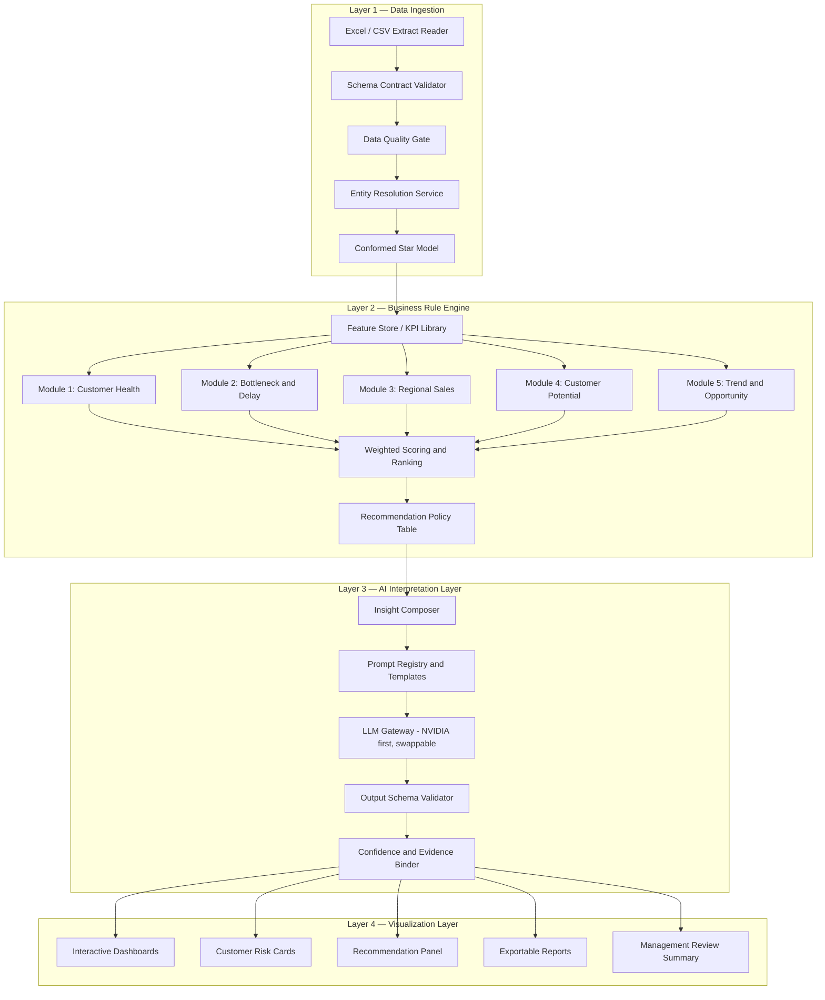
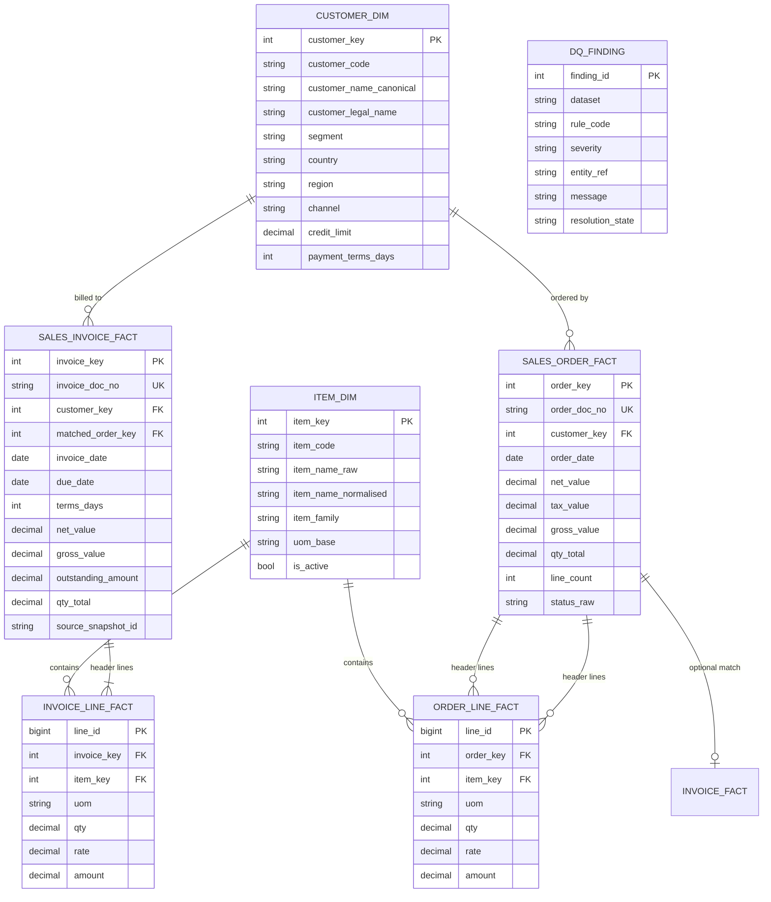
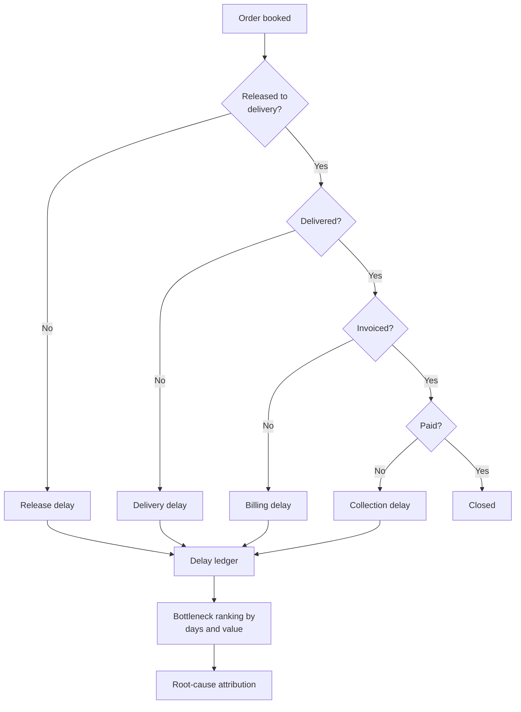
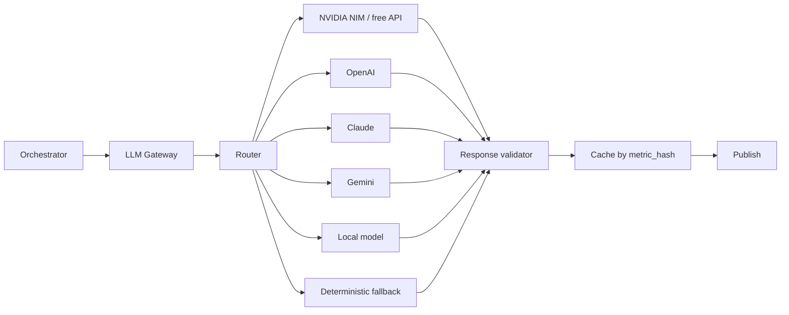
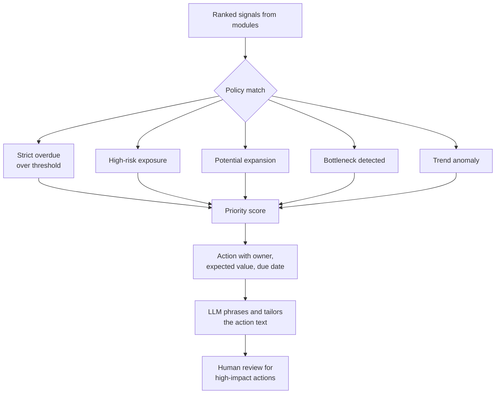

# HNS — AI-Based Sales Analytics & Decision Intelligence Platform

Project Flow, Architecture and Engineering Design Document

**Project code:** HNS
**Document type:** Project flow / architecture / design specification
**Document version:** 1.0
**Source of requirements:** `AI_Sales_Analytics_POC_Requirement_Document.docx`
**Status:** Design specification built on top of a delivered data sample

---

## 0. How To Read This Document

This document describes the HNS platform: an AI-assisted sales analytics and
recommendation engine intended to analyse ERP transactional data and produce
interpreted, parameter-driven business recommendations.

Because the delivered repository contains a **requirement document and a data
sample only** — no application source code — every statement in this document is
explicitly tagged so that a reviewer can always separate evidence from design:

| Tag | Meaning |
| --- | --- |
| `[OBSERVED]` | Verified directly from the files in this repository. Numbers are reproducible from the workbooks described in §4. |
| `[REQUIRED]` | Stated by the client's requirement document. |
| `[PROPOSED]` | A design recommendation made by this document. Not implemented. |
| `[PSEUDOCODE]` | Illustrative algorithm, not production code. |
| `[ASSUMPTION]` | An inference that is plausible but not proven by the delivered data. Must be confirmed with the business. |
| `[BLOCKED]` | Cannot be computed or verified with the currently available data. |

Anything without a tag in a heading or table caption should be read as
`[PROPOSED]` design narrative.

---

## 1. Executive Summary

### 1.1 What the client wants `[REQUIRED]`

The requirement document asks for an "AI-Based Sales Analytics & Decision
Intelligence Platform" that:

- analyses the complete **Order-to-Cash** lifecycle — Sales Orders, Sales
  Invoices, Delivery information, Payment behaviour, Debit/Credit Notes, Sales
  Returns, customer trends and operational bottlenecks;
- implements five analytical modules — **Customer Health & Discontinuation
  Intelligence**, **Sales Bottleneck & Delay Analysis**, **Regional Sales
  Intelligence**, **Customer Potential Analysis**, and **Trend & Opportunity
  Analysis**;
- produces **explanations, justifications, supporting parameters, confidence
  levels and suggested actions**, not just numbers;
- is explicitly *not* a static dashboard;
- uses **parameter-driven scoring, fixed business logic, controlled prompts and
  structured analytical pipelines** to guarantee repeatability;
- starts with **NVIDIA free LLM APIs** and scales later toward OpenAI, Claude,
  Gemini, local LLMs and enterprise deployments;
- is validated on a **15-day to 1-month** historical sample.

### 1.2 What actually exists `[OBSERVED]`

The repository contains **five files and zero lines of code**:

```
HNS/
├── AI_Sales_Analytics_POC_Requirement_Document.docx
├── Sales Invoice - DynaRep_Best Marine Private Limited__2026-04-01_2026-05-16_Sales Invoice_Submitted + Draft_Date Wise Sales Invoice.xlsx
├── Sales Invoice Details - DynaRep_Best Marine Private Limited__2026-04-01_2026-05-16_Sales Invoice_Submitted + Draft__Date Wise Sales Invoice.xlsx
├── Sales Order - DynaRep_Best Marine Private Limited__2026-04-01_2026-05-16_Date Wise Sales Order.xlsx
└── Sales Order Details - DynaRep_Best Marine Private Limited__2026-04-01_2026-05-16__Submitted + Draft_Date Wise Sales Order.xlsx
```

There is no API specification, no database schema, no code, no configuration,
no infrastructure definition and no test suite.

### 1.3 The three findings that shape the entire design

**Finding 1 — The data is good, but it is a quarter of a month, not a quarter of a year.**
The usable sample is a single month of April 2026. Any "trend", "churn" or
"seasonality" module cannot be validated on this sample; it can only be
*architected*. This is the single most important constraint on the POC and it is
a scoping conversation, not an engineering problem.

**Finding 2 — The requirement asks for Order-to-Cash; the data is only Order-to-Invoice.**
Of the eight datasets named in §7 of the requirement (Customer Master, Sales
Orders, Sales Invoices, Payment Entries, Credit Notes, Debit Notes, Sales
Returns), **three exist** (Sales Orders, Sales Invoices — both header and child
tables) and **five are absent**. Critically, there is **no payment-entry
dataset**, so genuine payment *behaviour* — DSO, days-to-pay, payment slippage,
payment-frequency drift — is not measurable at all. `Outstanding Amount` is a
single snapshot balance, not a payment history.

**Finding 3 — Customer identity is fragmented, and fragmentation is the dominant analytical risk.**
The order export contains **12 distinct customer strings** and the invoice
export contains **33**, but only **7 appear in both**. Twenty-six customers
invoice without ever appearing on an order, and five appear on orders without
ever invoicing. On top of that, three invoice strings
(`Best Marine Exports`, `Best Marine Online`, `Best Marine Pvt Ltd Delhi`) are
almost certainly one customer group that together accounts for **50.91 %** of
invoiced value. Without entity resolution, a "customer risk" score is computed
against the wrong legal entity and the recommendation is wrong.

### 1.4 Verified baseline at a glance `[OBSERVED]`

| Metric | Sales Invoice | Sales Order |
| --- | --- | --- |
| Data rows (after footer removal) | 610 | 37 |
| Child / detail rows | 3,333 | 415 |
| Distinct documents | 610 | 37 (32 with lines) |
| Date range in data | 02-Apr-2026 → 30-Apr-2026 | 01-Apr-2026 → 29-Apr-2026 |
| Distinct dates | 15 | 12 |
| Net value (`Amt.Total`) | 10,408,405.39 | 4,549,969.80 |
| Gross value (`Grand Total`) | 10,829,459.06 | 5,106,918.32 |
| Taxes / charges | not in invoice export | 556,948.52 |
| Quantity (`Qty Total`) | 14,998 | 6,860 |
| Distinct customer strings | 33 | 12 |
| Distinct items | 182 | — |

### 1.5 Recommendation to the client

Proceed, but split the POC into two explicitly different tracks:

1. **Build track** — the deterministic, auditable analytics engine (ingestion,
   data quality, entity resolution, feature store, weighted rule engine,
   dashboards). This is fully achievable on the current data and is where all
   the durable business value sits.
2. **Validate track** — the LLM interpretation layer that consumes the rule
   engine's structured output and converts it into narrative, explanations and
   recommended actions. This is achievable, but its *quality* can only be
   judged once payment, delivery and returns data arrive.

Everything the requirement calls "AI" that is actually arithmetic should be
arithmetic. The LLM's job is interpretation and phrasing, not calculation.

---

## 2. Requirement Traceability Matrix `[REQUIRED] → [PROPOSED]`

| # | Requirement (source §) | Required capability | Data available now | Buildable now? |
| --- | --- | --- | --- | --- |
| R1 | §3 Order-to-Cash lifecycle | Full O2C modelling | Orders + invoices only | **Partially** — O2I only |
| R2 | §5 Module 1: Customer Health & Discontinuation Intelligence | Customer health score, churn early warning | Invoices + outstanding snapshot | **Partially** — health yes, churn not validatable |
| R3 | §5 Module 2: Sales Bottleneck & Delay Analysis | Cycle-time and delay root cause | Order→invoice link absent, no delivery | **Partially** — data-quality and order-side delays only |
| R4 | §5 Module 3: Regional Sales Intelligence | Region-wise performance | **No region field anywhere** | **No** — blocked on data |
| R5 | §5 Module 4: Customer Potential Analysis | Upsell / cross-sell potential | Item + quantity history for 1 month | **Partially** — descriptive only |
| R6 | §5 Module 5: Trend & Opportunity Analysis | Trends, seasonality, whitespace | 15–29 days only | **Architect only** |
| R7 | §6 AI reasoning | Explanation, parameters, confidence, actions | Derived from rule engine output | **Yes** |
| R8 | §10 Consistency & reliability | Parameter-driven, repeatable output | Deterministic rule engine | **Yes** |
| R9 | §9 Architecture | NVIDIA LLM first, swappable later | — | **Yes** — provider abstraction |
| R10 | §12 Output formats | Dashboards, summaries, risk cards, recommendation panels, exports, review summaries | — | **Yes** |
| R11 | §8 Validation | 15-day to 1-month sample | Exactly that | **Yes** — with stated limits |
| R12 | §13 Future scope | Forecasting, churn, demand, conversational AI, alerts | — | Deferred |

---

## 3. Proposed System Architecture

The requirement proposes four layers (§11). This document adopts those four
layers and decomposes each into concrete components.

### 3.1 Layer map `[PROPOSED]`



### 3.2 Layer 1 — Data Ingestion

Responsibility: turn four flat ERP exports into one trustworthy, versioned,
analytically-shaped dataset. This layer is where the real engineering effort
should go, because every downstream number depends on it.

| Component | Responsibility | Key design decision |
| --- | --- | --- |
| `extract_reader` | Reads `.xlsx` / `.csv` from a drop folder, parses the single `Query Report` sheet, records file name, size, mtime and SHA-256 | Content hash, not mtime, decides whether a re-run is needed |
| `schema_contract` | Declarative column contract per dataset: name, dtype, nullability, semantic role, unit | Contracts live in YAML so business users can extend them without a code change |
| `dq_gate` | Runs structural, referential and business-rule checks; emits a quality score and a blocking verdict | Failures are **quarantined**, not silently dropped |
| `entity_resolution` | Maps raw `Customer Name` strings onto a governed `customer_key`; maps free-text `Item Name` onto `item_key` | Deterministic rules first, fuzzy match only as a proposal a human confirms |
| `conformed_model` | Materialises the star schema in §5 | Versioned snapshots; every insight is reproducible against a snapshot id |

### 3.3 Layer 2 — Business Rule Engine

Responsibility: compute every number. No LLM touches arithmetic.

Design principles, in order of importance:

1. **Determinism** — same snapshot + same parameter set ⇒ byte-identical output.
2. **Auditability** — every published number links to the rows that produced it.
3. **Parameterisation** — weights, thresholds and bands live in configuration,
   not code, so the business can tune without a deployment.
4. **Modularity** — the five modules are independent and can be enabled
   individually as data arrives.

### 3.4 Layer 3 — AI Interpretation Layer

Responsibility: take the rule engine's structured output and produce the
narrative, the justification, the confidence statement and the recommended
action — the things the requirement calls "AI reasoning".

Design principles:

1. The LLM **never invents a number.** It may only restate numbers supplied in
   its input, and its output is schema-validated against the input.
2. Every generation is **controlled by a versioned prompt template** stored in a
   prompt registry, with a pinned model id and temperature.
3. Every output carries an **evidence list** of `metric_id`s consumed from the
   rule engine.
4. A **deterministic narrative fallback** exists: if the LLM call fails or
   fails validation, a templated sentence generator produces the insight from
   the same metric set. The dashboard never goes blank because a third-party
   API was down.

### 3.5 Layer 4 — Visualization Layer

| Surface | Audience | Content |
| --- | --- | --- |
| Executive dashboard | Management | Revenue, realisation, concentration, top risks, top opportunities |
| Customer risk card | Sales / accounts | Health score, component scores, drivers, confidence, recommended action |
| Recommendation panel | Sales / ops | Ranked actions with expected value and effort |
| Module dashboards | Analysts | One per analytical module, with drill-down to source rows |
| Exportable report | Management review | Static snapshot with all parameters and snapshot id printed |

---

## 4. Delivered Dataset — Reverse-Engineered Specification

This section is entirely `[OBSERVED]`. It is the ground truth on which the
proposed architecture must operate.

### 4.1 Extraction conventions `[OBSERVED]`

- Every workbook contains a **single worksheet named `Query Report`**.
- Each sheet has **one header row**, one row per transaction header or line,
  and a **final `Grand Total` footer row** whose first cell is the literal
  string `Grand Total`.
- Filtering rule that is applied before any computation:

  ```python
  DATA_ROW = df.iloc[:, 0].astype(str).str.match(r"^\d{2}-[A-Za-z]{3}-\d{2}$")
  df = df[df[DATA_ROW]].reset_index(drop=True)
  ```

  This regex matches the real posting dates (`02-Apr-26`) and rejects the
  `Grand Total` footer. **This single step is critical** — an unfiltered frame
  silently inflates every total by one row and is the most common way this kind
  of ERP extract gets mis-analysed.

### 4.2 Sales Invoice header `[OBSERVED]`

**File:** `Sales Invoice - DynaRep_Best Marine Private Limited__2026-04-01_2026-05-16_Sales Invoice_Submitted + Draft_Date Wise Sales Invoice.xlsx`

| # | Column | Observed dtype | Semantic role |
| --- | --- | --- | --- |
| 0 | `Date` | text `dd-MMM-yy` | Invoice date |
| 1 | `Customer Name` | text | Party ledger name |
| 2 | `Amt.Total` | number | Invoice value **excluding** tax/charges |
| 3 | `Qty Total` | number | Header quantity (mixed UoM, see §4.8) |
| 4 | `Grand Total` | number | Invoice value **including** tax/charges |
| 5 | `Outstanding Amount` | number | Residual balance at export time |
| 6 | `Due Date` | text `dd-MMM-yy` | Payment due date |
| 7 | `Doc.No.` | text | Invoice number — **primary key** |

**Row accounting:** 611 raw rows − 1 footer = **610 data rows**, all with a
distinct `Doc.No.`.

### 4.3 Sales Invoice detail `[OBSERVED]`

**File:** `Sales Invoice Details - DynaRep_Best Marine Private Limited__2026-04-01_2026-05-16_Sales Invoice_Submitted + Draft__Date Wise Sales Invoice.xlsx`

| # | Column | Observed dtype | Semantic role |
| --- | --- | --- | --- |
| 0 | `Posting Date` | text `dd-MMM-yy` | Line posting date |
| 1 | `Customer Name` | text | Party ledger name |
| 2 | `Item Name` | text | Free-text item description |
| 3 | `Qty` | number | Line quantity |
| 4 | `Uom` | text | Unit of measure — `Nos` or `Pair` |
| 5 | `Rate` | number | Unit rate |
| 6 | `Amount` | number | **Extended, tax-exclusive** line value |
| 7 | `Item Sl No.` | number | Line sequence |
| 8 | `Doc.No.` | text | Foreign key → invoice header |

**Row accounting:** 3,334 raw − 1 footer = **3,333 line rows** across **610**
distinct documents.

### 4.4 Sales Order header `[OBSERVED]`

**File:** `Sales Order - DynaRep_Best Marine Private Limited__2026-04-01_2026-05-16_Date Wise Sales Order.xlsx`

| # | Column | Observed dtype | Semantic role |
| --- | --- | --- | --- |
| 0 | `Date` | text `dd-MMM-yy` | Order date |
| 1 | `Customer Name` | text | Party ledger name |
| 2 | `Qty Total` | number | Header quantity |
| 3 | `Amt.Total` | number | Order value excluding tax |
| 4 | `Grand Total` | number | Order value including tax |
| 5 | `Doc.No.` | text | Order number — **primary key** |
| 6 | `Total Taxes/Charges` | number | Tax/charge total |
| 7 | `Discount Amt` | number | Discount, zero on all 37 rows |

**Row accounting:** 38 raw − 1 footer = **37 data rows**, all with a distinct
`Doc.No.`.

### 4.5 Sales Order detail `[OBSERVED]`

**File:** `Sales Order Details - DynaRep_Best Marine Private Limited__2026-04-01_2026-05-16__Submitted + Draft_Date Wise Sales Order.xlsx`

| # | Column | Observed dtype | Semantic role |
| --- | --- | --- | --- |
| 0 | `Posting Date` | text `dd-MMM-yy` | Line posting date |
| 1 | `Customer Name` | text | Party ledger name |
| 2 | `Item Name` | text | Free-text item description |
| 3 | `Qty` | number | Line quantity |
| 4 | `Uom` | text | Unit of measure |
| 5 | `Rate` | number | Unit rate |
| 6 | `Amount` | number | Extended, tax-exclusive line value |
| 7 | `Sl No.Item` | number | Line sequence |
| 8 | `Doc.No.` | text | Foreign key → order header |

**Row accounting:** 416 raw − 1 footer = **415 line rows** across **32**
distinct documents.

### 4.6 Reference-integrity report `[OBSERVED]`

| Relationship | Result | Verdict |
| --- | --- | --- |
| Invoice header `Doc.No.` → invoice detail | 610 / 610 matched | **Clean** |
| Invoice detail `Amount` summed vs header `Amt.Total` | 610 / 610 exact to 2 dp | **Clean** |
| Invoice detail `Qty` summed vs header `Qty Total` | 610 / 610 exact | **Clean** |
| Order header `Doc.No.` → order detail | 32 / 37 matched | **5 orphans** |
| Order detail `Amount` summed vs header `Amt.Total` (matched only) | 32 / 32 exact | **Clean** |
| Order detail `Qty` summed vs header `Qty Total` (matched only) | 32 / 32 exact | **Clean** |
| Order detail documents with no header | 0 | **Clean** |

So the invoice side is internally perfect. **The order side is not.**

#### 4.6.1 The five orphan orders — root cause `[OBSERVED]`

This is worth writing out in full because it is the concrete example that
justifies the data-quality gate in Layer 1.

| Order `Doc.No.` | Date | Customer | Qty | Net | Gross | Diagnosis |
| --- | --- | --- | --- | --- | --- | --- |
| `SO-2526-MH00265-1` | 01-Apr-26 | Dynacom Tankers Management Pvt Ltd | 6 | 6,120.00 | 6,426.00 | No detail rows; **no twin document exists** |
| `SO-2526-MH00265-2` | 01-Apr-26 | Dynacom Tankers Management Pvt Ltd | 6 | 6,120.00 | 6,426.00 | Byte-identical twin of the row above; no detail rows |
| `SO-2627-AD00007` | 09-Apr-26 | Executive Ship Management Pte Ltd | 406 | 193,106.00 | 202,761.30 | `SO-2627-AD00007-1` **exists with identical qty, net and gross**; its 17 detail lines sum to exactly 193,106.00 / 406 |
| `SO-2627-AD00013` | 14-Apr-26 | Bureau Veritas India Pvt Ltd | 33 | 75,570.00 | 79,348.50 | `SO-2627-AD00013-1` **exists with identical qty, net and gross**; its 4 detail lines sum to exactly 75,570.00 / 33 |
| `SO-2627-MH00005` | 07-Apr-26 | Hydra Safety Trading Llc | 267 | 4,088.12 | 4,088.12 | `SO-2627-MH00005-1` exists but with **different** values (16 lines, 3,790.12, qty 247) — a genuine mismatch, not a suffix artefact |

Two distinct failure modes are present:

- **Mode A — suffixing.** For `SO-2627-AD00007` and `SO-2627-AD00013` the line
  items were posted under a `-1` suffixed document number. The header and the
  detail describe the *same* order. A naive join reports "missing lines"; the
  business reality is "lines filed under the wrong number". Treating these as
  zero-line orders would understate order fulfilment analysis for two orders
  worth 268,676.00 net.
- **Mode B — genuine gap.** `SO-2526-MH00265-1` and `SO-2526-MH00265-2` are an
  apparently duplicated pair with no lines and no suffixed twin. Either the
  order was never released to billing, or the line extract is incomplete.
  These must go to the business for confirmation — the engine must not guess.
- **Mode C — value conflict.** `SO-2627-MH00005` versus `SO-2627-MH00005-1`
  differ in both quantity (267 vs 247) and value (4,088.12 vs 3,790.12), a
  297.00 difference. Auto-linking them would be wrong; a human decides.

### 4.7 Customer fragmentation `[OBSERVED]`

| Set | Count |
| --- | --- |
| Distinct customer strings in the order export | 12 |
| Distinct customer strings in the invoice export | 33 |
| Present in **both** exports | 7 |
| Order-only (ordered, never invoiced in sample) | 5 |
| Invoice-only (invoiced, never ordered in sample) | 26 |

Order-only: `Akrotiri Tankers Ltd`, `Bureau Veritas India Pvt Ltd`,
`DELOS NAVIGATION LTD.`, `Osm Fleet Management India Private Limited`,
`Sarvam Safety Equipment Private Limited`.

Invoice-only includes 24 real counterparties plus **`Cash Sale`**, which is not
a customer at all — it is a counterparty placeholder for over-the-counter
transactions (75 invoices, 133,391.69 gross). It must be bucketed as a channel,
not scored as a relationship.

**Consequence:** joining orders to invoices by `Customer Name` is unsafe, and
matching on 7 of 33 customers would discard the large majority of activity. The
engine must run on `customer_key` from the resolution service (§6), never on the
raw string.

#### 4.7.1 The Best Marine concentration `[OBSERVED]`

| Raw string | Invoices | Gross invoiced | Outstanding |
| --- | --- | --- | --- |
| `Best Marine Exports` | 20 | 5,011,852.93 | 5,011,855.00 |
| `Best Marine Pvt Ltd Delhi` | 7 | 477,050.19 | 0.00 |
| `Best Marine Online` | 12 | 24,735.45 | 24,736.00 |
| **Group total** | **39** | **5,513,638.57** | **5,036,591.00** |

- Group share of invoiced value: **50.91 %**.
- Single largest string share: **46.28 %**.
- Top 5 customers: **76.52 %**. Top 10 customers: **90.88 %**.

The group-level view is materially different from the string-level view:
`Best Marine Exports` looks catastrophically delinquent (≈100 % outstanding)
while `Best Marine Pvt Ltd Delhi` is fully settled. Whether these are genuinely
different entities with different credit terms or one group on one commercial
arrangement is exactly the question the client must answer — and it is the
single highest-value question in the dataset, because it governs 50 % of revenue.

### 4.8 Units of measure `[OBSERVED]`

Invoice detail UoM distribution:

| UoM | Line count | Share |
| --- | --- | --- |
| `Nos` | 2,664 | 79.9 % |
| `Pair` | 669 | 20.1 % |

`Qty Total = 14,998` at header level is therefore **not a physically meaningful
single quantity** — it adds individual items and pairs of items. Any
quantity-based KPI (units sold, average order size in units, demand signal) is
invalid unless it is split by UoM first. This is a small detail with large
downstream consequences.

### 4.9 Tax, gross-versus-net, and outstanding artefacts `[OBSERVED]`

- Invoice-level difference between `Grand Total` and detail `Amount` summed:
  **4.045 %** of net value — this is tax/charges, present on the header but not
  on lines. Comparisons must declare which basis they use. This document uses
  **net** for performance and **gross** for cash exposure.
- Outstanding sometimes **exceeds** the day's invoiced gross by a rounding
  amount. Example, 2026-04-03: invoiced gross 502,247.52, outstanding
  502,248.00. Example, `Best Marine Exports`: invoiced 5,011,852.93,
  outstanding 5,011,855.00. The conclusion is that `Outstanding Amount` is
  derived at a finer granularity than the rounded `Grand Total` shown on the
  header. Outstanding must therefore be treated as a **separate authoritative
  measure**, never recomputed as `Grand Total − allocated payments`, and never
  compared to gross with a zero-tolerance equality test.

### 4.10 Payment terms `[OBSERVED]`

Derived as `Due Date − Date`:

| Term | Invoices | Share |
| --- | --- | --- |
| 0 days | 507 | 83.1 % |
| 4 days | 2 | 0.3 % |
| 30 days | 101 | 16.6 % |

Two useful consequences:

1. Term 0 dominates. For those invoices, **any residual balance is already past
   its due date** — so the strict-overdue subset can be computed without
   payment history.
2. `[ASSUMPTION]` If the `Outstanding Amount` snapshot date is the export end
   date implied by the file name (16-May-2026), then term-0 invoices dated in
   April are **16 to 44 days past due**. This assumption must be confirmed
   before the number is shown to a customer of the business.

### 4.11 Coverage and concentration `[OBSERVED]`

| Metric | Value |
| --- | --- |
| Invoice date range (data) | 02-Apr-2026 → 30-Apr-2026 |
| Order date range (data) | 01-Apr-2026 → 29-Apr-2026 |
| Date range (file names) | 01-Apr-2026 → 16-May-2026 |
| Distinct invoice dates | 15 |
| Distinct order dates | 12 |
| Distinct invoice items | 182 |
| Top item share | 11.13 % (`Boilersuit-~-MOL-~-StatSafe-Orange…`) |
| Top 10 items share | 40.92 % |

**Note the discrepancy** `[OBSERVED]`: the file names advertise coverage through
16-May-2026 but no row in any of the four sheets is dated after 30-Apr-2026.
Either the extract range was widened at query time or the second half of May had
no transactions. The pipeline records both the declared range and the observed
range and raises a warning when they disagree — a silent gap is worse than a
loud one.

Item granularity is also free text with embedded delimiters (`-~-`, `-`, `;`),
which makes grouping unstable. See §6.2.

### 4.12 Order-side value summary `[OBSERVED]`

| Customer | Orders | Qty | Net | Gross | Tax % |
| --- | --- | --- | --- | --- | --- |
| Osm Fleet Management India Private Limited | 1 | 1,341 | 2,817,530.00 | 3,287,115.40 | 16.67 |
| Executive Ship Management Pte Ltd | 6 | 1,389 | 686,820.00 | 721,161.00 | 5.00 |
| Dynacom Tankers Management Pvt Ltd | 8 | 527 | 529,908.00 | 557,968.36 | 5.30 |
| Bureau Veritas India Pvt Ltd | 2 | 66 | 151,140.00 | 158,697.00 | 5.00 |
| Msc Shipmanagement Limited Cyprus | 1 | 178 | 114,610.00 | 120,340.50 | 5.00 |
| V.Ships India Pvt.Ltd. | 2 | 120 | 79,752.00 | 84,503.74 | 5.96 |
| Sarvam Safety Equipment Private Limited | 1 | 50 | 58,990.00 | 62,646.70 | 6.20 |
| Hydra Safety Trading Llc | 12 | 2,992 | 45,903.60 | 45,903.60 | 0.00 |
| Apeejay Shipping Limited | 1 | 54 | 43,200.00 | 45,360.00 | 5.00 |
| Shipskart Marine Private Limited | 1 | 19 | 20,579.85 | 21,608.85 | 5.00 |
| DELOS NAVIGATION LTD. | 1 | 86 | 1,046.20 | 1,098.52 | 5.00 |
| Akrotiri Tankers Ltd | 1 | 38 | 490.15 | 514.65 | 5.00 |

Observations that matter for design:

- **Extreme order-side concentration.** One order (`Osm Fleet`, 2,817,530.00)
  is **61.9 %** of total net order value.
- **Order value is far below invoice value** (4,549,969.80 vs 10,408,405.39
  net). `[ASSUMPTION]` The order export is almost certainly *filtered* — the
  file name contains `Date Wise Sales Order` without a status qualifier, but 37
  orders cannot plausibly be the month's only orders for a business invoicing
  10.4 M. Treat the order side as a **partial** extract and do not compute
  order-to-invoice conversion from it.
- **Tax rates are inconsistent**: 5.00 % predominates, but 16.67 %, 6.20 %,
  5.96 %, 5.30 % and 0.00 % all appear. `Hydra Safety Trading` at 0.00 % is
  either zero-rated or exempt. A tax module must not hard-code 5 %.
- **Discount is 0.00 on all 37 orders** in this sample — the column exists but
  carries no information. A discount analysis module has nothing to chew on yet.

---

## 5. Target Analytical Data Model `[PROPOSED]`

A conformed star schema, so that Layer 2 modules query stable, governed tables
rather than re-deriving logic per dashboard.



Key modelling decisions and their justification:

1. **`sales_invoice_fact.matched_order_key` is nullable and optional.** No
   reliable order→invoice foreign key exists in the delivered data (§2, R1).
   Modelling it as required would force a fabricated join.
2. **Tax on order headers but not invoice lines.** The invoice export has no tax
   column, only `Grand Total`. Storing `gross_value` and `net_value` on the
   invoice fact preserves both bases without fabricating a tax amount.
3. **`dq_finding` is a first-class table.** The five orphan orders in §4.6.1 are
   not edge cases to be fixed once; they are permanent, queryable facts that
   every published metric must be able to reference.
4. **No `region` column is populated** because no source column exists
   (§2, R4). It is present in the model and explicitly `NULL`, so that the
   Regional module can activate the day a region-bearing extract arrives.

---

## 6. Entity Resolution & Data Quality

### 6.1 Customer resolution `[PROPOSED]`

Deterministic, in strict priority order. No fuzzy matching in the serving path.

| Rule | Rule definition | Observed example |
| --- | --- | --- |
| R-1 | Exact match on normalised legal name | — |
| R-2 | Alias / DBA table lookup (governed, human-maintained) | `Best Marine Online` → `Best Marine Exports` group |
| R-3 | Parent–subsidiary map, only when the business confirms | `Best Marine Pvt Ltd Delhi` → group `Best Marine` |
| R-4 | Known non-customer bucket | `Cash Sale` → channel `counter` |
| R-5 | Unresolved → own `customer_key`, flagged `unverified` | — |

Normalisation steps, in order: trim, collapse internal whitespace, strip
punctuation, case-fold, expand common legal-form suffixes
(`pvt`, `private`, `limited`, `ltd`, `llc`, `dmcc`, `pte`, `sdn bhd`, …) only
for *candidate generation*, never for the stored canonical name.

**Proposal workflow** `[PROPOSED]`: whenever R-2/R-3 has no entry, generate a
candidate pair list (token-set similarity, shared domain, shared tax identifier
if ever supplied), present it to a data steward, and store the human decision as
a versioned mapping row. This keeps the automated path deterministic while
letting human judgement improve it over time.

### 6.2 Item resolution `[PROPOSED]`

`Item Name` is free text with embedded structure — observed examples such as

```
Boilersuit-~-MOL-~-StatSafe-Orange -JAP-BM.CL-CT-UV-~-~-2pc
Parka-BM ColdStar-~-N.Blue-Polyster-~-BM.CL-Hooded-Cold Prot-HiViz-WR-- 20° C-~
Safety Shoes-Legasea-Xtreme-Black-PU-Single Density-Leather-StatSafe-O.R-I.R-S.A-Anti Slip-Steel Toe
```

The delimiters are inconsistent (`-~-`, `-`, spaces, `;`), the hierarchy is
implicit, and the trailing token is a pack size (`2pc`) that mixes with colour
and brand. Proposed pipeline:

1. **Parse** on the observed delimiters into `[product family, brand, model,
   attribute…, pack]`, keeping the raw string intact.
2. **Normalise** case, spaces, hyphens, degree symbols, units.
3. **Extract pack size** into its own column so that quantity can be converted
   to a base unit.
4. **Cluster** on the normalised token set; name clusters `item_key`.
5. **Human-confirm** the mapping between `item_family` and the commercial
   category taxonomy that the sales team already uses.

Until step 5 is done, item-family analytics are indicative only.

### 6.3 Data-quality rule catalogue `[PROPOSED]`

Each rule has a code, severity, and blocking behaviour.

| Code | Rule | Severity | On failure |
| --- | --- | --- | --- |
| `DQ-001` | Required columns present with expected names | **Blocker** | Reject the file |
| `DQ-002` | Footer row removed by date regex | **Blocker** | Reject if any footer survives |
| `DQ-003` | `Doc.No.` unique within dataset | **Blocker** | Quarantine duplicates |
| `DQ-004` | Every detail `Doc.No.` has a header | High | Emit finding; keep both |
| `DQ-005` | Σ line `Amount` = header `Amt.Total` (2 dp) | High | Emit finding; flag the document |
| `DQ-006` | Σ line `Qty` = header `Qty Total` | High | Emit finding |
| `DQ-007` | `Grand Total` ≥ `Amt.Total` | Medium | Emit finding |
| `DQ-008` | `Due Date` ≥ `Date` | Medium | Emit finding |
| `DQ-009` | `0 ≤ Outstanding ≤ Grand Total ± tolerance` | Medium | Emit finding, do not auto-correct |
| `DQ-010` | `Qty ≥ 0`, `Rate ≥ 0`, `Amount ≥ 0` | High | Quarantine the row |
| `DQ-011` | Single UoM per item_key | High | Block UoM-blind aggregation |
| `DQ-012` | Customer name resolves to `customer_key` | High | Emit `unverified` flag |
| `DQ-013` | Observed date range within declared range | Medium | Warn loudly |
| `DQ-014` | Rate variance vs trailing median > 50 % | Info | Emit finding for review |
| `DQ-015` | Non-customer placeholders present | Info | Bucket and warn |

`DQ-009` is deliberately a tolerance test, not equality, for the rounding reason
established in §4.9.

---

## 7. Data Flow

### 7.1 End-to-end pipeline `[PROPOSED]`

```mermaid
flowchart LR
    X["ERP exports x4"] --> R["1. Read and hash"]
    R --> V["2. Schema contract check"]
    V --> G["3. Footer strip and typing"]
    G --> Q["4. DQ rules DQ-001..015"]
    Q --> E["5. Entity resolution"]
    E --> S["6. Build star schema snapshot"]
    S --> F["7. Feature store materialisation"]
    F --> M["8. Five analytical modules"]
    M --> W["9. Weighted scoring and ranking"]
    W --> P["10. Recommendation policy"]
    P --> L["11. LLM interpretation"]
    L --> O["12. Schema validation and evidence bind"]
    O --> D["13. Dashboards and exports"]
    W --> D
    Q -.->|"quarantine and alerts"| A["Data steward queue"]
```



Steps 1–7 and 9–10 are **deterministic**. Step 8 is deterministic given
parameters. Only step 11 is non-deterministic, and only in wording — never in
the numbers it is allowed to cite.

### 7.2 Incremental vs full reload `[PROPOSED]`

Given the sample size, **full reload is correct** `[OBSERVED rationale]` — the
entire dataset is ~40 KB of data across 4,395 rows. A full rebuild is
milliseconds and removes an entire class of incremental-correctness bugs. The
production design should still include:

- a `snapshot_id` = `sha256(file_name, file_content, code_version, param_version)`;
- every published metric carries its `snapshot_id`;
- if the content hash is unchanged, the pipeline short-circuits and the previous
  outputs are republished verbatim — which is itself a determinism test.

### 7.3 Scheduling `[PROPOSED]`

| Phase | Trigger | Idempotent |
| --- | --- | --- |
| Ingest + DQ | File-drop watcher or scheduled job | Yes, hash-guarded |
| Rebuild star + features | On new validated snapshot | Yes |
| Run modules | On demand or after rebuild | Yes |
| LLM narrative generation | On demand, cache by `metric_hash` | Yes |
| Publish | After full validation | Yes |

LLM results are cached by `metric_hash`, so re-running the pipeline without a
data change costs zero API calls and produces an identical narrative.

---

## 8. Feature Store

### 8.1 Naming and grain `[PROPOSED]`

Every feature is `(feature_id, entity_type, entity_key, window, value,
as_of_date, snapshot_id)`. `entity_type ∈ {customer, item, order, invoice,
company}`. `window ∈ {7d, 30d, 90d, 180d, 365d, all}`.

### 8.2 Feature catalogue — computable now `[OBSERVED inputs → PROPOSED definitions]`

| Feature ID | Definition | Computable now? |
| --- | --- | --- |
| `f.inv.gross_30d` | Σ `Grand Total` over trailing 30 days | Yes |
| `f.inv.net_30d` | Σ `Amt.Total` over trailing 30 days | Yes |
| `f.inv.count_30d` | Invoice count over trailing 30 days | Yes |
| `f.inv.avg_ticket_30d` | `net_30d / count_30d` | Yes |
| `f.inv.outstanding_total` | Σ `Outstanding Amount` | Yes |
| `f.realisation_rate` | `1 − (Σ outstanding / Σ gross)` | Yes |
| `f.strict_overdue_amt` | Σ outstanding where `terms_days = 0` | Yes |
| `f.overdue_age_max` | Max days past due among term-0 invoices `[ASSUMPTION snapshot date]` | Yes, with confirmed snapshot date |
| `f.tax_rate_effective` | `1 − net/gross` | Yes |
| `f.cust.concentration_share` | Customer gross ÷ company gross | Yes |
| `f.cust.item_breadth` | Distinct `item_key` purchased | Yes (after §6.2) |
| `f.cust.uom_mix` | Share of lines in each UoM | Yes |
| `f.cust.discount_rate` | Σ discount ÷ Σ gross | **No** — discount zero/absent |
| `f.cust.orders_count` | Orders by resolved `customer_key` | Partially — order extract appears filtered |
| `f.cust.otif_rate` | On-time-in-full | **No** — needs delivery data |
| `f.cust.dso` | Days sales outstanding | **No** — needs payment entries |
| `f.cust.days_to_pay_p50` | Median days from invoice to payment | **No** — needs payment entries |
| `f.cust.return_rate` | Returns ÷ invoiced value | **No** — needs returns |
| `f.cust.credit_note_rate` | Credit notes ÷ invoiced value | **No** — needs credit/debit notes |
| `f.cust.region_perf` | Regional revenue and growth | **No** — needs region |
| `f.company.trend_index` | Linear slope on monthly revenue | **Architect only** — 1 month of data |

### 8.3 Illustrative computed values `[OBSERVED]`

| Metric | Value |
| --- | --- |
| Company gross invoiced | 10,829,459.06 |
| Company net invoiced | 10,408,405.39 |
| Company outstanding | 10,352,405.16 |
| Aggregate realisation rate | 4.405 % |
| Invoices with a residual balance | 603 / 610 |
| Invoices fully settled | 7 / 610 |
| Aggregate outstanding as % of gross | 95.595 % |
| Distinct invoiced customers | 33 |
| Top-1 customer share | 46.28 % |
| Top-5 customer share | 76.52 % |
| Top-10 customer share | 90.88 % |
| Distinct items | 182 |
| Top-10 item share | 40.92 % |
| Effective tax rate (invoice) | ~4.045 % of net |

The headline is uncomfortable and should be presented carefully: **4.405 % of
invoiced value has been realised**. Before anyone concludes that the business has
a collections crisis, note §4.10 — 83 % of invoices carry 0-day terms and the
snapshot is a single point in time on a month of activity. The engine's job is
to make exactly this distinction visible, not to hide it behind a number.

---

## 9. Module 1 — Customer Health & Discontinuation Intelligence

### 9.1 Available inputs and honest status

| Sub-capability | Status |
| --- | --- |
| Payment realisation and exposure | **Buildable now** |
| Revenue contribution and concentration | **Buildable now** |
| Order-to-invoice continuity (as proxy for relationship activity) | Buildable, weak — order extract appears filtered |
| Product-mix breadth and drift | Buildable after item resolution |
| Churn / discontinuation prediction | **Architect only** — needs ≥ 12 months |
| Delinquency risk modelling | **Blocked** — needs payment history |

### 9.2 Health score `[PROPOSED]`

All components normalised to 0–100, higher is healthier.

```text
H_realisation = 100 × (1 − outstanding_i / gross_i)
H_commitment  = 100 × (1 − min(1, overdue_share_i / overdue_cap))
H_revenue     = 100 × min(1, gross_i / gross_target_i)
H_diversity   = 100 × (1 − HHI_i)                    # Herfindahl over item mix
H_recency     = 100 × exp(−days_since_last_invoice_i / τ)
H_momentum    = 100 × clamp(0.5 + slope(gross)_i / 2·s_i, 0, 1)

Health_i = Σ_j w_j · H_j(i) / Σ_j w_j
```

with default weights held in configuration:

| Weight | Component | Business meaning |
| --- | --- | --- |
| 0.30 | `H_realisation` | Do they pay? |
| 0.20 | `H_commitment` | Do they respect terms? |
| 0.20 | `H_revenue` | How much do they matter to us? |
| 0.10 | `H_diversity` | Are we their only supplier? |
| 0.10 | `H_recency` | Are they still active? |
| 0.10 | `H_momentum` | Are they growing or shrinking? |

`H_revenue` is deliberately *not* "bigger is better" in isolation — it feeds a
separate exposure metric so that a large delinquent account cannot be hidden by
a healthy weighted average. It is reported alongside `Health`, never instead of
it.

### 9.3 Discontinuation risk `[PROPOSED]`

```text
Risk_i = 100 − Health_i
RiskAdjusted_i = Risk_i × Exposure_i
```

`Exposure_i = gross_i / Σ gross` on the **resolved** customer key, so
concentration enters the risk ranking rather than hiding inside it.

Bands `[PROPOSED]`, to be confirmed by the business:

| Band | Score | Default action |
| --- | --- | --- |
| Critical | 70–100 | Account review within 3 days, senior owner |
| High | 50–70 | Collections contact, credit review |
| Watch | 30–50 | Monitor, proactive outreach |
| Stable | 0–30 | Standard cycle |

### 9.4 Worked example on real data `[OBSERVED inputs, PROPOSED method]`

For `Best Marine Exports` on the delivered sample:

```text
gross_i           = 5,011,852.93
outstanding_i     = 5,011,855.00
H_realisation     = 100 × (1 − 5,011,855.00 / 5,011,852.93) ≈ 0.0
exposure_i        = 5,011,852.93 / 10,829,459.06 = 46.28 %
```

Interpretation the engine would emit: the single largest revenue relationship,
46 % of the business, shows effectively zero realisation on the sample. **But**
this must be presented with its caveats attached — the entity may be `Best
Marine Pvt Ltd Delhi`, which has 477,050.19 invoiced and **zero** outstanding;
`Outstanding` may predate credit notes that were not extracted; and the snapshot
date is unconfirmed. The correct output is therefore *"entity resolution and
snapshot-date confirmation required before escalation"*, not *"customer is a
defaulter"*.

That distinction — flag for verification rather than assert — is a core design
principle of the AI layer (§12).

---

## 10. Module 2 — Sales Bottleneck & Delay Analysis

### 10.1 The intended analysis



### 10.2 What is computable today `[OBSERVED]`

The order→invoice→payment chain is **not linkable** — there is no order
reference on invoices and no order reference on payments because payments do not
exist. What *can* be computed is a data-pipeline and order-side delay analysis:

| Delay type | Proxy available | Status |
| --- | --- | --- |
| Order-entry to line-posting lag | `Posting Date` vs header `Date` on order lines | Buildable for the 32 linked orders |
| Order with no line items | 5 of 37 (§4.6.1) | Buildable — and it is a real finding |
| Order awaiting billing | Order docs with no plausible invoice, by amount and customer | Blocked — no join key, no order status |
| Tax/charge processing delay | Effective tax rate per order | Buildable |
| Invoice ageing | `Due Date`, `Outstanding` | Buildable as a snapshot |
| True delivery delay | — | **Blocked** — no delivery dataset |
| True billing delay | — | **Blocked** — no status timestamps |
| True collection delay | — | **Blocked** — no payment dataset |

### 10.3 Bottleneck output schema `[PROPOSED]`

```json
{
  "bottleneck_id": "BN-ORDER-LINE-MISSING",
  "stage": "order_to_billing",
  "affected_documents": [
    "SO-2526-MH00265-1", "SO-2526-MH00265-2", "SO-2627-AD00007",
    "SO-2627-AD00013", "SO-2627-MH00005"
  ],
  "affected_count": 5,
  "affected_net_value": 285004.12,
  "diagnosis": "suffixing_or_gap",
  "confidence": 0.82,
  "root_cause": "3 documents have lines posted under a -1 suffixed number; 2 have no lines anywhere",
  "recommended_action": "ERP configuration review on sales order document numbering",
  "evidence_metric_ids": ["dq.order_detail_orphan_count", "dq.order_suffix_match_value"]
}
```

Affected net value = 6,120.00 + 6,120.00 + 193,106.00 + 75,570.00 + 4,088.12 =
**285,004.12** `[OBSERVED arithmetic]`.

---

## 11. Modules 3–5 — Regional, Potential, Trends

### 11.1 Module 3 — Regional Sales Intelligence `[BLOCKED on data]`

**Status: cannot be built on the current extract.** No source column in any of
the four sheets carries region, state, country, port, or ship-manager
territory. Deriving region from the customer name is unsafe — `Executive Ship
Management Pte Ltd` is Singapore-incorporated, `Msc Shipmanagement Limited
Cyprus` is Cypriot, and both operate Indian coastal supply. Guessing region from
name would produce a confident, wrong map.

**What to request `[PROPOSED]`**, in priority order:

1. Customer master with billing/shipping address and service region;
2. Sales person / key-account manager with territory;
3. Port or vessel-to-region mapping if route analysis is in scope.

**Design ready to activate `[PROPOSED]`** — once `region` lands on
`customer_dim`, the module computes: revenue and gross margin by region, region
mix shift, region growth vs trailing window, region × product matrix, region
concentration risk (Herfindahl), and "region white space" = regions where
top-decile customers buy categories they do not currently buy.

### 11.2 Module 4 — Customer Potential Analysis

**Status: descriptive only on this sample.**

Available now `[OBSERVED]`:

| Asset | Value |
| --- | --- |
| Distinct items in the invoice detail | 182 |
| Distinct customer strings | 33 |
| Basket shape | Observable per invoice |
| Top-10 item share | 40.92 % |

Proposed potential model:

```text
Affinity(a, i)  = P(item i | customer a) / P(item i | company)
PotentialScore_a = Σ_i ( 1 − P(item i | a) ) · Value_i · Affinity(a, i) · Reach_a
```

Interpretation: for customer `a`, value the items they do **not** buy but
similar customers do buy, weighted by how reachable that expansion plausibly is.

**Honest caveats:**

- `P(item | customer)` computed from **15–20 invoices per customer** is
  statistically very weak. Every affinity must carry a minimum-support guard:
  customers with fewer than *n* observations fall back to segment-level priors
  and the output is labelled `low_confidence`.
- `Affinity` requires ≥ 12 months to mean anything. On one month it describes
  the past, not the opportunity.
- Gross margin is **not available** — there is no cost column in any sheet. So
  potential is ranked on **revenue**, not value. Any business decision that
  turns on profit needs a cost/price master.

### 11.3 Module 5 — Trend & Opportunity Analysis

**Status: architect only.**

With 15 distinct invoice dates spanning 29 calendar days, the platform can
produce a *daily* run-rate and a *within-month* shape. It **cannot** produce:

- month-over-month or year-over-year growth;
- seasonality;
- a statistically meaningful trend slope;
- a demand forecast with any error bar.

Observed daily invoice value does show non-trivial within-month variation —
2026-04-07 alone carries 1,783,224.07 gross, and 2026-04-09/10 carry
1,802,700.47 and 1,587,476.45 — so the dataset does exhibit structure worth
describing. Describing a month's shape is not forecasting.

Proposed feature store design `[PROPOSED]` that becomes live as history accrues:

| Horizon | Minimum history before the metric is published | Metric |
| --- | --- | --- |
| Daily run-rate | 30 days | `Σ gross / distinct_dates` |
| WoW growth | 8 weeks | `(week_t / week_{t-1}) − 1` |
| MoM growth | 3 months | `(month_t / month_{t-1}) − 1` |
| Seasonal index | 24 months | `month_value / mean(month_value)` |
| Trend slope + confidence | 12 months | OLS slope ± CI on monthly revenue |
| Demand signal per item | 12 months, min support 8 weeks | Weighted moving average, item level |

The publication guard is the design point: a metric is **suppressed with an
explicit "insufficient history" message** until its minimum window is met. A
dashboard that quietly shows a forecast built on one month is worse than one
that admits the gap.

---

## 12. Layer 3 — AI Interpretation Layer

### 12.1 Division of labour `[PROPOSED]`

| Question | Answered by |
| --- | --- |
| "What is the outstanding balance?" | Rule engine — exact |
| "Is this customer healthy?" | Rule engine — weighted formula |
| "Which customers are at risk and why?" | Rule engine ranks; **LLM writes the explanation** |
| "What should we do about it?" | Policy table proposes; **LLM phrases and tailors** |
| "How confident are we?" | Rule engine computes the confidence inputs |

The LLM's authority is bounded to: *organise*, *explain*, *prioritise
presentation*, and *draft a message*. It has no authority to compute, rank, or
invent.

### 12.2 Prompt contract `[PROPOSED]`

```text
SYSTEM
  You are the narrative layer of a sales analytics platform.
  You receive a JSON payload of PRE-COMPUTED metrics.
  Rules:
   1. Use ONLY numbers present in the payload. Never derive, round, or estimate.
   2. Every claim MUST cite at least one metric_id from the payload.
   3. If the payload contains "blocked": true, say the analysis is not possible
      and name the missing dataset. Do not estimate.
   4. Do not invent customer names, dates, product names, or causes.
   5. Tone: concise business English. No hedging filler, no apologies.
   6. Respect the audience field: adjust technical depth, not the facts.

USER
  audience: {sales_manager | analyst | executive}
  module:   {customer_health | bottleneck | regional | potential | trend}
  metrics:  <JSON payload>
  template: {insight_summary | risk_card | recommendation | management_review}

OUTPUT — strict JSON, no prose outside the object
  { "headline": str,
    "insight":  str,
    "drivers":  [ {"metric_id": str, "statement": str} ],
    "confidence": { "level": "high|medium|low", "reason": str },
    "recommended_actions": [ {"action": str, "owner": str,
                              "expected_impact": str, "metric_ids": [str]} ],
    "caveats": [str] }
```

### 12.3 Provider gateway `[PROPOSED]`



Gateway responsibilities, satisfying §9 and §10 of the requirement:

- **Provider abstraction** — one internal `complete(messages, params)` interface
  so NVIDIA-first becomes OpenAI/Claude/local later with a config change only.
- **Model pinning** — the model id is configuration, recorded in every output
  for reproducibility.
- **Temperature discipline** — `temperature = 0` (or the provider's closest
  deterministic setting) for narrative consistency; variation between runs
  should come from data, not from sampling.
- **Retry with backoff**, then **fallback to the deterministic template**.
- **JSON schema validation** of every response; on validation failure, retry
  once with the validation error appended, then fall back.
- **Numeric guard** — a post-response check that every number in the output
  appears in the input payload. This is cheap and catches essentially all
  hallucinated figures.
- **No PII in prompts beyond what the dashboard already shows**, and a
  redaction step for anything not needed.

### 12.4 Deterministic narrative fallback `[PROPOSED]`

Because the requirement (§10) demands consistent output, the fallback is a
first-class code path, not an afterthought:

```python
def render_insight(metrics: dict, template: str) -> str:
    """Deterministic narrative from metrics only. Always available."""
    drivers = sorted(metrics["drivers"], key=lambda d: -abs(d["impact"]))[:3]
    parts = [
        f"{metrics['entity']} shows {metrics['headline_metric']} at "
        f"{metrics['headline_value']}."
    ]
    parts += [f"{d['statement']} (contributes {d['contribution_pct']}%)." for d in drivers]
    if metrics.get("blocked"):
        parts.append(f"Not assessable: missing {', '.join(metrics['missing'])}.")
    return " ".join(parts)
```

The LLM path and the fallback path consume the *same* metric payload, so the
two never disagree on facts — only on prose quality.

### 12.5 Confidence model `[PROPOSED]`

Confidence is **computed, not generated**, and passed to the LLM which must
echo it:

```text
confidence = data_completeness × metric_support × rule_certainty

data_completeness = available_of_datasets_that_this_metric_requires
metric_support    = min(1, n_observations / n_required)
rule_certainty    = 1.0 if a measured fact, else
                  0.7 if an inferred relationship, else
                  0.4 if a heuristic

bands: high ≥ 0.70 | medium ≥ 0.40 | low ≥ 0.20 | blocked if data_completeness = 0
```

`data_completeness` is deliberately **metric-relative**, not company-wide. A
global "3 of 8 datasets present" denominator would drag every metric down and
teach users to ignore the score. Realisation rate needs only invoices, and the
invoice extract reconciles perfectly, so its confidence is genuinely high. The
missing datasets belong in a separate, honest statement — the module
availability matrix in §14.3 — not in the denominator of a metric that does not
need them.

Evaluated on the delivered sample:

| Output | Datasets required | Available | Support | Certainty | Score | Level |
| --- | --- | --- | --- | --- | --- | --- |
| Realisation rate | invoice header | 1 / 1 | 610 / 30 | 1.0 | 1.00 | **high** |
| Outstanding exposure | invoice header | 1 / 1 | 610 / 30 | 1.0 | 1.00 | **high** |
| Concentration risk | invoice header | 1 / 1 | 33 / 20 | 1.0 | 1.00 | **high** |
| Order bottleneck | order header + detail | 2 / 2 | 32 / 37 | 1.0 | 0.86 | **medium** |
| Customer potential | invoice detail + item master | 1 / 2 | 33 / 50 | 0.7 | 0.23 | **low** |
| Churn prediction | invoices + payments + ≥ 12 months | 1 / 3 | 1 / 12 months | 0.4 | 0.01 | **suppressed** |
| Regional analysis | region field | 0 / 1 | — | — | 0.00 | **blocked** |
| DSO | payment entries | 0 / 1 | — | — | 0.00 | **blocked** |

Note the two distinct failure modes at the bottom of the table. `suppressed`
means the data exists but is too thin to support the claim. `blocked` means the
data does not exist at all. They need different remediation and different
owners, so the platform reports them differently.

Surfacing `blocked` with `confidence = 0` is a feature, not a gap: it is what
stops the platform from confidently answering questions the data cannot answer.

---

## 13. Recommendation Engine



Priority `[PROPOSED]`:

```text
Priority = severity × exposure × urgency × (1 / effort)
```

All four factors come from configuration. Actions with
`exposure × severity` above a threshold are queued for **human approval before
execution** — the platform recommends; people with authority decide.

Action catalogue `[PROPOSED]`, each tied to a trigger and an owner:

| Trigger | Recommended action | Default owner |
| --- | --- | --- |
| `strict_overdue_amt` > 0 and days past due > 14 | Collections contact within 5 working days | AR |
| `realisation_rate` < 0.5 and `exposure` > 10 % | Credit limit / prepayment review | Finance + Sales head |
| Entity resolution conflict on a > 10 % customer | Confirm legal entity and credit terms before any escalation | Data steward |
| Order with no lines > 7 days | ERP document-numbering review | ERP / IT |
| Item affinity gap above threshold | Structured cross-sell outreach | Key account manager |
| Region white space (when available) | Territory expansion proposal | Sales head |
| Insight confidence < 0.4 | Do not publish; route to analyst queue | Analyst |

---

## 14. Output Contracts

### 14.1 Customer risk card `[PROPOSED]`

```json
{
  "snapshot_id": "sha256:…",
  "param_version": "params-1.3.0",
  "customer_key": 42,
  "customer_name_canonical": "Best Marine Exports",
  "entity_resolution": {
    "state": "needs_review",
    "member_strings": ["Best Marine Exports", "Best Marine Online",
                       "Best Marine Pvt Ltd Delhi"],
    "reason": "alias mapping unconfirmed for group membership"
  },
  "health_score": 32.3,
  "risk_score": 67.7,
  "risk_band": "high",
  "exposure_pct": 46.28,
  "components": {
    "realisation": 0.0,
    "commitment": 0.0,
    "revenue": 100.0,
    "diversity": 61.4,
    "recency": 12.0,
    "momentum": 50.0
  },
  "metrics": {
    "gross_30d": 5011852.93,
    "outstanding_total": 5011855.0,
    "realisation_rate": -0.00000041,
    "invoice_count": 20
  },
  "confidence": {
    "level": "high",
    "data_completeness": 1.0,
    "metric_support": 1.0,
    "rule_certainty": 1.0,
    "scope": "confidence applies to the measured figures only, not to entity identity",
    "reason": "all figures derive from a fully reconciled invoice extract; entity grouping is unresolved"
  },
  "drivers": [
    {"metric_id": "f.realisation_rate", "impact": -0.30},
    {"metric_id": "f.cust.concentration_share", "impact": -0.15}
  ],
  "recommended_actions": [
    {"action": "Confirm legal entity and credit terms before collections action",
     "owner": "Data steward + AR",
     "metric_ids": ["f.inv.outstanding_total", "f.cust.concentration_share"]}
  ],
  "caveats": [
    "Outstanding exceeds invoiced gross by 2.07 due to source rounding granularity.",
    "Entity group membership is unconfirmed; group-level outstanding is 5036591.00.",
    "Snapshot date is inferred from file name, not asserted by the data."
  ]
}
```

Note what the contract does: it reports the alarming number, the entity doubt,
and the rounding artefact **together**. A weaker design would show the score
alone and the reader would act on a number that may belong to the wrong entity.

The score above is arithmetically self-consistent with §9.2, so a reviewer can
check it: `health = (0.30·0.0 + 0.20·0.0 + 0.20·100.0 + 0.10·61.4 + 0.10·12.0 +
0.10·50.0) / 1.00 = 32.34`, giving `risk = 67.66` and band `high` under the
§9.3 banding. The `momentum` component is a placeholder at its neutral value of
50 because a slope on one month of data would be meaningless — another example
of the platform declining to publish a number it cannot support.

### 14.2 Management review summary `[PROPOSED]`

Consists of: period, snapshot and parameter provenance; data-completeness
banner; revenue and realisation headline; concentration warning; top-5 risks;
top-5 opportunities; module availability matrix; data-quality findings that
gated the numbers; and an explicit list of what could **not** be analysed and
what data would unblock it.

### 14.3 Module availability matrix `[OBSERVED assessment]`

| Module | Status | Blocking gap |
| --- | --- | --- |
| Customer Health | Live | — |
| Discontinuation prediction | Suppressed | ≥ 12 months history |
| Order / billing bottleneck | Live (partial) | Order status timestamps |
| Delivery bottleneck | Blocked | Delivery / GRN dataset |
| Collection bottleneck | Blocked | Payment entries |
| Regional sales | Blocked | Region or territory field |
| Customer potential | Live (descriptive) | Item master, cost data, 12 months |
| Trend & opportunity | Suppressed | ≥ 12 months history |
| Returns / credit notes | Blocked | Return, credit note, debit note datasets |
| Customer master attributes | Blocked | Customer master table |

---

## 15. Technology Choices and Trade-offs

| Layer | Choice `[PROPOSED]` | Alternative | Trade-off |
| --- | --- | --- | --- |
| Ingestion | Python + pandas + openpyxl | Power Query, Airbyte | Already implied by the ERP's Excel outputs; lowest friction |
| Storage (POC) | DuckDB + Parquet | PostgreSQL | Analytical, zero-server, file-based; trivial to hand over |
| Storage (prod) | PostgreSQL | Snowflake, BigQuery | Managed scale once multi-user and concurrent writes appear |
| Transformation | pandas or DuckDB SQL | dbt, Spark | dbt adds lineage and tests at the cost of setup |
| Orchestration | Dagster or Prefect | Airflow | Data-quality gates as first-class steps |
| Rule engine | Config-driven Python + YAML weights | Drools, DMN | Transparent to the business; no new DSL to learn |
| LLM gateway | Thin provider-abstraction client | LangChain, LlamaIndex | A gateway is ~200 lines; frameworks add dependency risk |
| Model host | NVIDIA API first | local vLLM | Meets §9; swap later via config |
| Serving | FastAPI REST + static JSON export | Streamlit | Separates compute from presentation |
| Dashboard | Power BI / Metabase over the star schema | React + D3 | Business already knows Power BI; no new skill |
| Validation | pytest + golden JSON fixtures + snapshot diffs | manual review | Directly proves the §10 consistency requirement |
| Config | YAML in version control | database-driven config | Diffable, reviewable, auditable |

**Deliberate non-choices `[PROPOSED]`:**

- **No vector database and no RAG over the transactions.** The insight is
  arithmetic plus explanation. Retrieval adds cost, non-determinism and a second
  place for errors, with no benefit at this data scale. If narrative documents
  (contracts, product specs, sales policies) are later added, that is when RAG
  belongs — in the interpretation layer only.
- **No fine-tuning in the POC.** §10 demands repeatability; a pinned prompt and
  schema validation deliver that. Fine-tuning adds a training set, a drift
  problem and a reproducibility problem.
- **No microservice split.** Four layers, one deployable pipeline, one serving
  app. Microservices are an answer to scale this project does not have.

---

## 16. Testing & Validation Strategy

This section is how the POC proves §10 "Consistency & Reliability" rather than
merely claiming it.

### 16.1 Test layers `[PROPOSED]`

| Layer | What is asserted | Gate |
| --- | --- | --- |
| Unit | DQ rule functions, weight arithmetic, band boundaries, normalisation | Blocks merge |
| Contract | Each source file still matches its YAML schema contract | Blocks publish |
| Reconciliation | Σ lines = header; orphan detection; UoM consistency | Blocks publish |
| Golden output | Full metric payload byte-matches a committed fixture | Blocks publish |
| Determinism | Same snapshot + same params → identical payload across 5 runs | Blocks publish |
| Snapshot diff | New run differs from previous only in expected metrics | Requires sign-off |
| LLM contract | Response parses; every number exists in the input; schema valid | Blocks publish of that insight |
| Fallback | With the LLM disabled, every insight still renders | Blocks publish |
| Business acceptance | Analyst reconciles top-10 numbers to the Excel by hand | Sign-off |

### 16.2 Known reconciliation results to encode as tests `[OBSERVED]`

These are real, currently-observed facts. They are excellent regression fixtures
because they are non-trivial and hand-verifiable:

1. Invoice rows after footer strip = **610**.
2. Invoice header ↔ detail document match = **610 / 610**.
3. Invoice line-sum vs header net = **610 / 610 exact**.
4. Invoice line-sum qty vs header qty = **610 / 610 exact**.
5. Order rows after footer strip = **37**; order detail documents = **32**.
6. Orphan orders = **5**, of which **2** have an exactly-matching `-1` twin.
7. Company net invoiced = **10,408,405.39**; gross = **10,829,459.06**.
8. Company outstanding = **10,352,405.16**.
9. Order net = **4,549,969.80**; gross = **5,106,918.32**; tax = **556,948.52**.
10. Distinct invoice customers = **33**; order customers = **12**; overlap = **7**.
11. Distinct items = **182**.
12. UoM split = 2,664 `Nos` lines / 669 `Pair` lines.
13. `Cash Sale` = 75 invoices / 133,391.69 gross.
14. Max invoice date = **30-Apr-2026** even though file names declare 16-May-2026.

### 16.3 Acceptance criteria `[PROPOSED]`

The POC succeeds when:

1. `pytest` and the golden-output suite pass on a clean checkout.
2. The same input produces byte-identical metric payloads across five runs.
3. Every published number traces to a `snapshot_id`, a parameter version and a
   list of contributing `metric_id`s.
4. Disabling the LLM still produces a complete, correct dashboard.
5. The module availability matrix (§14.3) is displayed and truthful.
6. An analyst has hand-reconciled the top-10 customers, top-10 items and the
   five orphan orders to the source workbooks.
7. Every "blocked" analysis states the missing dataset by name.

---

## 17. Delivery Plan

Durations are indicative effort for a small team and should be re-estimated with
the client's own capacity `[PROPOSED]`.

| Phase | Scope | Exit criteria |
| --- | --- | --- |
| **P0 — Data foundation** | Contracts, reader, footer handling, DQ rules, star schema, entity resolution for the observed strings | 610/37 row reconciliation passes; 5 orphans explained; golden tests green |
| **P1 — Rule engine** | Feature store, Customer Health, Bottleneck analysis, availability matrix | Scores reproducible; weights configurable without code change |
| **P2 — Interpretation** | LLM gateway, prompt registry, schema validation, numeric guard, deterministic fallback | Insights validate; fallback covers 100 % of outputs; 3 repeated runs agree on all cited numbers |
| **P3 — Presentation** | Dashboards, risk cards, recommendation panel, exports, management summary | Stakeholder walkthrough signed off |
| **P4 — Hardening** | Determinism suite, snapshot diffs, logging, alerting on DQ | §16.3 all satisfied |
| **P5 — Extension** *(conditional)* | Regional module, potential model hardening, trend metrics as history accrues | Blocked until the corresponding dataset lands |

Critical path is P0 → P1 → P2 → P3. P4 cannot be compressed: a platform whose
selling point is "repeatable, explainable output" and which cannot prove
repeatability has not met the requirement.

---

## 18. Data Requests to the Client `[PROPOSED]`

Ordered by analytical value unlocked per unit of effort:

| Priority | Request | Unblocks |
| --- | --- | --- |
| 1 | **Payment entries / receipts** (invoice ref, receipt date, amount, mode) | DSO, days-to-pay, real delinquency, genuine churn signals |
| 2 | **Customer master** (code, legal name, group, segment, credit limit, terms, address, region, salesperson) | Entity resolution confidence, region module, credit-aware health |
| 3 | **Sales order ↔ invoice linkage** (order ref on the invoice, or an order status table) | True order-to-cash funnel, billing delay, conversion |
| 4 | **Delivery / GRN records** | OTIF, delivery bottleneck, true lead time |
| 5 | **Returns, credit notes, debit notes** | Net revenue, return rate, quality-driven churn |
| 6 | **Item master** (code, family, cost, UoM, pack size) | Margin-aware potential, correct quantity maths |
| 7 | **≥ 24 months of history** | All trend, seasonality and forecast capability |
| 8 | Confirmation of the **outstanding snapshot date** and whether it is pre- or post-credit-note | Correctness of every ageing metric |
| 9 | Explanation of the **`SO-2526-MH00265-1/-2`** duplicate pair | Completeness of order analysis |
| 10 | Definition of **payment terms** (is 0-day "due on receipt"?) | Correctness of overdue logic |

Items 8, 9 and 10 cost one email each and materially change published numbers.
They should be asked before P1 exit review, not after.

---

## 19. Risks and Limitations

| # | Risk | Severity | Mitigation |
| --- | --- | --- | --- |
| R1 | One month of data validated as a "trend and opportunity" platform | **High** | Suppress under-powered metrics with explicit messages; agree the reduced POC scope in writing before build |
| R2 | No payment data, yet the requirement is Order-to-Cash | **High** | Ship Order-to-Invoice honestly; publish the availability matrix; request item 1 |
| R3 | Customer fragmentation corrupts every customer-level metric | **High** | Entity resolution in P0; `unverified` flag; no customer score without a `customer_key` |
| R4 | The order export appears filtered, so order-side metrics may be wrong | High | Confirm extract filter with the client; label order metrics `partial` until confirmed |
| R5 | Mixed UoM silently corrupts quantity metrics | Medium | UoM-aware feature layer; `DQ-011` |
| R6 | `Grand Total` vs `Amt.Total` confusion produces wrong comparisons | Medium | Every metric declares its basis; gross for cash, net for performance |
| R7 | Outstanding > gross on some documents looks like an error and invites distrust | Medium | Document the derivation artefact in the methodology note (§4.9) |
| R8 | LLM invents a number and a user acts on it | **High** | Numeric guard, schema validation, evidence binding, deterministic fallback |
| R9 | Prompt or model change silently alters published narratives | Medium | Pin prompt version and model id in config; store both with every output; snapshot-diff narratives too |
| R10 | Free API rate limits or outage mid-demo | Medium | Cache by `metric_hash`, retry with backoff, deterministic fallback |
| R11 | Scope creep into 13 "future scope possibilities" | Medium | Future scope is out of the POC; P5 only, and only when data lands |
| R12 | Executives ask for a customer risk score and read it as fact | **High** | Score cards always carry confidence, caveats and the availability matrix; make caveats impossible to hide in the UI |
| R13 | Entity group assumption (Best Marine) is wrong | High | Surface as `needs_review`; never auto-merge; require steward sign-off |
| R14 | Single-customer concentration means one lost account dominates every metric | Medium | Always report with and without the top customer |

---

## 20. Interview Questions & Model Answers

**Q1. Walk me through this project end to end.**
Four Excel exports land in a drop folder. We validate them against declared schema contracts, strip the `Grand Total` footers, and run fifteen data-quality rules. Anything that fails is quarantined and raised as a finding rather than silently fixed. Surviving rows go through entity resolution, where raw customer strings become governed customer keys — this is critical because the order and invoice exports share only seven of their customer names. We build a conformed star schema plus a snapshot id that fingerprints the exact inputs, code and parameters. A deterministic rule engine then computes every metric and runs the five analytical modules. A weighted, parameter-driven scoring model ranks customers and generates signals. A policy table turns signals into actions. Only then does an LLM enter: it receives a JSON payload of pre-computed metrics and may only organise, explain and phrase them — never calculate. Its output is schema-validated, every number is checked to exist in the input, and if anything fails a deterministic template renderer produces the narrative from the same payload. Finally the visualization layer publishes dashboards, risk cards, recommendation panels and exports.

**Q2. How do you guarantee the AI gives consistent answers?**
Three mechanisms. First, the LLM performs no arithmetic — all numbers come from the rule engine, so consistency of figures is a property of deterministic code, not of a language model. Second, prompts are versioned in a registry and the model id plus temperature are pinned in configuration and recorded with every output. Third, there is a deterministic fallback renderer: if the model is unavailable, times out, or returns invalid output, a template generator produces the explanation from the same metric payload. I enforce this with a test that runs the whole pipeline five times and asserts byte-identical metric payloads, plus a test that disables the LLM entirely and asserts the dashboard still renders completely.

**Q3. Why not use LangChain, a vector database and RAG?**
The insight here is arithmetic plus explanation, not retrieval. Four workbooks of forty thousand rows of transactional data answer every question through aggregation — a vector store would add cost, latency and a second failure mode for zero analytical benefit. LangChain would add a large dependency surface to a gateway that is roughly two hundred lines of provider-abstraction code. If narrative documents such as contracts, product specifications or sales policies are added later, retrieval becomes valuable — but then it belongs in the interpretation layer, not in the metric computation.

**Q4. What did you find in the data that the client probably did not know?**
Several things. Every workbook carries a `Grand Total` footer row that inflates any naive sum by one row. The invoice export is internally perfect — 610 documents, and every document's line amounts and quantities sum exactly to its header. The order export is not — five orders have no lines, and for two of them the lines exist but were posted under a `-1` suffixed document number with identical value and quantity. That is a 268,676 net value of order activity that a naive join would report as missing. Most importantly, the order and invoice exports share only seven customer names: 33 in the invoices, 12 in the orders, with 26 invoice-only and 5 order-only. And three invoice customer strings that look like one group account for 50.9 % of invoiced value. So customer-level analytics are only as good as the entity resolution, and that became the first build phase rather than a cleanup task.

**Q5. You say 95.6 % of invoiced value is outstanding. Isn't that alarming?**
It is a striking number and I would not present it without three caveats. First, 83 % of invoices carry 0-day terms, so any residual balance is already past due — which makes the figure real rather than an artefact of unexpired terms. Second, the snapshot date is not stated in the data; I inferred mid-May from the file names, which is an assumption, not a fact. Third, and most importantly, `Best Marine Pvt Ltd Delhi` is fully settled while `Best Marine Exports` is fully outstanding — if those are one customer group on one commercial arrangement, the picture changes completely. This is exactly why the platform reports a confidence level and a `needs_review` entity state instead of a bare risk score. The right output is "verify the entity and the snapshot date before escalating", not "this customer is a defaulter".

**Q6. How would you validate an AI-driven analytics platform?**
With the same rigour as code. Data-quality tests assert the reconciliation numbers — 610 of 610 invoice documents match, 32 of 37 orders match. Golden-output fixtures assert the full metric payload. A determinism test asserts five runs produce identical payloads. An LLM contract test asserts the response parses, matches the schema, and cites only numbers present in the input. A fallback test asserts the dashboard is complete with the LLM disabled. And a business acceptance test where an analyst hand-reconciles the top ten customers and the five orphan orders against Excel. The last one is the only test that proves the numbers are *right* rather than merely repeatable.

**Q7. What is the biggest technical risk, and how do you mitigate it?**
The largest risk is producing a confident, wrong customer risk score because of customer-name fragmentation — the data supports it, since 50 % of revenue sits behind three strings that may or may not be one entity. Mitigation is structural: entity resolution is phase zero, every customer-level metric requires a resolved key, unverified entities are flagged rather than scored silently, and no auto-merge happens without human sign-off. The second risk is LLM hallucinated figures, mitigated by the numeric guard, schema validation, evidence binding and deterministic fallback. The third is scope: the requirement asks for Order-to-Cash with five modules, but the data supports Order-to-Invoice with about two and a half. I would resolve that in writing before building, not discover it at the acceptance review.

**Q8. How does this scale?**
POC scale is already trivial — the full dataset is forty thousand rows and a full rebuild is milliseconds, so the POC does a complete reload with no incremental logic, which removes a whole class of correctness bugs. For production I would swap DuckDB and Parquet for PostgreSQL behind the same star schema, keep the rule engine pure so it is testable in isolation, put the LLM gateway behind a queue so a long narrative never blocks a pipeline run, cache generations by metric hash so re-runs cost nothing, and add a customer master and payments as new sources — which is an additive change to the ingestion layer only. The layers that carry the business logic do not change.

**Q9. What would you do in the first two weeks?**
Confirm the data. Specifically: get the outstanding snapshot date and whether it is pre- or post-credit-note; ask what "0-day" payment terms means; ask why `SO-2526-MH00265-1` and `-2` are identical with no lines; get the customer master; confirm whether the order export is filtered. Then build the ingestion contract and data-quality gate and encode the fourteen reconciliation assertions as tests. The value of the first fortnight is not a dashboard — it is knowing exactly which numbers can be published and which must be labelled blocked, with evidence.

**Q10. What is explicitly out of scope?**
Forecasting, churn prediction, demand prediction, a conversational assistant and automated alerts — all listed under future scope in the requirement. Also out of scope: margin analysis, because there is no cost data; anything regional, because there is no region field; anything about delivery or returns, because those datasets are absent; and microservice decomposition, a vector database and RAG, none of which this scale justifies. Naming what is out of scope is how the consistency requirement in section 10 of the requirement actually gets met.

---

## 21. Appendix A — Source Index

| Artefact | Path | Use in this document |
| --- | --- | --- |
| Requirement document | `HNS/AI_Sales_Analytics_POC_Requirement_Document.docx` | §1.1, §2, §12, §15, §20 — all `[REQUIRED]` items |
| Invoice header extract | `HNS/Sales Invoice - DynaRep_Best Marine Private Limited__2026-04-01_2026-05-16_Sales Invoice_Submitted + Draft_Date Wise Sales Invoice.xlsx` | §4.2, §8.3, §9.4 |
| Invoice detail extract | `HNS/Sales Invoice Details - DynaRep_Best Marine Private Limited__2026-04-01_2026-05-16_Sales Invoice_Submitted + Draft__Date Wise Sales Invoice.xlsx` | §4.3, §4.7.1, §4.8, §4.11 |
| Order header extract | `HNS/Sales Order - DynaRep_Best Marine Private Limited__2026-04-01_2026-05-16_Date Wise Sales Order.xlsx` | §4.4, §4.12 |
| Order detail extract | `HNS/Sales Order Details - DynaRep_Best Marine Private Limited__2026-04-01_2026-05-16__Submitted + Draft_Date Wise Sales Order.xlsx` | §4.5, §4.6, §4.6.1 |

Every worksheet is named `Query Report`. All figures in §4, §8.3, §9.4, §10.3 and §16.2 are reproducible
from these five files.

---

## 22. Appendix B — Observed Figures, Consolidated

| Figure | Value | Source |
| --- | --- | --- |
| Invoice data rows (footer removed) | 610 | invoice header |
| Invoice line rows | 3,333 | invoice detail |
| Order data rows (footer removed) | 37 | order header |
| Order line rows | 415 | order detail |
| Invoice documents matched to lines | 610 / 610 | reconciliation |
| Order documents matched to lines | 32 / 37 | reconciliation |
| Orphan orders | 5 | §4.6.1 |
| Orphan orders with a matching `-1` twin | 2 | §4.6.1 |
| Orphan order net value | 285,004.12 | §4.6.1 |
| Invoice net value | 10,408,405.39 | invoice header |
| Invoice gross value | 10,829,459.06 | invoice header |
| Invoice outstanding | 10,352,405.16 | invoice header |
| Aggregate outstanding / gross | 95.595 % | derived |
| Aggregate realisation rate | 4.405 % | derived |
| Invoices with residual balance | 603 / 610 | invoice header |
| Invoices fully settled | 7 / 610 | invoice header |
| Invoice quantity total | 14,998 | invoice header (mixed UoM) |
| Order net value | 4,549,969.80 | order header |
| Order gross value | 5,106,918.32 | order header |
| Order taxes / charges | 556,948.52 | order header |
| Order quantity total | 6,860 | order header (mixed UoM) |
| Invoice customers (raw strings) | 33 | invoice header |
| Order customers (raw strings) | 12 | order header |
| Customers in both exports | 7 | cross-export |
| Best Marine group value | 5,513,638.57 | invoice header |
| Best Marine group share | 50.91 % | derived |
| Top-1 customer share | 46.28 % | derived |
| Top-5 customer share | 76.52 % | derived |
| Top-10 customer share | 90.88 % | derived |
| Distinct items | 182 | invoice detail |
| Top-1 item share | 11.13 % | invoice detail |
| Top-10 item share | 40.92 % | invoice detail |
| UoM `Nos` lines | 2,664 | invoice detail |
| UoM `Pair` lines | 669 | invoice detail |
| `Cash Sale` invoices / gross | 75 / 133,391.69 | invoice header |
| Payment terms 0 / 4 / 30 days | 507 / 2 / 101 | invoice header |
| Invoice date range (data) | 02-Apr-2026 → 30-Apr-2026 | invoice header |
| Order date range (data) | 01-Apr-2026 → 29-Apr-2026 | order header |
| Date range (file names) | 01-Apr-2026 → 16-May-2026 | file names |
| Order discount | 0.00 on all 37 rows | order header |
| Distinct order dates / invoice dates | 12 / 15 | both headers |

---

*End of document.*
